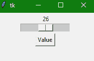
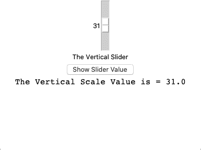

# Python Tkinter 缩放小部件

> 原文：<https://www.studytonight.com/tkinter/python-tkinter-scale-widget>

在本教程中，我们将介绍 Python 中的 Tkinter **Scale 小部件**，该小部件用于添加一个**图形滑块**对象，用户可以滑动该对象并选择一个数字，因为数值会附加到该滑块标尺上，并且当您上下或左右移动滑块时，附加到其上的数值会增加或减少，您可以将滑块设置为您想要选择的值。

*   由**提供的**滑动条**刻度部件**有助于**根据我们应用中滑动条**的**方向，从**左右滑动**或从**上下滑动**来选择数值。**

*   如果入口小部件的目的是在给定的数值范围内从用户处获取数字输入，则**刻度小部件**用作入口小部件的**替代品。**

*   您还可以**控制最小和最大值**以及标尺的分辨率。

## Tkinter 缩放小部件

Tkinter **缩放小部件**的**语法**如下所示:

```
W = Scale(master, options) 
```

在上面的语法中，`master`参数表示**父窗口**。您可以使用许多`options`来更改刻度部件的布局，这些**选项**被写成**逗号分隔的键值**。

### Tkinter 缩放小部件选项:

以下是 Tkinter Scale 小部件使用的各种选项:

| **选项名称** | **描述** |
| --- | --- |
| `activebackground` | 该选项表示**小部件处于焦点**时的背景颜色。 |
| `bg` | 该选项代表小部件的**背景颜色** |
| `bd` | 该选项**代表小部件**的边框大小。默认值为 2 像素。 |
| `cursor` | 借助该选项，**鼠标指针将变为特定的光标类型，可以是箭头、点等**。 |
| `command` | 该选项将被**设置为每次**移动滑块时被称为**的程序。**如果我们快速移动**滑块**，当稳定时，回调到**程序。** |
| `digits` | 当用于控制刻度数据的**控制变量为字符串类型**时，则该选项主要用于**指定数字刻度转换为**字符串**时的位数。** |
| `fg` | 该选项表示**文本的前景色** |
| `font` | 该选项**表示文本的字体类型** |
| `from_` | 该选项用于**表示小部件范围**的一端。 |
| `highlightcolor` | 当**部件处于焦点**下时，该**选项指示高亮颜色** |
| `highlightbackground` | 当**部件不在焦点**下时，该**选项指示高亮颜色** |
| `label` | 该选项可以**设置为一些文本，然后可以显示为带有刻度**的标签。如果**刻度是水平的**那么它显示在**左上角**或者如果**刻度是垂直的**那么它显示在**右上角**。 |
| `length` | 该选项指示**小部件**的长度。如果标尺在水平方向上，它代表**的 X 维度；如果标尺在垂直方向**上，它代表**的 Y 维度**。**** |
| `relief` | 该选项用于**指定边框类型**。它的默认值是 FLAT |
| `orient` | 根据刻度的类型，该选项可以设置为水平或垂直。 |
| `resolution` | 该选项将被设置为刻度值的最小变化 |
| `repeatdelay` | 该选项主要用于**在滑块开始在该方向上重复移动**之前**告知按钮被按下的持续时间**。其默认值为 **300 毫秒** |
| `sliderlength` | 该选项表示**滑块窗口沿标尺**长度的长度。它的默认值是 30 像素。另外，您可以将其更改为**适当的值**。 |
| `showvalue` | 默认情况下，刻度的**值以文本形式**显示，我们也可以将此**选项设置为 0，以抑制标签**。 |
| `state` | 默认情况下，**刻度部件的状态为激活状态**。要使其无响应，您也可以将其设置为**禁用** |
| `width` | 该选项用于表示小部件槽部的**宽度** |
| `variable` | 该选项用于**表示刻度**的控制变量 |
| `to` | 此选项用于**代表一个浮点或整数值，指定刻度所代表的范围**的另一端 |
| `takefocus` | 一般来说，焦点会**在刻度部件**中循环。如果你不想要这个行为，你可以**将这个选项设置为 0** 。 |
| `tickinterval` | 在该选项的帮助下，**刻度值显示在指定刻度间隔**的倍数上。此选项的默认值为 0。 |
| `troughcolor` | 该选项用于**设置波谷**的颜色 |

### Tkinter 缩放小部件方法

以下是缩放小部件使用的几种方法:

*   `get()`:

    此方法用于获取刻度的当前值。

*   `set(value)`:

    此方法用于设置刻度值。

## Tkinter 缩放小部件-水平示例

下面我们有一个基本的例子，我们将**创建一个水平滑动条**。

```
from tkinter import *  

win = Tk()  
win.geometry("200x100")

v = DoubleVar()  

scale = Scale( win, variable=v, from_=1, to=50, orient=HORIZONTAL)  
scale.pack(anchor=CENTER)  

btn = Button(win, text="Value")  
btn.pack(anchor=CENTER)  

label = Label(win)  
label.pack()  

win.mainloop()
```



在本教程中，我们创建了一个水平缩放小部件。如果您在代码中看到，我们已经为此将`orient`指定为**水平**。我们还为滑块刻度指定了数值的**范围。**

## Tkinter 缩放小部件-垂直示例

下面我们有另一个例子，我们将创建一个**垂直滑块**:

```
from tkinter import *

win = Tk() 
win.geometry("400x300") 

v = DoubleVar() 

def show(): 	
	sel = "The Vertical Scale Value is = " + str(v.get()) 
    # adding scale value to label to show
	scale_val.config(text=sel, font=("Courier", 16)) 

scl = Scale(win, variable=v, from_=60, to=1, orient=VERTICAL) 

mainlabel = Label(win, text="The Vertical Slider") 

btn = Button(win, text ="Show Slider Value", 
			command = show, 
			bg = "darkblue", 
			fg = "white") 

# creating another label to show the scale value
scale_val = Label(win) 

scl.pack(anchor = CENTER) 
mainlabel.pack() 
btn.pack() 
scale_val.pack() 

win.mainloop() 
```



您可以将滑块从底部移动到顶部，因为它是一个垂直滑块。在给定的例子中，我们还在我们的应用程序中添加了一个按钮**，并且我们定义了一个功能`show()`，该功能作为**事件处理程序**附加到按钮部件上。因此，在用户使用滑块选择任何值，然后单击按钮后，该值将显示在按钮下方的标签小部件中。**

## 总结:

在本教程中，我们了解了 Tkinter Scale 小部件，这是一个很好的用户界面组件，用于从最终用户那里获取特定范围内的数字输入值。

* * *

* * *