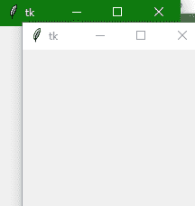

> 哎哎哎:# t0]https://www . studytonight . com/tkinter/python-tkinter-top level widget


# Python Tkinter Toplevel Widget

在本教程中，我们将介绍 Python 中的 Tkinter **顶层小部件**，该小部件用于**创建和显示**顶层窗口，而不是应用程序窗口。

*   在 Tkinter **顶级小部件**的帮助下，您可以在父窗口顶部的单独窗口中为用户提供**额外信息**。

*   使用**顶层小部件**创建的这个**顶层窗口**由窗口管理器直接组织和管理**。**

*   **顶层窗口**不一定要有家长在上面。

*   您可以创建多个顶层窗口。

*   使用**创建的顶级窗口顶级小部件**包含**标题栏**、**边框**、**以及一些窗口装饰**。

*   借助这个小工具，你可以在新窗口上提供**弹出**、**一些额外信息**、**或者一些小工具**。

## Python Tkinter Toplevel Widget

Tkinter 顶级小部件的语法如下:

```
W = Toplevel(master,options) 
```

在上面的语法中，`master`参数表示**父窗口**。您可以使用许多**选项**来配置您的顶级小部件，这些**选项**被写成**逗号分隔的键值对**。

### Tkinter Toplevel Widget 选项:

下面给出了与 Tkinter 顶级小部件一起使用的各种`options`:

| **选项名称** | **描述** |
| --- | --- |
| `bd` | 来表示**窗口的边框尺寸** |
| `bg` | 来表示**窗口的背景颜色** |
| `class_` | 一般来说，在文本小部件中选择的**文本只需导出**即可选择到窗口管理器。**也可以将该选项的值设置为 0，使这种行为为假。** |
| `cursor` | 该选项将鼠标指针转换为指定的光标类型**，并可设置为**箭头、点等。 |
| `width` | 该选项用于**表示窗口的宽度** |
| `height` | 该选项用于**表示窗口的高度** |
| `font` | 此选项**指示要插入到小部件中的文本的字体类型****。** |
| `fg` | 该选项用于指示**小部件的前景色。** |
| `relief` | 该选项**表示窗口的类型。** |

### Tkinter 顶层小部件方法:

下面给出了 Tkinter 顶级小部件使用的各种方法:

| **方法** | **描述** |
| --- | --- |
| `title(string)` | 该方法用于**定义窗口的标题**。 |
| `withdraw()` | 该方法用于**删除窗口**，但不会破坏窗口。 |
| `positionfrom(who)` | 该方法用于定义**位置控制器** |
| `sizefrom(who)` | 该方法用于定义**尺寸控制器**。 |
| `minsize(width,height)` | 该方法用于声明窗口的**最小尺寸** |
| `maxsize(width,height)` | 该方法用于声明窗口的**最大尺寸** |
| `resizable(width,height)` | 此方法用于**控制窗口**是否可以**调整大小**。 |
| `transient([master])` | 该方法用于将**窗口转换为临时窗口** |
| `iconify()` | 此方法用于**将顶层窗口转换为图标**。 |
| `deiconify()` | 这个方法是**主要用来显示**窗口。 |
| `frame()` | 为了指示**系统相关的窗口标识符**，使用该方法。 |
| `group(window)` | 此方法用于**将顶级窗口**添加到**指定的窗口组** |
| `protocol(name,function)` | 该方法用于**指示将为特定协议**调用的功能 |
| `state()` | 该方法用于**获取窗口**的当前状态。该选项的一些可能值是**正常、图标、撤回和图标**。 |

## Tkinter 顶层小部件示例

下面我们有一个基本的例子，我们将创建一个简单的顶层窗口。

```
from tkinter import *  

win = Tk()  

win.geometry("200x200")  

def open():  
    top = Toplevel(win)  
    top.mainloop()  

btn = Button(win, text="open", command=open)  

btn.place(x=75, y=50)  

win.mainloop()
```



在上面的代码中，我们已经创建了一个顶级小部件，该部件是在单击按钮时创建和启动的。

## 总结:

所以现在我们知道什么是 Tkinter Toplevel 小部件，以及如何创建它。Tkinter Toplevel 小部件很适合在不同的窗口中显示应用程序的某些部分，该窗口显示在主应用程序窗口的顶部。

* * *

* * *