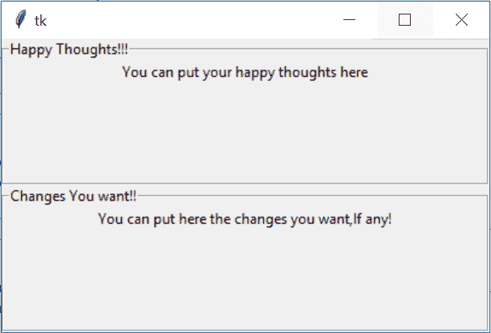

> 哎哎哎:# t0]https://www . studytonight . com/tkinter/python-tkinter-label frame widget


# Python Tkinter LabelFrame Widget

在本教程中，我们将介绍 Python 中的 Tkinter **LabelFrame 小部件**及其语法和几个示例。LabelFrame 小部件主要用于**在子小部件**周围绘制边框。

*   这个小部件是一个**边框的容器小部件**，是**用来将相关的小部件**分组到一个 Tkinter 应用中，为用户提供更好的用户体验。

*   例如，我们可以使用 labelframe 小部件对应用程序中使用的[单选按钮小部件](https://www.studytonight.com/tkinter/python-tkinter-radiobutton-widget)进行分组。

*   还可以**为 LabelFrame 小部件添加一个标题**(我们将在代码示例中看到这一点)。

*   **标签框架小部件**是**框架小部件**的一个变种**，它具有框架的所有特征。**

<u>**注意:**</u> 如果你已经使用 [HTML 进行网页开发](https://www.studytonight.com/code/)，那么标签框架就和 [HTML fieldset 标签](https://www.studytonight.com/html5-references/html-fieldset-tag)一样。

## Tkinter LabelFrame Widget

**标签框架小部件**的语法如下。让我们看看:

```
w = LabelFrame(master, option=value)
```

在上面的语法中，`master`参数表示**父窗口。**您可以使用许多`options`来配置标签框架，这些选项被写成**逗号分隔的键值对**。

### Tkinter LabelFrame Widget 选项:

以下是标签框架小部件使用的各种选项:

| **选项名称** | **描述** |
| --- | --- |
| `height` | 该选项用于**表示小部件的高度。** |
| `width` | 该选项用于**表示框架的宽度。** |
| `text` | 该选项表示**包含标签**文本的字符串。 |
| `relief` | 该选项代表**边框的样式**。**这个选项的默认值是 GROOVE** |
| `padx` | 该选项表示**小部件的水平填充** |
| `pady` | 该选项**代表小部件**的垂直填充 |
| `font` | 该选项表示**小部件文本的字体类型** |
| `highlighthickness` | 该选项表示**焦点高亮边框的宽度** |
| `highlightbackground` | 该选项表示小部件没有焦点时**焦点高亮边框**的颜色 |
| `highlightcolor` | 该选项指示**当小部件处于焦点**下时焦点高亮的颜色 |
| `bg` | 该选项**表示小部件**的背景颜色 |
| `bd` | 该选项用于**表示指示器**周围边框的大小。**这个选项的默认值是 2 像素。** |
| `Class` | 该选项的默认**值为 LabelFrame。** |
| `colormap` | 这个选项主要是**用来指定这个小部件**要使用哪个路图。在这个选项的帮助下，我们可以在这个小部件上重用另一个窗口的颜色映射。颜色图是指 **256 种颜色，用于形成图形** |
| `container` | 如果我们将此选项的值设置为真，则**标签框架将成为容器小部件**。**这个选项的默认值是假的** |
| `cursor` | 该选项将鼠标指针转换为指定的光标类型**，并可设置为**箭头、点等 |
| `fg` | 该选项用于**指示小部件**的前景色 |
| `labelAnchor` | 该选项表示**小部件**内文本的准确位置。该选项的默认值为**西北(西北)** |
| `labelwidget` | 该选项**表示标签**要使用的部件。此外，如果没有指定值，框架将使用标签的文本 |

## Tkinter 标签框架小部件示例

下面我们有一个 LabelFrame 小部件的基本示例。让我们看看下面给出的代码片段:

```
from tkinter import *  

win = Tk()  
win.geometry("300x200")  

labelframe1 = LabelFrame(win, text="Happy Thoughts!!!")  
labelframe1.pack(fill="both", expand="yes")  

toplabel = Label(labelframe1, text="You can put your happy thoughts here")  
toplabel.pack()  

labelframe2 = LabelFrame(win, text = "Changes You want!!")  
labelframe2.pack(fill="both", expand = "yes")  

bottomlabel = Label(labelframe2, text = "You can put here the changes you want,If any!")  
bottomlabel.pack()  

win.mainloop() 
```



正如您在上面的输出中看到的，我们已经创建了两个 labelframe 小部件，其中我们已经为 labelframe 小部件添加了文本，并且在 labelframe 小部件内部，我们有一个[标签小部件](https://www.studytonight.com/tkinter/python-tkinter-label-widget)。我们可以在 labelframe 小部件中拥有任意多的小部件。

## 总结:

因此，有了这个，我们就完成了 Tkinter labelframe 小部件，它就像 HTML fieldset 标记一样，如果你知道 HTML 的话。labelframe 小部件用于在其他小部件周围创建边框，以便对应用程序中的其他小部件进行分组。

* * *

* * *