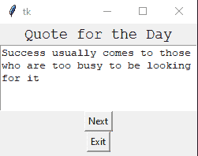

# Tkinter 文本小部件

在本教程中，我们将介绍 Python 中的 Tkinter **文本小部件**。如果你想在你的桌面应用中有一个**文本编辑器**，那么你可以使用 Tkinter **文本小部件**。

*   **文本小部件**用于提供一个**多行文本框**(输入框)，因为在 Tkinter **中单行文本框**是使用 [**输入小部件**](https://www.studytonight.com/tkinter/python-tkinter-entry-widget) 提供的。

*   您可以在文本小部件中使用各种**样式和属性**。

*   您也可以使用文本小部件**中的**标记和标签**来定位文本的特定部分**。

*   像**图像和链接**这样的媒体文件也可以插入到文本小部件中。

*   有一些需要多行文本的应用，比如**发送消息**或者从用户那里获取**长输入**，或者到**在应用中显示可编辑的长格式文本**内容等。用例由这个小部件完成。

*   因此为了**显示文本信息**，我们将使用文本小部件。

## Tkinter Text Widget

文本小部件的语法如下所示:

```py
W = Text(master, options) 
```

在上面的语法中，`master`参数表示**父窗口。**可以使用很多`options`来配置文本编辑器，这些选项写成**逗号分隔的键值对**。

### Tkinter Text Widget 选项:

以下是文本小部件使用的各种选项:

| **选项名称** | **描述** |
| --- | --- |
| `bd` | 该选项**代表小部件的边框宽度。** |
| `bg` | 该选项指示**小部件的背景颜色。** |
| `exportselection` | 该选项用于**导出窗口管理器选择**中选择的文本。如果您不想导出文本**，那么您可以将该选项的值设置为 0。** |
| `cursor` | 该选项将鼠标指针转换为指定的光标类型**，并可设置为**箭头、点等。 |
| `font` | 该选项用于**指示文本的字体类型。** |
| `fg` | 该选项指示**小部件**的文本颜色 |
| `height` | 该选项表示**宽度** t 的垂直尺寸，主要以行数表示。 |
| `highlightbackground` | 该选项指示小部件不在焦点下时的**高亮颜色。** |
| `higlightthickness` | 该选项用于**指示高光**的厚度。**这个选项的默认值是 1。** |
| `highlightcolor` | 该选项**指示当小部件处于焦点下时焦点高亮**的颜色。 |
| `insertbackground` | 该选项用于**表示插入光标的颜色。** |
| `padx` | 该选项指示**小部件的水平填充。** |
| `pady` | 该选项指示**小部件的垂直填充。** |
| `relief` | 该选项指示**小部件**的边框类型。该选项的默认值为**下沉。** |
| `state` | 如果该选项的值设置为**禁用**，则**小部件对鼠标和键盘**无响应 |
| `tabs` | 该选项用于控制**制表符如何用于文本的定位** |
| `width` | 该选项**代表小部件的宽度，以字符**表示。 |
| `wrap` | 要将较宽的线**缠绕成多条线**，使用该选项。这个选项的默认值是 **CHAR** ，它**在任何字符**处断开变得太宽的线 |
| `xscrollcommand` | 如果你想让**文本小部件水平滚动**，那么你可以将这个选项设置为滚动条小部件的 `set()`方法 |
| `yscrollcommand` | 如果你想让**文本小部件垂直滚动**，那么你可以将这个选项设置为滚动条小部件的 `set()`方法 |
| `spacing1` | 此选项**指示要在文本的每一行上方插入的垂直空间。** |
| `spacing2` | 该选项用于**指定当逻辑行换行时，要在**显示的文本行之间增加多少额外的垂直空间。该选项的默认**值为 0** |
| `spacing3` | 此选项**指示要插入文本每行下方的垂直空间。** |
| `selectbackground` | 该选项**表示所选文本的背景颜色。** |
| `selectborderwidth` | 该选项**指示所选文本周围边框的宽度。** |
| `insertofftime` | 该选项表示**时间量(单位为毫秒)**，在**期间，插入光标**在眨眼周期中处于**关闭**状态 |
| `insertontime` | 该选项表示**时间量(单位为毫秒)**，在**期间，插入光标**在眨眼周期中位于上的 |
| `insertborderwidth` | 为了表示**光标周围边框的宽度，我们使用这个选项。**该选项**的默认值为 0** 。 |

### Tkinter 文本小部件方法:

文本小部件使用的一些方法如下:

| **方法** | **描述** |
| --- | --- |
| `index(index)` | 此方法用于获取指定的索引。 |
| `see(index)` | 此方法根据字符串在指定索引处是否可见返回 true 或 false。 |
| `insert(index,string)` | 此方法用于在指定索引处插入字符串。 |
| `get(startindex,endindex)` | 此方法返回指定范围内的字符 |
| `delete(startindex,endindex)` | 此方法删除指定范围内的字符 |

## 标签处理的方法

主要是标签用来**分别配置文本小部件**的不同区域。标签基本上是给文本各个区域的名称。下面给出了一些处理标签的方法:

*   `tag_config()`

    要**配置标签的属性**，将使用该方法。

*   `tag_add(tagname, startindex, endindex)`

    该方法主要用于**标记出现在指定索引**的字符串。

*   `tag_delete(tagname)`

    这个方法主要是**用来删除指定的标签**。

*   `tag_remove(tagname, startindex, endindex)`

    要将标签从指定的范围中移除，使用此方法。

## 标记处理方法

在给定的文本小部件中，为了将**书签标记到字符之间的指定位置**使用了**标记**。下面给出了一些方法:

*   `index(mark)`

    此方法主要用于获取指定标记的索引。

*   `mark_names()`

    此方法用于获取文本小部件范围内的所有标记名称。

*   `mark_gravity(mark, gravity)`

    为了得到给定标记的重力，将使用这种方法。

*   `mark_set(mark, index)`

    此方法用于通知给定标记的新位置。

*   `mark_unset(mark)`

    为了从文本中删除给定的标记，将使用此方法。

## Tkinter 文本小部件示例

让我们讨论文本小部件的一个基本示例。文本小部件示例的代码片段如下所示:

```py
import tkinter as tk 
from tkinter import *

win = Tk() 

#to specify size of window. 
win.geometry("250x170") 

# To Create a text widget and specify size. 
T = Text(win, height = 6, width = 53) 

# TO Create label 
l = Label(win, text = "Quote for the Day") 
l.config(font =("Courier", 14)) 

Quote = """Success usually comes to those who are too busy to be looking for it"""

# Create a button for the next text. 
b1 = Button(win, text = "Next", ) 

# Create an Exit button. 
b2 = Button(win, text = "Exit", 
			command = win.destroy) 

l.pack() 
T.pack() 
b1.pack() 
b2.pack() 

# Insert the Quote 
T.insert(tk.END, Quote) 

tk.mainloop() 
```

上面给出的代码片段的输出如下:



如果你想破坏这个窗口，只需点击**退出**按钮。

## 总结:

在本教程中，我们学习了 Tkinter Text 小部件，当我们想要在应用程序中添加一个文本区域来接受大量用户输入时，会用到这个小部件。

* * *

* * *