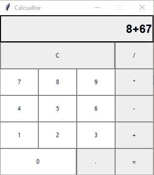
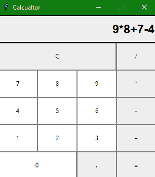

# 使用 Tkinter 的计算器应用程序(Python 项目)

> 原文：<https://www.studytonight.com/tkinter/calculator-application-using-tkinter>

在本教程中，我们将介绍如何使用 Python 创建一个简单的计算器应用程序。

在之前的教程中，我们已经介绍了如何创建 [tkinter 按钮](https://www.studytonight.com/tkinter/python-tkinter-button-widget)、 [tkinter 标签](https://www.studytonight.com/tkinter/python-tkinter-label-widget)、 [tkinter 条目](https://www.studytonight.com/tkinter/python-tkinter-entry-widget)、 [tkinter 框架](https://www.studytonight.com/tkinter/python-tkinter-frame-widget)和 [tkinter 检查按钮](https://www.studytonight.com/tkinter/python-tkinter-checkbutton-widget)等等。现在，在前面讨论的所有小部件的帮助下，我们将使用 Tkinter 创建一个计算器应用程序。

**下面是我们的计算器的外观**，它是通过使用输入字段、按钮来实现的，为了计算的目的，我们将在函数中定义的代码中使用逻辑，例如，如果您想要将两个数字相加，那么在这之后必须有一个用于加法目的的逻辑，类似地，对于减法、乘法等，我们已经创建了任务是执行这些操作的函数。



我们有一个**输入字段**，其中将显示用户输入，并显示计算的最终结果。

**按钮有 0、1、2、3、4、5、6、7、8、9、+、-、*、/、=、。，和 C(清除按钮)**

### 什么是计算器？

对于那些不知道的人来说，**计算器**基本上是一个在**计算机上的程序，它模拟任何**手持计算器**的行为，用于**执行数学计算**。它是我们日常生活中使用的一种非常基本的设备。现在所有的智能手机都有计算器应用。**

创建任何图形用户界面应用程序主要有两个步骤:

*   第一步是**创建用户界面**。

*   第二步是最重要的一步，在这一步中，给图形用户界面添加功能

现在让我们从**开始，使用 Python 中的 Tkinter 创建一个简单的计算器应用程序**，用于**基本算术计算**。

## 计算器应用代码

现在是时候看看使用 Tkinter 创建计算器应用程序的代码了:

```py
from tkinter import *

win = Tk() # This is to create a basic window
win.geometry("312x324")  # this is for the size of the window 
win.resizable(0, 0)  # this is to prevent from resizing the window
win.title("Calculator")

###################Starting with functions ####################
# 'btn_click' function : 
# This Function continuously updates the 
# input field whenever you enter a number

def btn_click(item):
    global expression
    expression = expression + str(item)
    input_text.set(expression)

# 'bt_clear' function :This is used to clear 
# the input field

def bt_clear(): 
    global expression 
    expression = "" 
    input_text.set("")

# 'bt_equal':This method calculates the expression 
# present in input field

def bt_equal():
    global expression
    result = str(eval(expression)) # 'eval':This function is used to evaluates the string expression directly
    input_text.set(result)
    expression = ""

expression = ""

# 'StringVar()' :It is used to get the instance of input field

input_text = StringVar()

# Let us creating a frame for the input field

input_frame = Frame(win, width=312, height=50, bd=0, highlightbackground="black", highlightcolor="black", highlightthickness=2)

input_frame.pack(side=TOP)

#Let us create a input field inside the 'Frame'

input_field = Entry(input_frame, font=('arial', 18, 'bold'), textvariable=input_text, width=50, bg="#eee", bd=0, justify=RIGHT)

input_field.grid(row=0, column=0)

input_field.pack(ipady=10) # 'ipady' is internal padding to increase the height of input field

#Let us creating another 'Frame' for the button below the 'input_frame'

btns_frame = Frame(win, width=312, height=272.5, bg="grey")

btns_frame.pack()

# first row

clear = Button(btns_frame, text = "C", fg = "black", width = 32, height = 3, bd = 0, bg = "#eee", cursor = "hand2", command = lambda: bt_clear()).grid(row = 0, column = 0, columnspan = 3, padx = 1, pady = 1)

divide = Button(btns_frame, text = "/", fg = "black", width = 10, height = 3, bd = 0, bg = "#eee", cursor = "hand2", command = lambda: btn_click("/")).grid(row = 0, column = 3, padx = 1, pady = 1)

# second row

seven = Button(btns_frame, text = "7", fg = "black", width = 10, height = 3, bd = 0, bg = "#fff", cursor = "hand2", command = lambda: btn_click(7)).grid(row = 1, column = 0, padx = 1, pady = 1)

eight = Button(btns_frame, text = "8", fg = "black", width = 10, height = 3, bd = 0, bg = "#fff", cursor = "hand2", command = lambda: btn_click(8)).grid(row = 1, column = 1, padx = 1, pady = 1)

nine = Button(btns_frame, text = "9", fg = "black", width = 10, height = 3, bd = 0, bg = "#fff", cursor = "hand2", command = lambda: btn_click(9)).grid(row = 1, column = 2, padx = 1, pady = 1)

multiply = Button(btns_frame, text = "*", fg = "black", width = 10, height = 3, bd = 0, bg = "#eee", cursor = "hand2", command = lambda: btn_click("*")).grid(row = 1, column = 3, padx = 1, pady = 1)

# third row

four = Button(btns_frame, text = "4", fg = "black", width = 10, height = 3, bd = 0, bg = "#fff", cursor = "hand2", command = lambda: btn_click(4)).grid(row = 2, column = 0, padx = 1, pady = 1)

five = Button(btns_frame, text = "5", fg = "black", width = 10, height = 3, bd = 0, bg = "#fff", cursor = "hand2", command = lambda: btn_click(5)).grid(row = 2, column = 1, padx = 1, pady = 1)

six = Button(btns_frame, text = "6", fg = "black", width = 10, height = 3, bd = 0, bg = "#fff", cursor = "hand2", command = lambda: btn_click(6)).grid(row = 2, column = 2, padx = 1, pady = 1)

minus = Button(btns_frame, text = "-", fg = "black", width = 10, height = 3, bd = 0, bg = "#eee", cursor = "hand2", command = lambda: btn_click("-")).grid(row = 2, column = 3, padx = 1, pady = 1)

# fourth row

one = Button(btns_frame, text = "1", fg = "black", width = 10, height = 3, bd = 0, bg = "#fff", cursor = "hand2", command = lambda: btn_click(1)).grid(row = 3, column = 0, padx = 1, pady = 1)

two = Button(btns_frame, text = "2", fg = "black", width = 10, height = 3, bd = 0, bg = "#fff", cursor = "hand2", command = lambda: btn_click(2)).grid(row = 3, column = 1, padx = 1, pady = 1)

three = Button(btns_frame, text = "3", fg = "black", width = 10, height = 3, bd = 0, bg = "#fff", cursor = "hand2", command = lambda: btn_click(3)).grid(row = 3, column = 2, padx = 1, pady = 1)

plus = Button(btns_frame, text = "+", fg = "black", width = 10, height = 3, bd = 0, bg = "#eee", cursor = "hand2", command = lambda: btn_click("+")).grid(row = 3, column = 3, padx = 1, pady = 1)

# fourth row

zero = Button(btns_frame, text = "0", fg = "black", width = 21, height = 3, bd = 0, bg = "#fff", cursor = "hand2", command = lambda: btn_click(0)).grid(row = 4, column = 0, columnspan = 2, padx = 1, pady = 1)

point = Button(btns_frame, text = ".", fg = "black", width = 10, height = 3, bd = 0, bg = "#eee", cursor = "hand2", command = lambda: btn_click(".")).grid(row = 4, column = 2, padx = 1, pady = 1)

equals = Button(btns_frame, text = "=", fg = "black", width = 10, height = 3, bd = 0, bg = "#eee", cursor = "hand2", command = lambda: bt_equal()).grid(row = 4, column = 3, padx = 1, pady = 1)

win.mainloop() 
```

Tkinter 中有**多种功能，在它们的帮助下**变得简单**和**方便，只需要**这个小代码**就可以做一个简单的计算器**。**

除了 Tkinter 小部件之外，我们还在代码中定义了以下函数:

**`btn_click()`功能:**该功能处理按钮点击各种数字按钮将其添加到操作中。

**`bt_clear()`功能:**该功能用于处理清除操作，以清除计算器应用程序中以前的输入。

**`bt_equal()`功能:**该功能用于处理等号按钮执行操作并显示结果。

现在，我们将向您展示一个快照，作为上面代码的输出。是的，您可以在您的系统上实现它，以便更清楚地了解计算器应用程序使用 Tkinter:



## 总结:

在本教程中，我们使用 Tkinter 和 Tkinter 的各种小部件开发了一个基本的 Calculator 应用程序，我们已经在 Tkinter 教程中介绍了这些小部件。单击“下一步”查看更多使用 Tkinter 开发的应用程序，因为这将帮助您实践所学知识。

* * *

* * *