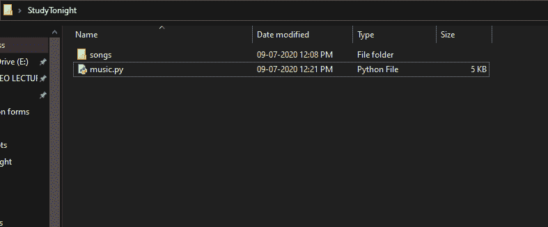

# 使用 Tkinter 的音乐播放器应用程序(Python 项目)

> 原文：<https://www.studytonight.com/tkinter/music-player-application-using-tkinter>

在本教程中，我们将使用 **Tkinter** 和 **Pygame** 模块用 Python 创建一个音乐播放器应用程序。

在我们的日常生活中，我们看到每个人都有一个爱好，那就是听音乐。所以为了听音乐，他们都需要一个音乐播放器(硬件或软件)，可以播放自己喜欢的歌曲。我们必须在我们的电脑上安装这个音乐播放器，基于操作系统，即视窗、麦金塔、安卓、Linux 等。然后我们可以听我们喜欢的歌。

现在我们将帮助您从头开始编码和创建音乐播放器。

## 用于音乐播放器应用程序的库:

现在，我们将告诉您我们将在代码中使用的库:

### 1.Tkinter

我们已经在这个页面的标题中告诉过您，我们将使用 Tkinter 库，这是一个用于 GUI 创建的标准库。Tkinter 库是最受欢迎的，也非常容易使用，它附带了许多小部件(这些小部件有助于创建好看的图形用户界面应用程序)。

此外，Tkinter 是一个非常轻量级的模块，它有助于创建跨平台应用程序(因此相同的代码可以轻松地在 **Windows** 、 **macOS** 和 **Linux 上工作)**

To use all the functions of Tkinter you need to import it in your code and the command for the same is:

```py
from tkinter import *
```


### 2.Pygame 模组

Pygame 是一个 Python 模块，可与计算机图形和声音库一起工作，设计时具有播放音频、视频等不同多媒体格式的能力。在创建我们的音乐播放器应用程序时，我们将使用 Pygame 的`mixer.music`模块为我们的音乐播放器应用程序提供不同的功能，这些功能通常与歌曲轨道的操作有关。

用于安装 **pygame** 模块的命令是:

```py
pip install pygame
```

 要在代码中使用该模块，您需要编写以下内容:

```py
import pygame
```

###  3。操作系统模块

没有必要显式安装这个模块，因为它附带了 Python 的标准库。该模块提供了与操作系统交互的不同功能。在本教程中，我们将使用操作系统模块**从指定目录**中获取歌曲播放列表，并将其提供给音乐播放器应用程序。

要在代码中使用此模块，您需要导入其和命令，如下所示:

```py
import OS
```

导入库和模块后，现在是时候创建一个基本窗口，我们将在其中添加我们的用户界面元素或 [Tkinter 小部件](https://www.studytonight.com/tkinter/python-tkinter-widgets)。您可以在导入库之后，也可以在根窗口循环之前的末尾添加此代码，代码如下:

```py
root = Tk() # In order to create an empty window
# Passing Root to MusicPlayer Class
MusicPlayer(root)
```

## 音乐播放器类

这里我们有在 MusicPlayer 类中定义的构造函数和其他函数。

### 1.`_init_`建造师

在这个构造器的帮助下，我们将为窗口设置**标题，为窗口设置**几何图形**。我们将**启动 pygame 和 pygame 混合器**，然后声明轨迹变量和状态变量。**

*   然后我们将**为**歌曲标签** & **状态标签**创建轨道帧**，然后在插入歌曲轨道标签和状态标签之后。

*   之后，我们将创建**按钮框**和**将播放、暂停、取消播放和停止按钮**插入其中。

*   然后我们将创建**播放列表框****并在其中添加滚动条**，我们将向播放列表中添加歌曲。

代码片段如下:

```py
def __init__(self,root):
    self.root = root
    # Title of the window
    self.root.title("MusicPlayer")
    # Window Geometry
    self.root.geometry("1000x200+200+200")
    # Initiating Pygame
    pygame.init()
    # Initiating Pygame Mixer
    pygame.mixer.init()
    # Declaring track Variable
    self.track = StringVar()
    # Declaring Status Variable
    self.status = StringVar()

    # Creating the Track Frames for Song label & status label
    trackframe = LabelFrame(self.root,text="Song Track",font=("times new roman",15,"bold"),bg="Navyblue",fg="white",bd=5,relief=GROOVE)
    trackframe.place(x=0,y=0,width=600,height=100)
    # Inserting Song Track Label
    songtrack = Label(trackframe,textvariable=self.track,width=20,font=("times new roman",24,"bold"),bg="Orange",fg="gold").grid(row=0,column=0,padx=10,pady=5)
    # Inserting Status Label
    trackstatus = Label(trackframe,textvariable=self.status,font=("times new roman",24,"bold"),bg="orange",fg="gold").grid(row=0,column=1,padx=10,pady=5)

    # Creating Button Frame
    buttonframe = LabelFrame(self.root,text="Control Panel",font=("times new roman",15,"bold"),bg="grey",fg="white",bd=5,relief=GROOVE)
    buttonframe.place(x=0,y=100,width=600,height=100)
    # Inserting Play Button
    playbtn = Button(buttonframe,text="PLAYSONG",command=self.playsong,width=10,height=1,font=("times new roman",16,"bold"),fg="navyblue",bg="pink").grid(row=0,column=0,padx=10,pady=5)
    # Inserting Pause Button
    playbtn = Button(buttonframe,text="PAUSE",command=self.pausesong,width=8,height=1,font=("times new roman",16,"bold"),fg="navyblue",bg="pink").grid(row=0,column=1,padx=10,pady=5)
    # Inserting Unpause Button
    playbtn = Button(buttonframe,text="UNPAUSE",command=self.unpausesong,width=10,height=1,font=("times new roman",16,"bold"),fg="navyblue",bg="pink").grid(row=0,column=2,padx=10,pady=5)
    # Inserting Stop Button
    playbtn = Button(buttonframe,text="STOPSONG",command=self.stopsong,width=10,height=1,font=("times new roman",16,"bold"),fg="navyblue",bg="pink").grid(row=0,column=3,padx=10,pady=5)

    # Creating Playlist Frame
    songsframe = LabelFrame(self.root,text="Song Playlist",font=("times new roman",15,"bold"),bg="grey",fg="white",bd=5,relief=GROOVE)
    songsframe.place(x=600,y=0,width=400,height=200)
    # Inserting scrollbar
    scrol_y = Scrollbar(songsframe,orient=VERTICAL)
    # Inserting Playlist listbox
    self.playlist = Listbox(songsframe,yscrollcommand=scrol_y.set,selectbackground="gold",selectmode=SINGLE,font=("times new roman",12,"bold"),bg="silver",fg="navyblue",bd=5,relief=GROOVE)
    # Applying Scrollbar to listbox
    scrol_y.pack(side=RIGHT,fill=Y)
    scrol_y.config(command=self.playlist.yview)
    self.playlist.pack(fill=BOTH)
    # Changing Directory for fetching Songs
    os.chdir("PATH/OF/DIRECTORY")
    # Fetching Songs
    songtracks = os.listdir()
    # Inserting Songs into Playlist
    for track in songtracks:
      self.playlist.insert(END,track) 
```

在上面的代码中，用存储歌曲文件的适当路径更改**路径/OF/DIRECTORY** 。

### 2.`playsong()`功能

现在我们将定义播放歌曲功能，代码为:

```py
 def playsong(self):
    # Displaying Selected Song title
    self.track.set(self.playlist.get(ACTIVE))
    # Displaying Status
    self.status.set("-Playing")
    # Loading Selected Song
    pygame.mixer.music.load(self.playlist.get(ACTIVE))
    # Playing Selected Song
    pygame.mixer.music.play()
```

### 3.`stopsong()`功能

停止歌曲的代码片段:

```py
 def stopsong(self):
    # Displaying Status
    self.status.set("-Stopped")
    # Stopped Song
    pygame.mixer.music.stop()
```

### 4.`pausesong()`功能

暂停歌曲的代码片段:

```py
def pausesong(self):
    # Displaying Status
    self.status.set("-Paused")
    # Paused Song
    pygame.mixer.music.pause()
```

### 5.`unpausesong()`功能

解包歌曲的代码片段:

```py
 def unpausesong(self):
    # It will Display the  Status
    self.status.set("-Playing")
    # Playing back Song
    pygame.mixer.music.unpause() 
```

### 6.根窗口循环

该命令将是:

```py
root.mainloop()
```

下面是我们应用程序的一些截图:

名为 study 的文件夹今晚放置歌曲的代码文件和文件夹如下所示:



我们将在代码中提供歌曲文件夹的路径，所有歌曲都放在该文件夹中，以便访问它们。

下面的截图向您展示了应用程序的外观:


每当你点击歌曲时，它会是这样的:


点击**播放歌曲按钮**:


点击**暂停按钮**:


点击**停止按钮**:


所以这都是关于使用 Tkinter 构建音乐播放器应用程序。希望大家喜欢这个应用。请与我们分享更多关于基于 Tkinter 的桌面应用程序的想法，我们一定会在我们的 Tkinter 教程中添加更多的 Tkinter 项目。

* * *

* * *