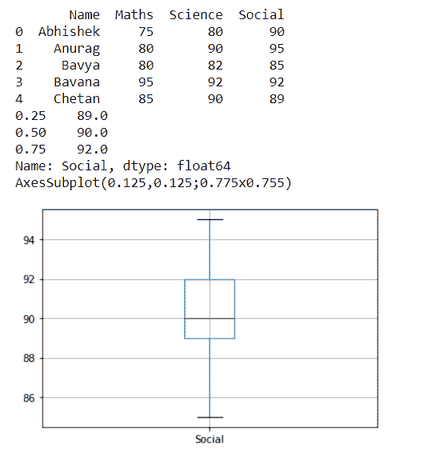
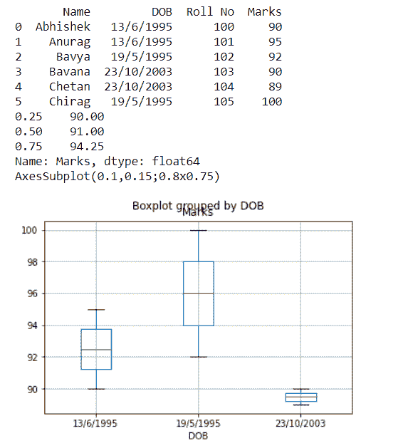
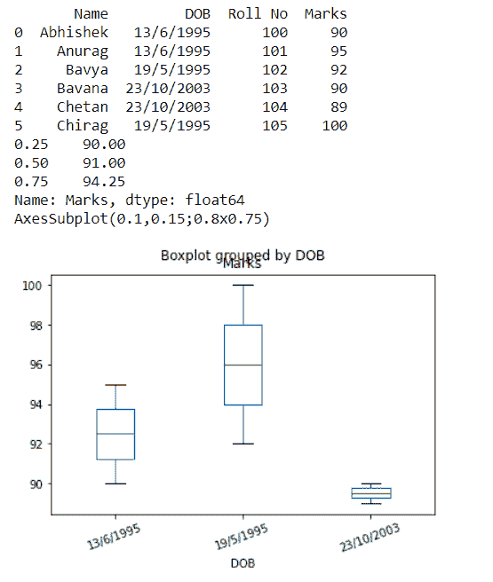
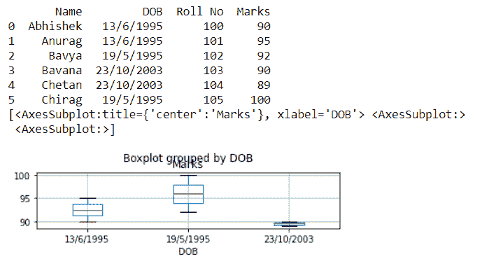

# 熊猫数据框图()方法

> 原文：<https://www.studytonight.com/pandas/pandas-dataframe-boxplot-method>

一个`boxplot`通常被称为显示数据帧五个数字摘要的方框和图。五位数汇总是数据集的最小值，第一个四分位数是数据集的 25%，中值是数据集的 50%，第三个四分位数是数据集的 75%，以及数据集的最大值。箱折线图是一种通过四分位数图形化描述数字数据组的方法。

在本教程中，我们将学习[python](https://www.studytonight.com/python/getting-started-with-python)pandas DataFrame . box plot()方法，该方法从 data frame 列制作一个盒子图。

下图显示了`DataFrame.boxplot()`方法的语法。

### 句法

```py
DataFrame.boxplot(column=None, by=None, ax=None, fontsize=None, rot=0, grid=True, figsize=None, layout=None, return_type=None, backend=None, **kwargs)
```

### 参数:

**列:**字符串或字符串列表，可选。列名或名称列表，或向量。

**by:** 字符串或数组状，可选。数据框中的一列到`pandas.DataFrame.groupby()`。一个方框图将由中的每个列值完成。

**fontsize:** float 或 str。以磅为单位或以字符串为单位的刻度标签字体大小(例如，大)。

**rot:** int 或 float，默认为 0。标签相对于屏幕坐标系的旋转角度(度)。

**网格:** bool，默认 True。将此设置为“真”将显示网格。

**布局:**元组(行、列)，可选。例如，(3，5)将使用 3 列 5 行显示子情节，从左上角开始。

**return_type:** {'axes '，' dict '，' both'}或无，默认' axes '。要返回的对象的类型。默认为`axes`。

## 示例 1:使用`DataFrame.boxplot()`方法创建箱折线图

考虑`DataFrame.boxplot()`方法如何工作的一个简单例子。通过将数据框列的名称传递给`DataFrame.boxplot()`方法，创建一个数据框并生成箱折线图。

```py
import pandas as pd
df = pd.DataFrame([['Abhishek',75,80,90], ['Anurag',80,90,95],['Bavya',80,82,85],['Bavana',95,92,92],['Chetan',85,90,89]], columns=['Name','Maths','Science','Social'])
print(df)
boxplot=df.boxplot(column=['Social'])
print(df['Social'].quantile([0.25,0.5,0.75]))
print(boxplot)
```

一旦我们运行该程序，我们将获得以下输出。



## 示例 2:通过对列值中的数据进行分组，使用`DataFrame.boxplot()`方法创建箱折线图

这个例子与上一个类似，但是首先，它会根据`by='DOB'`参数将数据帧分组到不同的组中，然后为每个`DataFrame`创建一个箱折线图。

```py
import pandas as pd
df = pd.DataFrame([['Abhishek','13/6/1995',100,90], ['Anurag','13/6/1995',101,95],['Bavya','19/5/1995',102,92],['Bavana','23/10/2003',103,90],['Chetan','23/10/2003',104,89],['Chirag','19/5/1995',105,100]], columns=['Name','DOB','Roll No','Marks'])
print(df)
print(df['Marks'].quantile([0.25,0.5,0.75]))
boxplot=df.boxplot(column=['Marks'],by='DOB')
print(boxplot)
```

一旦我们运行该程序，我们将获得以下输出。

****

## 示例 3:使用 fontsize、rot 和 grid 参数自定义 boxplot 的 DataFrame.boxplot()方法

我们可以使用 fontsize、rot 和 grid 参数自定义 boxplot，下面的示例也是如此。

```py
import pandas as pd
df = pd.DataFrame([['Abhishek','13/6/1995',100,90], ['Anurag','13/6/1995',101,95],['Bavya','19/5/1995',102,92],['Bavana','23/10/2003',103,90],['Chetan','23/10/2003',104,89],['Chirag','19/5/1995',105,100]], columns=['Name','DOB','Roll No','Marks'])
print(df)
print(df['Marks'].quantile([0.25,0.5,0.75]))
boxplot=df.boxplot(column=['Marks'],by='DOB',grid=False, rot=20, fontsize=10)
print(boxplot)
```

一旦我们运行该程序，我们将获得以下输出。

****

## 示例 4:通过自定义布局参数的 DataFrame.boxplot()方法

我们可以使用布局参数自定义 boxplot，下面的示例也是如此。它将使用 3 列 1 行显示子情节。

```py
import pandas as pd
df = pd.DataFrame([['Abhishek','13/6/1995',100,90], ['Anurag','13/6/1995',101,95],['Bavya','19/5/1995',102,92],['Bavana','23/10/2003',103,90],['Chetan','23/10/2003',104,89],['Chirag','19/5/1995',105,100]], columns=['Name','DOB','Roll No','Marks'])
print(df)
boxplot=df.boxplot(column=['Marks'],by='DOB',layout=(3,1))
print(boxplot)
```

一旦我们运行该程序，我们将获得以下输出。

****

### **结论**

在本教程中，我们学习了数据框的 python pandas DataFrame.boxplot()方法。我们学习了语法、参数，并向 DataFrame.boxplot()方法传递了不同的方法，我们解决了示例并理解了方法。

* * *

* * *