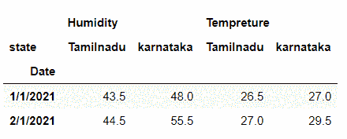
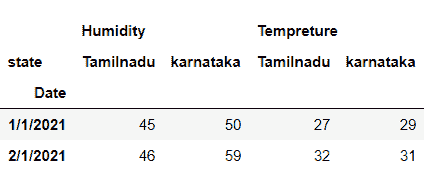
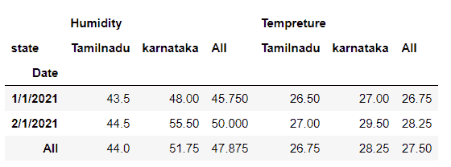

# Pandas数据帧`pivot_table()`方法

> 原文：<https://www.studytonight.com/pandas/pandas-dataframe-pivot_table-method>

在本教程中，我们将讨论和学习Pandas`DataFrame.pivot_table()`的方法。此方法可用于聚合和汇总数据帧的数据。当此方法应用于数据帧时，它会返回一个电子表格样式的数据透视表作为数据帧。

下面是`DataFrame.pivot_table()`方法的语法。

### 句法

```py
DataFrame.pivot_table(values=None, index=None, columns=None, aggfunc='mean', fill_value=None, margins=False, dropna=True, margins_name='All', observed=False)
```

### 因素

**值:**表示要聚合的列，可选。

**索引:**表示前一个的列、石斑鱼、数组或列表。

**列:**表示前一个的列、石斑鱼、数组或列表。

**aggfunc:** 代表功能，功能列表，dict，默认为`numpy.mean`

## 示例:使用`DataFrame.pivot_table()`方法聚合数据帧

默认情况下，`DataFrame.pivot_table()`方法使用函数`np.mean`聚合数据帧的数据。这里，在这个例子中，我们通过将“日期”作为索引轴，“状态”作为列轴来重塑数据帧，并使用`DataFrame.pivot_table()`方法根据此来聚合数据。见下面的例子。

```py
#importing pandas as pd
import pandas as pd
#creating the DataFrame
df=pd.DataFrame({'Date':['1/1/2021','1/1/2021','2/1/2021','2/1/2021','1/1/2021','1/1/2021','2/1/2021','2/1/2021'],
                 'state':['karnataka','karnataka','karnataka','karnataka','Tamilnadu','Tamilnadu','Tamilnadu','Tamilnadu'],
                 'Tempreture':[25,29,28,31,26,27,22,32],
                 'Humidity':[46,50,52,59,42,45,46,43]})
df.pivot_table(index='Date',columns='state')
```

## 

## 示例:使用`DataFrame.pivot_table()`方法应用功能

我们可以使用`**aggfunc**` 参数将不同的函数传递给`DataFrame.pivot_table()`方法。见下面的例子。

`DataFrame.pivot_table()`方法根据指定的函数返回数据帧。

```py
#importing pandas as pd
import pandas as pd
import numpy as np
#creating the DataFrame
df=pd.DataFrame({'Date':['1/1/2021','1/1/2021','2/1/2021','2/1/2021','1/1/2021','1/1/2021','2/1/2021','2/1/2021'],
                 'state':['karnataka','karnataka','karnataka','karnataka','Tamilnadu','Tamilnadu','Tamilnadu','Tamilnadu'],
                 'Tempreture':[25,29,28,31,26,27,22,32],
                 'Humidity':[46,50,52,59,42,45,46,43]})
df.pivot_table(index='Date',columns='state',aggfunc='max')
```

## 

## 示例:将函数的`list`传递给 pivot_table()方法

我们可以使用`**aggfunc**` 参数将函数的`list`传递给`DataFrame.pivot_table()`方法。`DataFrame.pivot_table()`方法返回由分层列组成的数据帧，其中函数名位于顶层。见下面的例子。

```py
#importing pandas as pd
import pandas as pd
import numpy as np
#creating the DataFrame
df=pd.DataFrame({'Date':['1/1/2021','1/1/2021','2/1/2021','2/1/2021','1/1/2021','1/1/2021','2/1/2021','2/1/2021'],
                 'state':['karnataka','karnataka','karnataka','karnataka','Tamilnadu','Tamilnadu','Tamilnadu','Tamilnadu'],
                 'Tempreture':[25,29,28,31,26,27,22,32],
                 'Humidity':[46,50,52,59,42,45,46,43]})
df.pivot_table(index='Date',columns='state',aggfunc=['sum','count'])
```

## 

## 示例:将`margins=True`设置为`DataFrame.pivot_table()`方法

如果参数`margins=True` 在`DataFrame.pivot_table()`方法中，它会在结果数据帧中添加`'All'` 行和列，该数据帧由值的集合组成。见下面的例子。

```py
#importing pandas as pd
import pandas as pd
#creating the DataFrame
df=pd.DataFrame({'Date':['1/1/2021','1/1/2021','2/1/2021','2/1/2021','1/1/2021','1/1/2021','2/1/2021','2/1/2021'],
                 'state':['karnataka','karnataka','karnataka','karnataka','Tamilnadu','Tamilnadu','Tamilnadu','Tamilnadu'],
                 'Tempreture':[25,29,28,31,26,27,22,32],
                 'Humidity':[46,50,52,59,42,45,46,43]})
df.pivot_table(index='Date',columns='state',margins=True)
```

### ****

### 结论

在本教程中，我们学习了 Pandas DataFrame.pivot_table()方法。我们学习了语法、参数，并通过在数据帧上应用这种方法解决了一些例子。

* * *

* * *