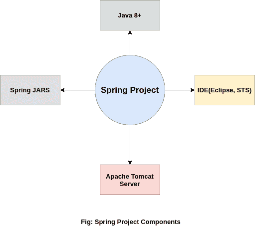
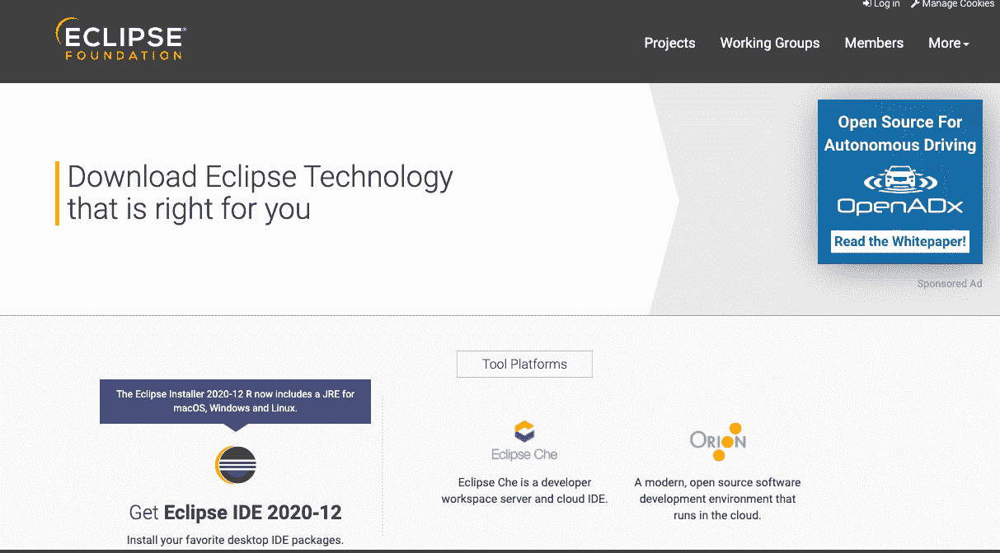
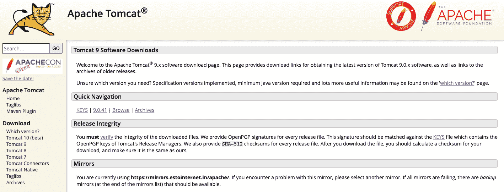

# 春季环境设置

> 原文：<https://www.studytonight.com/spring-framework/spring-environment-setup>

要为 Spring Framework 建立一个开发环境，我们需要以下工具:

*   安装 Java

*   安装 Eclipse

*   安装 Tomcat 服务器

*   下载 Spring JARs

因此，让我们在本地系统中下载并安装这些工具，以便成功执行 Spring 应用程序。

## 第一步:安装 Java

Java 是一种编程语言，Spring 框架使用它来创建应用程序。所以我们的第一个任务是[在我们的计算机上安装 Java](https://www.studytonight.com/post/step-by-step-guide-to-install-jdk-11-on-windows)[并设置它的类路径](http://studytonight.com/java/setting-classpath-for-java.php)。关于 Java 语言的更多信息，你可以阅读我们的 [Java 教程](https://www.studytonight.com/java/)。

## 步骤 2:下载并安装 Eclipse

Eclipse 是一个集成开发环境，用于软件开发。它提供了一个在单一位置构建应用程序的平台。我们可以使用它的控件来处理多种工具。

要下载月食，访问月食官方网站[下载](https://www.eclipse.org/downloads/)即可。下载 **Zip 文件**后，解压安装。

安装 Eclipse 时，确保 **Java** 已经安装了**及其**类路径**，因为 Eclipse 在安装**期间选择了 JVM 路径。****

## 步骤 3:下载 Tomcat 服务器

Tomcat 是一个允许在本地机器上测试 web 应用程序的服务器。在这里，我们将使用它来测试我们的 Spring 应用程序。我们可以从[阿帕奇基金会](https://tomcat.apache.org/)官方网站下载。下载后，提取它，我们将使用它在服务器上运行应用程序。

我们建议您下载 Tomcat 服务器的第 9 版。

## 步骤 4:下载 Spring JARs

为了使用 Spring 框架，我们必须有 Spring JARs，它们基本上是 Java 文件，包含包、类和接口来创建 Spring 应用程序。

有两种方法可以得到这些 JARs。要么从 Spring 官方网站下载它们并放入 Spring 项目中，要么创建一个 [Maven 项目](https://www.studytonight.com/spring-framework/spring-maven-project)，它会自动将这些 JARs 下载到您的项目中。

如果你想直接下载这些 JARs，那么点击这里[下载 Spring JARs](https://repo.spring.io/release/org/springframework/spring/) 访问 Spring 的官方库。从那里挑选最新的 JARs，提取它们，并把它们放到 Spring 项目的 lib 文件夹中。

**在**完成以上所有步骤之后，现在我们可以使用 Eclipse IDE 创建一个 Spring 应用程序了。**在下一个主题**中，我们将**创建一个春季应用程序**。

* * *

* * *