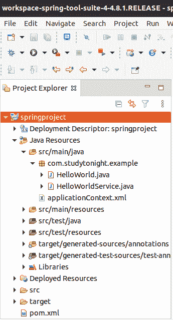

# 使用 STS 的Spring项目

> 原文：<https://www.studytonight.com/spring-framework/spring-project-using-sts>

在本文中，我们将使用 STS 工具创建一个 Spring 项目。STS (Spring 工具套件)是由 Spring 基金会提供的官方 IDE。我们可以用它来创建 spring 应用。它类似于日蚀，如果你熟悉日蚀，那么你会发现它非常容易使用。让我们从下载 STS 开始，然后创建应用。

要下载 STS，您可以访问 Spring 的官方网站，或者只需使用此[链接(下载 STS)](https://spring.io/tools) 。下载后将其安装到您的本地系统，然后运行。

## 创建Spring项目

要创建 Spring 项目，点击**文件**菜单，选择**项目**，进一步弹出几个项目类型，如 Maven 项目、动态项目、Java 项目等。选择 maven 项目是因为我们使用了基于 Maven 的 spring 项目。有关创建基于 Maven 的 Spring 项目的更多细节，请阅读本文 [Maven 项目](https://www.studytonight.com/spring-framework/spring-maven-project)。

现在创建一个项目后，让我们创建一个简单的 hello spring 应用。为了创建应用，我们主要创建了三个文件:

*   HelloWorld.java

*   HelloWorldService.java

*   applicationContext.java

这个项目有一个包含配置和项目依赖关系的 **pom.xml** 文件。您必须向该文件添加 [Spring Dependencies](https://mvnrepository.com/artifact/org.springframework/spring-core) 来配置应用。之后，您的项目结构应该如下所示。

### 项目结构:

以下是创建的新项目的项目结构:



现在让我们逐一查看每个文件中的代码。

### HelloWorld.java

该文件包含用于加载应用上下文文件的代码，该文件被配置为加载 bean。好奇想知道，比恩是什么？别担心，我们将在后面的教程中介绍它。现在，只需创建这个文件。

```java
package com.studytonight.example;
import org.springframework.context.support.ClassPathXmlApplicationContext;
public class HelloWorld {

	public static void main(String[] args) {

		// loading the Bean and XML definitions from the given XML file
		ClassPathXmlApplicationContext context = new ClassPathXmlApplicationContext("applicationContext.xml");
		HelloWorldService obj = context.getBean(HelloWorldService.class);
		obj.hello();
		context.close();
	}
}
```

### HelloWorldService.java

该文件包含将向控制台打印“Hello Spring”消息的代码。用**“helloworldservice . Java”**名称创建此文件。

```java
package com.studytonight.example;

public class HelloWorldService {

	public void hello() {
		System.out.println("Hello Spring!");
	}
}
```

### applicationContext.xml

这是 Spring 项目的配置文件。我们可以给它命名任何东西，但是现在在你的 maven 项目中把它保存为 **applicationContext.xml** 。

```java
<?xml version="1.0" encoding="UTF-8"?>

<beans 
	xmlns:xsi="http://www.w3.org/2001/XMLSchema-instance" xmlns:p="http://www.springframework.org/schema/p"
	xmlns:aop="http://www.springframework.org/schema/aop" xmlns:context="http://www.springframework.org/schema/context"
	xmlns:jee="http://www.springframework.org/schema/jee" xmlns:tx="http://www.springframework.org/schema/tx"
	xmlns:task="http://www.springframework.org/schema/task"
	xsi:schemaLocation="http://www.springframework.org/schema/aop http://www.springframework.org/schema/aop/spring-aop-3.2.xsd http://www.springframework.org/schema/beans http://www.springframework.org/schema/beans/spring-beans-3.2.xsd http://www.springframework.org/schema/context http://www.springframework.org/schema/context/spring-context-3.2.xsd http://www.springframework.org/schema/jee http://www.springframework.org/schema/jee/spring-jee-3.2.xsd http://www.springframework.org/schema/tx http://www.springframework.org/schema/tx/spring-tx-3.2.xsd http://www.springframework.org/schema/task http://www.springframework.org/schema/task/spring-task-3.2.xsd">

	<context:component-scan base-package="com.studytonight.examples" />
	<bean id="helloWorldService"
		class="com.studytonight.example.HelloWorldService">
	</bean>
</beans>
```

### pom.xml 文件

这个文件是 maven 项目的一部分，用于为我们的项目添加依赖项。对于我们的项目，我们添加了 spring 依赖项。这是这个项目最晚的一次。尽管我们可以从 maven 存储库中获得这些最新的依赖项。[Spring依存关系](https://mvnrepository.com/artifact/org.springframework/spring-core)。

```java
<project 
	xmlns:xsi="http://www.w3.org/2001/XMLSchema-instance"
	xsi:schemaLocation="http://maven.apache.org/POM/4.0.0 https://maven.apache.org/xsd/maven-4.0.0.xsd">
	<modelVersion>4.0.0</modelVersion>
	<groupId>com.studytonight</groupId>
	<artifactId>springproject</artifactId>
	<version>0.0.1-SNAPSHOT</version>
	<packaging>jar</packaging>
	<dependencies>
		<dependency>
			<groupId>org.springframework</groupId>
			<artifactId>spring-core</artifactId>
			<version>${spring.version}</version>
		</dependency>
		<dependency>
			<groupId>org.springframework</groupId>
			<artifactId>spring-context</artifactId>
			<version>${spring.version}</version>
		</dependency>
	</dependencies>
	<properties>
		<spring.version>5.2.8.RELEASE</spring.version>
	</properties>
	<build>
		<sourceDirectory>src</sourceDirectory>
		<plugins>
			<plugin>
				<artifactId>maven-compiler-plugin</artifactId>
				<version>3.8.1</version>
				<configuration>
					<source>1.8</source>
					<target>1.8</target>
				</configuration>
			</plugin>
		</plugins>
	</build>
</project>
```

## 运行应用:

运行此应用(项目)并获得以下结果。因为它不是一个 web 应用，所以我们可以简单地将它作为一个 Java 应用来运行。

你好春天！

* * *

* * *