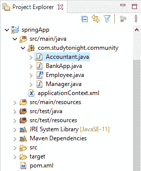

# Spring 注解和基于 XML 的配置

> 原文：<https://www.studytonight.com/spring-framework/spring-annotation-and-xml-based-configuration>

在本主题中，我们将学习创建一个字符串应用，并使用 **XML 和注释**代码对其进行配置。让我们创建一个 maven 项目，并使用 XML 文件对其进行配置。如果你不熟悉 maven 项目，那么你可以在这里阅读我们的详细文章[。](https://www.studytonight.com/spring-framework/spring-maven-project)

以下是我们项目中创建的文件。这些文件的源代码如下。

*   Employee.java

*   Accountant.java

*   Manager.java

*   银行应用.java

*   applicationContext.xml

下面是我们在创建了以上所有文件(**Java****XML**)之后的项目结构。

## Spring 项目结构:

以下是 spring 项目的项目结构:



让我们为项目创建 Java 类和 XML 文件。

### 银行应用.java

它是一个配置文件，读取`applicationContext`文件，使用`getBean()`方法获取 Bean，然后根据检索到的对象调用方法。

```java
package com.studytonight.community;

import org.springframework.context.ApplicationContext;
import org.springframework.context.support.ClassPathXmlApplicationContext;

public class BankApp {

	private static ApplicationContext context;
	public static void main(String[] args) {

		context = new ClassPathXmlApplicationContext("applicationContext.xml");
		Employee e = (Employee) context.getBean("manager");
		e.doWork();
	}

}
```

### Employee.java

它是一个包含抽象方法 doWork()的接口，该方法将被实现的类覆盖。

```java
package com.studytonight.community;

public interface Employee {

	void doWork();

}
```

### Accountant.java

我们的 bean 类将用于执行实现。实现`Employee`接口，实现`doWork()`方法。

```java
package com.studytonight.community;
import org.springframework.stereotype.Component;
@Component
public class Accountant implements Employee{

	public void doWork() {

		System.out.println("Audit the accounts...");
	}
}
```

### Manager.java

这是另一个实现`Employee`接口并覆盖`doWork()`方法的类。

```java
package com.studytonight.community;
import org.springframework.stereotype.Component;

@Component
public class Manager implements Employee{

	public void doWork() {

		System.out.println("Manage the branch office");
	}
}
```

### applicationContext.xml

这是一个配置 spring 并注册 bean 的应用上下文文件。

```java
<?xml version="1.0" encoding="UTF-8"?>
<beans 
	xmlns:xsi="http://www.w3.org/2001/XMLSchema-instance"
	xmlns:context="http://www.springframework.org/schema/context"
	xsi:schemaLocation="http://www.springframework.org/schema/beans 
                           http://www.springframework.org/schema/beans/spring-beans.xsd
                           http://www.springframework.org/schema/context 
                           http://www.springframework.org/schema/context/spring-context.xsd">

	<context:component-scan base-package="com.studytonight.community"></context:component-scan>

</beans>
```

### pom.xml 文件

这个文件包含这个项目的所有依赖项，比如 spring jars、servlet jars 等。将这些依赖项放入项目中以运行应用。

```java
<project  xmlns:xsi="http://www.w3.org/2001/XMLSchema-instance" xsi:schemaLocation="http://maven.apache.org/POM/4.0.0 https://maven.apache.org/xsd/maven-4.0.0.xsd">
  <modelVersion>4.0.0</modelVersion>
  <groupId>com.studytonight</groupId>
  <artifactId>springApp</artifactId>
  <version>0.0.1-SNAPSHOT</version>
  <dependencies>
		<!-- https://mvnrepository.com/artifact/org.springframework/spring-web -->
		<dependency>
			<groupId>org.springframework</groupId>
			<artifactId>spring-core</artifactId>
			<version>${spring.version}</version>
		</dependency>
		<dependency>
			<groupId>org.springframework</groupId>
			<artifactId>spring-context</artifactId>
			<version>${spring.version}</version>
		</dependency>
		<dependency>
			<groupId>javax.annotation</groupId>
			<artifactId>javax.annotation-api</artifactId>
			<version>1.3.2</version>
		</dependency>
	</dependencies>
	<properties>
		<spring.version>5.2.8.RELEASE</spring.version>
	</properties>
	<build>
		<sourceDirectory>src</sourceDirectory>
		<plugins>
			<plugin>
				<artifactId>maven-compiler-plugin</artifactId>
				<version>3.8.1</version>
				<configuration>
					<source>1.8</source>
					<target>1.8</target>
				</configuration>
			</plugin>
		</plugins>

	</build>
</project>
```

### 运行应用:

成功完成项目并添加依赖项后，运行应用，您将获得如下输出。

管理分公司

* * *

* * *