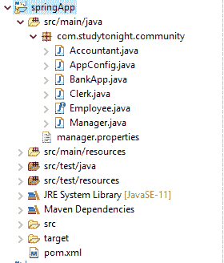

# 使用 Java 的春季配置(无 XML)

> 原文：<https://www.studytonight.com/spring-framework/spring-configuration-using-java-no-xml>

在本教程中，我们将创建一个 spring 项目，并使用 Java 代码对其进行配置。我们将不使用任何 XML 代码，只使用 Java 代码。该项目包含以下文件。

*   银行应用程序.java

*   AppConfig.java

*   Accountant.java

*   Manager.java

*   Employee.java

*   pom.xml 文件

下面是为 Spring 应用程序创建的 maven 项目结构。

## **春季项目-结构:**

以下是 spring 项目的项目结构:



在上述项目中创建的文件包含以下代码。请参见下面的文件。

### 银行应用程序.java

该文件包含为我们的应用程序创建 IOC 容器的代码。AnnotationConfigApplicationContext 类用于为应用程序上下文创建对象。

```java
package com.studytonight.community;

import org.springframework.context.annotation.AnnotationConfigApplicationContext;

public class BankApp {

	public static void main(String[] args) {

		AnnotationConfigApplicationContext context = new AnnotationConfigApplicationContext(AppConfig.class);
		Manager employee = context.getBean(Manager.class);
		employee.doWork();
		context.close();
	}
}
```

### AppConfig.java

这是一个 Java 配置文件，它是我们为基于 xml 的配置示例创建的 **applicationContext.xml** 文件的替代文件。`@Configuration`注释表示这不是一个简单的类，而是一个配置类，`@ComponentScan`注释用于表示我们 spring 项目中的组件位置。

```java
package com.studytonight.community;

import org.springframework.context.annotation.ComponentScan;
import org.springframework.context.annotation.Configuration;

@Configuration
@ComponentScan("com.studytonight.community")
public class AppConfig {

}
```

### Accountant.java

这是一个使用`@Component`标注的组件类。它实现了`Employee`接口并覆盖了它的方法`doWork()`。

```java
package com.studytonight.community;

import org.springframework.stereotype.Component;

@Component
public class Accountant implements Employee{

	public void doWork() {

		System.out.println("Auditing Accounts...");

	}
}
```

### Manager.java

这是另一个使用`@Component`注释标记并实现`Employee`接口的组件类。

```java
package com.studytonight.community;
import org.springframework.stereotype.Component;
@Component
public class Manager implements Employee{

	public void doWork() {

		System.out.println("Manage the branch office");
	}
}
```

### Employee.java

这是一个包含`doWork()`抽象方法的界面`Employee`。每个实现这个接口的类都必须覆盖`doWork()`方法。

```java
package com.studytonight.community;

public interface Employee {

	void doWork();

}
```

### pom.xml 文件

这个文件包含这个项目的所有依赖项，比如 spring jars、servlet jars 等。将这些依赖项放入项目中以运行应用程序。

```java
<project  xmlns:xsi="http://www.w3.org/2001/XMLSchema-instance" xsi:schemaLocation="http://maven.apache.org/POM/4.0.0 https://maven.apache.org/xsd/maven-4.0.0.xsd">
  <modelVersion>4.0.0</modelVersion>
  <groupId>com.studytonight</groupId>
  <artifactId>springApp</artifactId>
  <version>0.0.1-SNAPSHOT</version>
  <dependencies>
		<!-- https://mvnrepository.com/artifact/org.springframework/spring-web -->
		<dependency>
			<groupId>org.springframework</groupId>
			<artifactId>spring-core</artifactId>
			<version>${spring.version}</version>
		</dependency>
		<dependency>
			<groupId>org.springframework</groupId>
			<artifactId>spring-context</artifactId>
			<version>${spring.version}</version>
		</dependency>
		<dependency>
			<groupId>javax.annotation</groupId>
			<artifactId>javax.annotation-api</artifactId>
			<version>1.3.2</version>
		</dependency>
	</dependencies>
	<properties>
		<spring.version>5.2.8.RELEASE</spring.version>
	</properties>
	<build>
		<sourceDirectory>src</sourceDirectory>
		<plugins>
			<plugin>
				<artifactId>maven-compiler-plugin</artifactId>
				<version>3.8.1</version>
				<configuration>
					<source>1.8</source>
					<target>1.8</target>
				</configuration>
			</plugin>
		</plugins>

	</build>
</project>
```

## 运行应用程序:

成功完成项目并添加依赖项后，运行应用程序，您将获得如下输出。

管理分公司

* * *

* * *