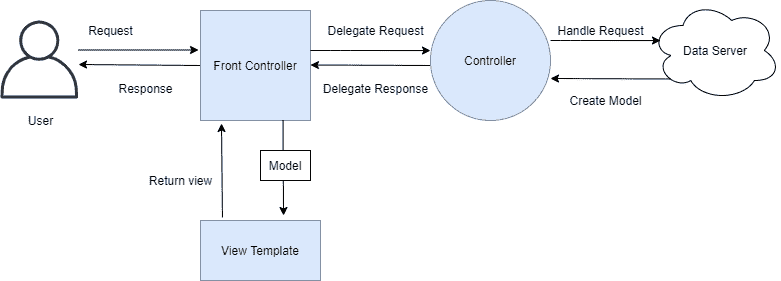

# Spring MVC 简介

> 原文：<https://www.studytonight.com/spring-framework/spring-mvc-introduction>

spring MVC 是一个 Spring 模块，用于使用 Spring 框架创建 web 应用。Spring 提供了一个源模块`spring-webmvc`来构建基于 MVC 的 web 应用。

## 什么是 MVC？

MVC 是一种用于创建应用的设计模式。MVC 代表模型、视图和控制器。它由三个组件模型、视图和控制器组成，在下面的架构中，我们可以看到 MVC 组件是如何交互和协同工作的。我们将在后面的教程中详细介绍 MVC 的每个组件，但是现在，我们可以将其理解为 Controller 是一个请求处理程序，它处理用户请求并响应请求的视图页面。视图是一个页面，可以是一个 HTML 或 JSP 页面，作为结果呈现，而模型表示数据库表，用于应用和数据库之间的数据处理。

Spring MVC 使用 Servlet Dispatcher 作为前端控制器，主要作为请求处理程序工作，也处理所有用户定义的控制器。

## Spring MVC 架构



**用户:**用户是客户端-服务器架构中请求资源的客户端。

[**视图:**](https://www.studytonight.com/tutorials/preview?subject=spring-framework&url=spring-mvc-view) 视图是 MVC 架构中的一个组件，代表一个 HTML/JSP 文件，由控制器随机生成。例如，

**//hello.jsp**

```java
<%@ page language="java" contentType="text/html; charset=UTF-8"
    pageEncoding="UTF-8"%>
<!DOCTYPE html>
<html>
<head>
<meta charset="UTF-8">
<title>Hello JSP</title>
</head>
<body>
<h1>Hello, Welcome to JSP</h1>
</body>
</html>
```

**前端控制器:**它是 Spring 框架的内置控制器，用于处理 web 应用的所有请求。Spring 的`DispatcherServlet`作为前置控制器工作。

**模型:**它是一个组件，是 MVC 架构的一部分，代表一个类。该模型用于编写业务逻辑和获取器、设置器方法。例如，

**//User.java**

```java
package com.studytonight.models;

public class User {
	int id;
	String name;
	String lastName;
	String email;

	public User(int id, String name, String lastName, String email) {
		//super();
		this.id = id;
		this.name = name;
		this.lastName = lastName;
		this.email = email;
	}
	public int getId() {
		return id;
	}
	public void setId(int id) {
		this.id = id;
	}
	public String getName() {
		return name;
	}
	public void setName(String name) {
		this.name = name;
	}
	public String getLastName() {
		return lastName;
	}
	public void setLastName(String lastName) {
		this.lastName = lastName;
	}
	public String getEmail() {
		return email;
	}
	public void setEmail(String email) {
		this.email = email;
	}
}
```

**控制器:**用于处理 web 应用中的客户端请求。它接收来自用户的请求，并在与模型和数据库协调后发送所请求的视图。在 Spring 应用中，标记有@Controller 或@RestController 注释的类被视为控制器，可以用来处理请求和响应。例如，

```java
package com.studytonight.controllers;
import java.util.List;
import org.springframework.beans.factory.annotation.Autowired;
import org.springframework.stereotype.Controller;
import org.springframework.web.bind.annotation.GetMapping;
import org.springframework.web.bind.annotation.ResponseBody;
import com.studytonight.models.User;
import com.studytonight.service.UserService;

@Controller
public class UserController {

	@Autowired
	private UserService userService;

	@GetMapping("/users")
	@ResponseBody
	public void users() {
		List<User> users =  userService.getUser();
		for(User user: users) {
			System.out.println(user.getFirstName()+" "+user.getLastName()+" "+user.getEmail());
		}
	}
}
```

好了，到这里为止，希望你已经有了 MVC 的概念，以及 MVC 在 web 应用中是如何工作的。在下一个主题中，我们将介绍 MVC 组件和工作示例。

* * *

* * *