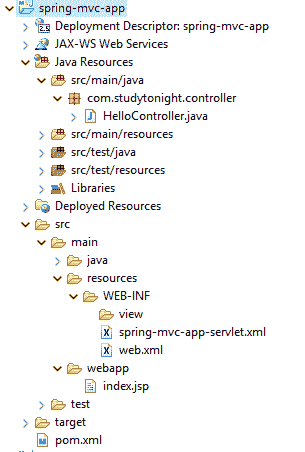
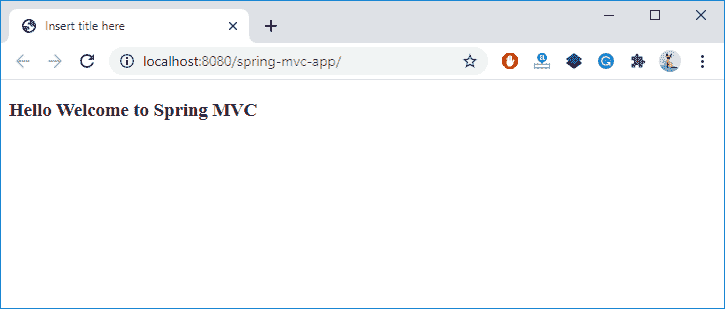
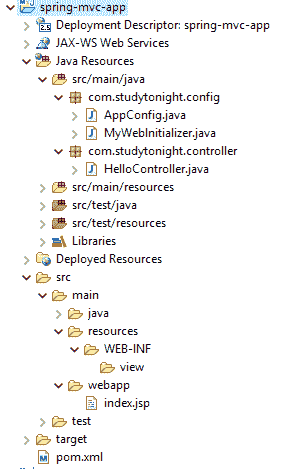

# Spring MVC 你好世界应用

> 原文：<https://www.studytonight.com/spring-framework/spring-mvc-hello-world-application>

在本文中，我们将使用 [Spring](https://www.studytonight.com/tutorials/preview?subject=spring-framework&url=spring-introduction) [MVC](https://www.studytonight.com/tutorials/preview?subject=spring-framework&url=spring-mvc-introduction) 创建一个简单的 hello world 应用程序。我们创建了一个基于 [maven](https://www.studytonight.com/tutorials/preview?subject=spring-framework&url=spring-maven-project) 的 Spring 项目，它包含一个控制器、一个视图(JSP 文件)和一些 XML 文件。我们的项目如下图所示。

## 项目结构



### 项目文件源代码:

**//HelloController.java**

是一个控制器类文件，使用`@Controller`标注，返回一个索引 JSP 页面作为 MVC 的视图组件。

```java
package com.studytonight.controller;

import org.springframework.stereotype.Controller;

@Controller
public class HelloController {

	public String hello() {
		return "index";
	}
} 
```

**//spring-MVC-app-servlet . XML**

这是一个配置文件，包含基本包定位器和`InternalResourceViewResolver`通过给视图(JSP)文件添加后缀和前缀来获取视图。

```java
<?xml version="1.0" encoding="UTF-8"?>
<beans 
	xmlns:xsi="http://www.w3.org/2001/XMLSchema-instance" 
	xmlns:context="http://www.springframework.org/schema/context"
	xmlns:mvc="http://www.springframework.org/schema/mvc"
	xsi:schemaLocation="
		http://www.springframework.org/schema/beans
    	http://www.springframework.org/schema/beans/spring-beans.xsd
    	http://www.springframework.org/schema/context
    	http://www.springframework.org/schema/context/spring-context.xsd
    	http://www.springframework.org/schema/mvc
        http://www.springframework.org/schema/mvc/spring-mvc.xsd">

	<!-- Step 3: Add support for component scanning -->
	<context:component-scan base-package="com.studytonight.controller" />

	<!-- Step 4: Add support for conversion, formatting and validation support -->
	<mvc:annotation-driven/>

	<!-- Step 5: Define Spring MVC view resolver -->
	<bean
		class="org.springframework.web.servlet.view.InternalResourceViewResolver">
		<property name="prefix" value="/WEB-INF/view/" />
		<property name="suffix" value=".jsp" />
	</bean>
</beans> 
```

**// web.xml**

当我们使用 Spring MVC 时，这个 XML 文件是必需的，用于配置前端控制器 DispatcherServlet 和应用程序上下文文件。

```java
<?xml version="1.0" encoding="UTF-8"?>
<web-app xmlns:xsi="http://www.w3.org/2001/XMLSchema-instance"

	xsi:schemaLocation="http://xmlns.jcp.org/xml/ns/javaee http://xmlns.jcp.org/xml/ns/javaee/web-app_3_1.xsd"
	id="WebApp_ID" version="3.1">

	<display-name>spring-mvc-app</display-name>

	<absolute-ordering />

	<!-- Spring MVC Configs -->

	<!-- Step 1: Configure Spring MVC Dispatcher Servlet -->
	<servlet>
		<servlet-name>dispatcher</servlet-name>
		<servlet-class>org.springframework.web.servlet.DispatcherServlet</servlet-class>
		<init-param>
			<param-name>contextConfigLocation</param-name>
			<param-value>/WEB-INF/spring-mvc-demo-servlet.xml</param-value>
		</init-param>
		<load-on-startup>1</load-on-startup>
	</servlet>

	<!-- Step 2: Set up URL mapping for Spring MVC Dispatcher Servlet -->
	<servlet-mapping>
		<servlet-name>dispatcher</servlet-name>
		<url-pattern>/</url-pattern>
	</servlet-mapping>

</web-app>
```

**//index.jsp**

这是一个视图文件，将由控制器返回给客户端。

```java
<%@ page language="java" contentType="text/html; charset=ISO-8859-1"
    pageEncoding="ISO-8859-1"%>
<!DOCTYPE html>
<html>
<head>
<meta charset="ISO-8859-1">
<title>Hello Spring</title>
</head>
<body>
<p>Hello Welcome to Spring MVC</p>
</body>
</html>
```

### 输出:

运行该应用程序，您将在浏览器中获得如下输出。



## Spring MVC 的无 XML 配置

在这种情况下，我们希望仅使用 Java 代码(无 XML)配置 Dispatcher servelet，然后将以下文件包含到您的项目中，并删除**spring-MVC-app-servlet . XML**和 **web.xml** 文件。

### 项目结构



配置文件有以下源代码。

**//MyWebInitializer.java**

这个类类似于 web.xml，用于为 Spring 应用程序配置 DispatcherServlet。`getServletConfigClasses()`方法用于加载 AppConfig.java 类。

```java
package com.studytonight.config;
import org.springframework.web.servlet.support.AbstractAnnotationConfigDispatcherServletInitializer;
public class MyWebInitializer extends AbstractAnnotationConfigDispatcherServletInitializer {

	@Override
	protected Class<?>[] getRootConfigClasses() {
		// TODO Auto-generated method stub
		return null;
	}

	@Override
	protected Class<?>[] getServletConfigClasses() {
		return new Class[] { AppConfig.class };
	}

	@Override
	protected String[] getServletMappings() {
		return new String[] { "/" };
	}
}
```

//app config . Java

这类似于我们配置视图文件的应用程序上下文。在这里，我们使用了`InternalResourceViewResolver`类及其方法`setPrefix()`、`setSuffix()`来配置视图文件。

```java
package com.studytonight.config;
import org.springframework.context.annotation.Bean;
import org.springframework.context.annotation.Configuration;
import org.springframework.web.servlet.ViewResolver;
import org.springframework.web.servlet.config.annotation.EnableWebMvc;
import org.springframework.web.servlet.view.InternalResourceViewResolver;

@Configuration
@EnableWebMvc
public class AppConfig {
	// define a bean for ViewResolver
	@Bean
	public ViewResolver viewResolver() {
		InternalResourceViewResolver viewResolver = new InternalResourceViewResolver();
		viewResolver.setPrefix("/WEB-INF/view/");
		viewResolver.setSuffix(".jsp");
		return viewResolver;
	}
}
```

将这些文件添加到项目中并运行项目。它将产生类似的输出。

* * *

* * *