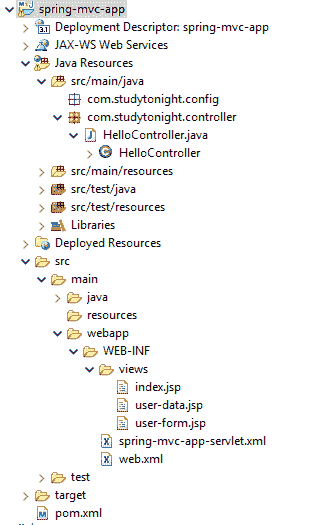
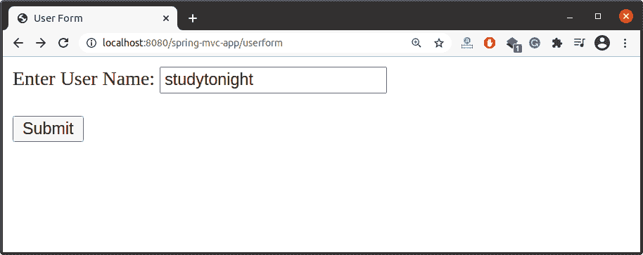
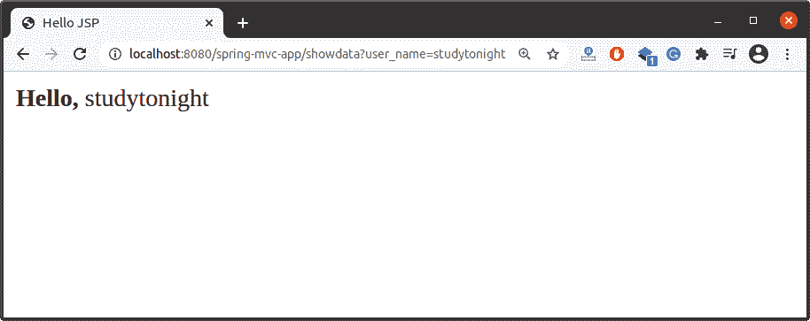

# Spring MVC 处理表单数据

> 原文：<https://www.studytonight.com/spring-framework/spring-mvc-handling-form-data>

在本文中，我们将创建一个 Spring 应用，并将 HTML 表单数据提取到 JSP 页面中。

我们将使用**参数**隐式对象来获取表单数据。下面是我们的项目结构，显示了我们项目中可用的文件。

### 项目结构



**// HelloController.java**

这是一个控制器类，包含两种方法`showForm()`和`showdata()`。`showForm()`方法与用户表单请求映射，用于返回用户表单。

```java
package com.studytonight.controller;
import org.springframework.stereotype.Controller;
import org.springframework.web.bind.annotation.RequestMapping;
import org.springframework.web.bind.annotation.RequestMethod;

@Controller
public class HelloController {

	@RequestMapping(value = "userform", method = RequestMethod.GET)
	public String showForm() {
		return "user-form";
	}	

	@RequestMapping(value = "showdata", method = RequestMethod.GET)
	public String showdata() {
		return "user-data";
	}
}
```

**//user-form.jsp**

这是我们的 HTML 表单页面，它接受用户输入，并在 showdata mapping 处将其提交给服务器。该请求将由控制器(家庭控制器)处理。

```java
<%@ page language="java" contentType="text/html; charset=ISO-8859-1"
    pageEncoding="ISO-8859-1"%>
<!DOCTYPE html>
<html>
<head>
<meta charset="ISO-8859-1">
<title>User Form</title>
</head>
<body>
<form action="showdata" method="Get">
	<input type="text" name="user_name"><br/><br/>
	<input type="submit" />
</form>
</body>
</html>
```

**//user-data.jsp**

此页面显示用户以 HTML 形式输入的输入。控制器将此页面作为响应返回给客户端。该页面使用**表达式语言**获取用户表单数据。这里，**参数**是一个包含所有请求数据的 JSP 隐式对象。

```java
<%@ page language="java" contentType="text/html; charset=ISO-8859-1"
    pageEncoding="ISO-8859-1"%>
<!DOCTYPE html>
<html>
<head>
<meta charset="ISO-8859-1">
<title>Hello JSP</title>
</head>
<body>
<strong>Hello,</strong>
${param.user_name}
</body>
</html>
```

这些是 Spring 配置 XML 文件，配置视图文件和 dispatcher servlet，为应用提供一个前端控制器。

**//spring-MVC-app-servlet . XML**

```java
<?xml version="1.0" encoding="UTF-8"?>
<beans 
	xmlns:xsi="http://www.w3.org/2001/XMLSchema-instance" 
	xmlns:context="http://www.springframework.org/schema/context"
	xmlns:mvc="http://www.springframework.org/schema/mvc"
	xsi:schemaLocation="
		http://www.springframework.org/schema/beans
    	http://www.springframework.org/schema/beans/spring-beans.xsd
    	http://www.springframework.org/schema/context
    	http://www.springframework.org/schema/context/spring-context.xsd
    	http://www.springframework.org/schema/mvc
        http://www.springframework.org/schema/mvc/spring-mvc.xsd">

	<!-- Step 3: Add support for component scanning -->
	<context:component-scan base-package="com.studytonight.controller" />

	<!-- Step 4: Add support for conversion, formatting and validation support -->
	<mvc:annotation-driven/>

	<!-- Step 5: Define Spring MVC view resolver -->
	<bean
		class="org.springframework.web.servlet.view.InternalResourceViewResolver">
		<property name="prefix" value="/WEB-INF/views/" />
		<property name="suffix" value=".jsp" />
	</bean>
</beans> 
```

**// web.xml**

```java
<?xml version="1.0" encoding="UTF-8"?>
<web-app xmlns:xsi="http://www.w3.org/2001/XMLSchema-instance"

	xsi:schemaLocation="http://xmlns.jcp.org/xml/ns/javaee http://xmlns.jcp.org/xml/ns/javaee/web-app_3_1.xsd"
	id="WebApp_ID" version="3.1">

	<display-name>spring-mvc-app</display-name>

	<absolute-ordering />

	<!-- Spring MVC Configs -->

	<!-- Step 1: Configure Spring MVC Dispatcher Servlet -->
	<servlet>
		<servlet-name>dispatcher</servlet-name>
		<servlet-class>org.springframework.web.servlet.DispatcherServlet</servlet-class>
		<init-param>
			<param-name>contextConfigLocation</param-name>
			<param-value>/WEB-INF/spring-mvc-app-servlet.xml</param-value>
		</init-param>
		<load-on-startup>1</load-on-startup>
	</servlet>

	<!-- Step 2: Set up URL mapping for Spring MVC Dispatcher Servlet -->
	<servlet-mapping>
		<servlet-name>dispatcher</servlet-name>
		<url-pattern>/</url-pattern>
	</servlet-mapping>

</web-app>
```

//POM . XML

这个文件包含这个项目的所有依赖项，比如 spring jars、servlet jars 等。将这些依赖项放入项目中以运行应用。

```java
<project 
	xmlns:xsi="http://www.w3.org/2001/XMLSchema-instance"
	xsi:schemaLocation="http://maven.apache.org/POM/4.0.0 https://maven.apache.org/xsd/maven-4.0.0.xsd">
	<modelVersion>4.0.0</modelVersion>
	<groupId>com.studytonight</groupId>
	<artifactId>spring-mvc-app</artifactId>
	<version>0.0.1-SNAPSHOT</version>
	<packaging>war</packaging>
	<dependencies>
		<dependency>
			<groupId>org.springframework</groupId>
			<artifactId>spring-core</artifactId>
			<version>${spring.version}</version>
		</dependency>
		<dependency>
			<groupId>org.springframework</groupId>
			<artifactId>spring-context</artifactId>
			<version>${spring.version}</version>
		</dependency>
		<dependency>
			<groupId>org.springframework</groupId>
			<artifactId>spring-webmvc</artifactId>
			<version>${spring.version}</version>
		</dependency>
		<dependency>
			<groupId>com.fasterxml.jackson.core</groupId>
			<artifactId>jackson-databind</artifactId>
			<version>2.10.0.pr3</version>
		</dependency>
		<!-- https://mvnrepository.com/artifact/javax.xml.bind/jaxb-api -->
		<dependency>
			<groupId>javax.xml.bind</groupId>
			<artifactId>jaxb-api</artifactId>
			<version>2.3.0</version>
		</dependency>
	</dependencies>
	<properties>
		<spring.version>5.2.8.RELEASE</spring.version>
	</properties>
	<build>
		<plugins>
			<plugin>
				<artifactId>maven-war-plugin</artifactId>
				<version>3.2.3</version>
				<configuration>
					<warSourceDirectory>WebContent</warSourceDirectory>
				</configuration>
			</plugin>
		</plugins>
	</build>
</project>
```

### 运行应用

成功完成项目并添加依赖项后，运行应用，您将获得如下输出。输入用户名后提交表单。



这是显示上述用户名提交的用户名的第二个 JSP 页面。



* * *

* * *