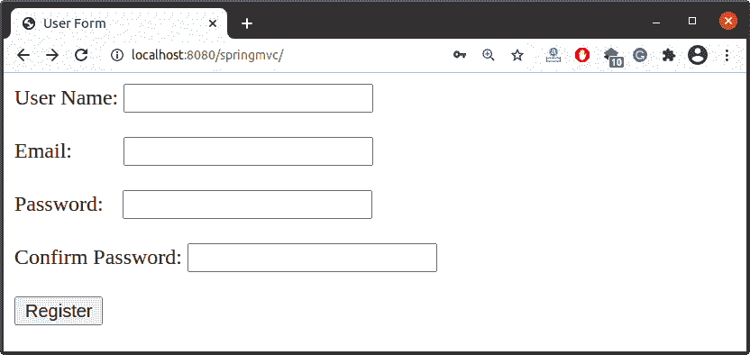
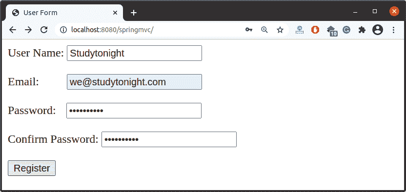
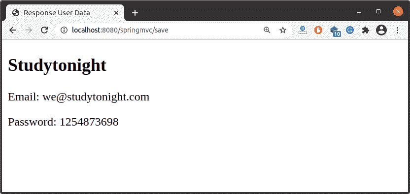

# Spring MVC 表单标签

> 原文：<https://www.studytonight.com/spring-framework/spring-mvc-form-tags>

Spring 提供了一个表单标签库来使用 JSP 实现视图页面。它提供了用于创建 HTML 组件、错误消息、主题和国际化消息的标签。当您使用 Spring MVC 时，它非常有用。

它是一个内置的库，因此我们可以通过使用以下标签在 JSP 页面上使用它:

```java
<%@ taglib prefix="form" uri="http://www.springframework.org/tags/form"%>
```

添加这个标签后，我们可以使用**表单前缀**创建一个 HTML 表单。例如，要创建一个输入文本，我们可以这样使用它:

```java
<form:input type="text" path="name" />
```

它相当于下面的 HTML 代码。

```java
<input id="name" name="name" type="text" value=""/>
```

### Spring MVC 表单标签列表

Spring 提供了以下标签，可用于在应用程序中创建表单。

| 表单标签 | 描述 | 例子 |
| 表单:表单 | 它是一个表单标签，用于创建一个 HTML 表单。 | 

```java
<form:form action="save" method="post" modelAttribute="user">
```

 |
| 表单:输入 | 这是一个用于创建文本字段的输入标签。 | 

```java
<form:input type="text" path="name" />
```

 |
| 表单:单选按钮 | 这是一个用于创建单选按钮的单选标签。 | 

```java
<form:radiobutton path="choice" />
```

 |
| 表单:复选框 | 这是一个用于创建复选框的复选框标签。 | 

```java
<form:checkbox path="india" value="91"/>
```

 |
| 表单:密码 | 它是一个输入标签，用于创建密码输入字段。 | 

```java
<form:input type="password" path="password" />
```

 |
| 表单:选择 | 这是一个用于创建下拉列表的选择标记。 | 

```java
<form:select path="country_names" />
```

 |
| 表单:文本区域 | 该标签用于生成多行文本字段。 | 

```java
<form:textarea path="name" col="5" row="2" />
```

 |
| 表单:隐藏 | 这是一个用于创建隐藏输入字段的输入标签。 | 

```java
<form:hidden path="name" />
```

 |
| 球衣 | 这是一个选项标签，用于创建一个单一的 HTML 选项。 | 

```java
<form:select path="name" value="1">
    <form:option value="1">1</form:option>
	<form:option value="2">2</form:option>
</form:select>
```

 |
| 表单:标签 | 这是一个标签标签，用于创建表单域标签标签。 | 

```java
<form:label path="contact">Contact</form:label>
```

 |

## 举例时间:

让我们创建一个基于 maven 的 Spring 示例，使用 Spring 表单标签库生成表单。在这里，我们已经给出了我们项目的一些基本源文件。您可以参考它们来了解 Spring 表单标签库。给定的类文件是我们配置 MVC 应用程序及其视图的配置文件。

```java
package com.studytonight;
import org.springframework.context.annotation.Bean;
import org.springframework.context.annotation.ComponentScan;
import org.springframework.context.annotation.Configuration;
import org.springframework.web.servlet.ViewResolver;
import org.springframework.web.servlet.config.annotation.WebMvcConfigurer;
import org.springframework.web.servlet.view.InternalResourceViewResolver;

@Configuration
@ComponentScan("com.studytonight")
public class AppConfig implements WebMvcConfigurer{
	@Bean
	public ViewResolver viewResolver() {
		InternalResourceViewResolver irvr = new InternalResourceViewResolver();
		irvr.setPrefix("WEB-INF/views/");
		irvr.setSuffix(".jsp");
		irvr.setOrder(0);
		return irvr;
	}
}
```

//main app . Java

正是我们的 ServlertDispatcher 类创建了应用程序上下文并注册了我们的配置类。

```java
package com.studytonight;

import javax.servlet.ServletContext;
import javax.servlet.ServletException;
import javax.servlet.ServletRegistration;
import org.springframework.web.WebApplicationInitializer;
import org.springframework.web.context.support.AnnotationConfigWebApplicationContext;
import org.springframework.web.servlet.DispatcherServlet;
public class MainApp implements WebApplicationInitializer {

	@Override
	public void onStartup(ServletContext servletContext) throws ServletException { 
		AnnotationConfigWebApplicationContext context = new AnnotationConfigWebApplicationContext();
		context.register(AppConfig.class);
		context.setServletContext(servletContext);
		ServletRegistration.Dynamic servlet = servletContext.addServlet("dispatcher", new DispatcherServlet(context));
		servlet.setLoadOnStartup(1);
		servlet.addMapping("/");
		context.close();	
	}
}
```

//user controller . Java

这是一个控制器类，包含两个方法 index()和 save()，index()用于呈现包含使用 Tag 库创建的用户表单的 JSP 页面，第二个方法返回另一个显示用户输入的数据的 JSP 页面。

```java
package com.studytonight.controller;

import org.springframework.stereotype.Controller;
import org.springframework.ui.Model;
import org.springframework.web.bind.annotation.GetMapping;
import org.springframework.web.bind.annotation.ModelAttribute;
import org.springframework.web.bind.annotation.PostMapping;
import com.studytonight.model.User;

@Controller
public class UserController {

	@GetMapping("/")
	public String index(Model model) {
		model.addAttribute("user", new User());
		return "index";
	}

	@PostMapping("save")
	public String save(@ModelAttribute("user") User user, Model model) {
		model.addAttribute("user", user);
		return "response";
	}
}
```

**//User.java**

它是一个 bean 类，用于保存应用程序中的用户数据。

```java
package com.studytonight.model;

public class User {

	private int id;
	private String name;
	private String email;
	private String password;
	private String confirm_password;

	public int getId() {
		return id;
	}
	public void setId(int id) {
		this.id = id;
	}
	public String getName() {
		return name;
	}
	public void setName(String name) {
		this.name = name;
	}
	public String getEmail() {
		return email;
	}
	public void setEmail(String email) {
		this.email = email;
	}
	public String getPassword() {
		return password;
	}
	public void setPassword(String password) {
		this.password = password;
	}
	public String getConfirm_password() {
		return confirm_password;
	}
	public void setConfirm_password(String confirm_password) {
		this.confirm_password = confirm_password;
	}
}
```

**查看文件**

在这里，您可以看到我们在 JSP 页面中使用 Spring 标签库创建了一个用户表单。我们使用了几个标签，如文本框、电子邮件、密码框等。

//index.jsp

```java
<%@ page language="java" contentType="text/html; charset=UTF-8"
	pageEncoding="UTF-8"%>
<%@ taglib prefix="form" uri="http://www.springframework.org/tags/form"%>

<!DOCTYPE html>
<html>
<head>
<meta charset="UTF-8">
<title>User Form</title>
</head>
<body>
	<form:form action="save" method="post" modelAttribute="user">
		User Name: <form:input type="text" path="name" />
		<br>
		<br>
		Email: <form:input type="email" path="email" style="margin-left:34px;" />
		<br>
		<br> 
		Password: <form:input type="password" path="password"  style="margin-left:10px;" />
		<br>
		<br>
		Confirm Password: <form:input type="password" path="confirm_password" />
		<br>
		<br>
		<input type="submit" value="Register">
	</form:form>
</body>
</html>
```

//response.jsp

```java
<%@ page language="java" contentType="text/html; charset=UTF-8"
	pageEncoding="UTF-8"%>
<!DOCTYPE html>
<html>
<head>
<meta charset="UTF-8">
<title>Response User Data</title>
</head>
<body>
	<h2>${user.name}</h2>
	<p>Email: ${user.email}</p>
	<p>Password: ${user.password}</p>
</body>
</html>
```

### 运行应用程序

成功完成项目并添加依赖项后，使用服务器运行应用程序，您将获得如下输出。

### 使用表单标签创建的用户表单



### 输入用户信息



### 检索数据

//response.jsp 文件



* * *

* * *