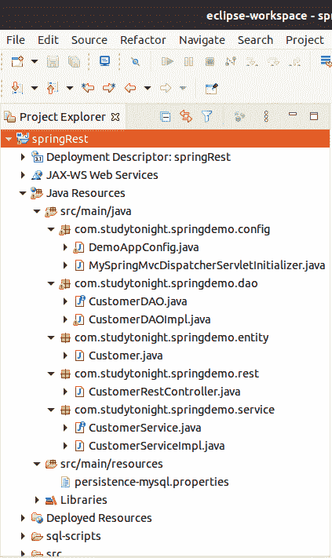
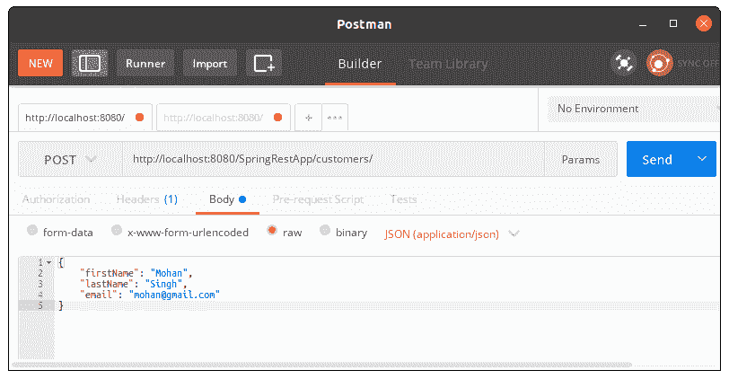
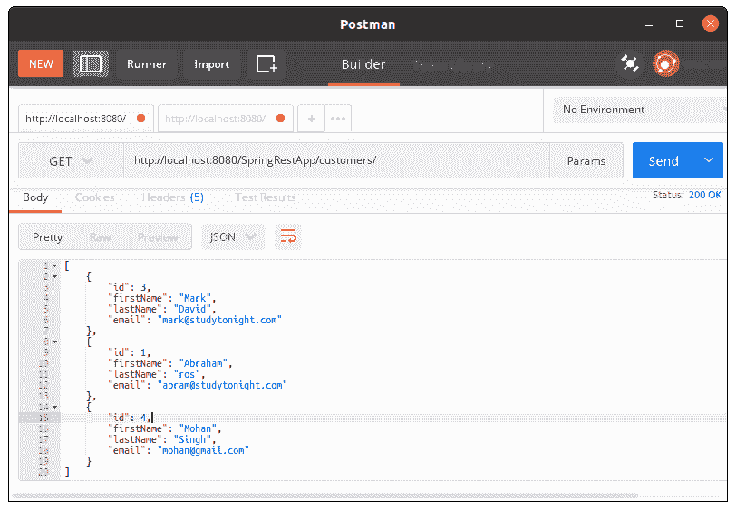
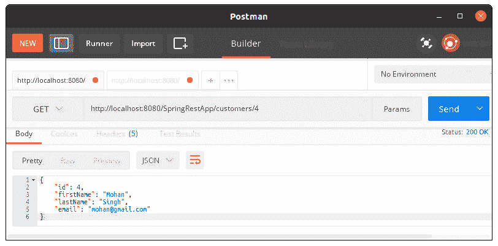

# Spring REST CURD应用

> 原文：<https://www.studytonight.com/spring-framework/spring-rest-crud-application>

在本文中，我们将创建一个 CRUD(创建、读取、更新和删除)Spring 应用。这个应用使用 REST(表示状态转移)方法来执行 CRUD 操作。它使用 [@RestController](https://www.studytonight.com/spring-framework/spring-restcontroller) 注释来创建一个控制器，该控制器处理请求并将响应以 JSON 格式发回。

REST 是一种架构风格，包含一组创建 web 服务的约束。可以参考我们关于 [REST API](https://www.studytonight.com/rest-web-service/types-of-webservices) 的文章。我们也可以用这种方法执行 CRUD 操作。让我们通过示例来理解并创建一个基于 maven 的项目，该项目包含几个文件，其结构如下所示。

### 项目结构

### 

**// DemoAppConfig.java**

这是一个 Java 配置文件，它是我们为基于 xml 的配置示例创建的 **applicationContext.xml** 文件的替代文件。`@Configuration`注释表示这不是一个简单的类，而是一个配置类，`@ComponentScan`注释用于表示我们 spring 项目中的组件位置。

`@PropertySource`注释用于读取属性文件。在这里，我们已经设置了数据库配置和会话工厂来使用数据库。

```java
package com.studytonight.springdemo.config;

import java.beans.PropertyVetoException;
import java.util.Properties;
import java.util.logging.Logger;
import javax.sql.DataSource;
import org.hibernate.SessionFactory;
import org.springframework.beans.factory.annotation.Autowired;
import org.springframework.context.annotation.Bean;
import org.springframework.context.annotation.ComponentScan;
import org.springframework.context.annotation.Configuration;
import org.springframework.context.annotation.PropertySource;
import org.springframework.core.env.Environment;
import org.springframework.orm.hibernate5.HibernateTransactionManager;
import org.springframework.orm.hibernate5.LocalSessionFactoryBean;
import org.springframework.transaction.annotation.EnableTransactionManagement;
import org.springframework.web.servlet.ViewResolver;
import org.springframework.web.servlet.config.annotation.EnableWebMvc;
import org.springframework.web.servlet.config.annotation.ResourceHandlerRegistry;
import org.springframework.web.servlet.config.annotation.WebMvcConfigurer;
import org.springframework.web.servlet.view.InternalResourceViewResolver;
import com.mchange.v2.c3p0.ComboPooledDataSource;

@Configuration
@EnableWebMvc
@EnableTransactionManagement
@ComponentScan("com.studytonight.springdemo")
@PropertySource({ "classpath:persistence-mysql.properties" })
public class DemoAppConfig implements WebMvcConfigurer {

	@Autowired
	private Environment env;
	private Logger logger = Logger.getLogger(getClass().getName());	
	// define a bean for ViewResolver
	@Bean
	public DataSource myDataSource() {
		ComboPooledDataSource myDataSource = new ComboPooledDataSource();
		try {
			myDataSource.setDriverClass("com.mysql.jdbc.Driver");		
		}
		catch (PropertyVetoException exc) {
			throw new RuntimeException(exc);
		}
		logger.info("jdbc.url=" + env.getProperty("jdbc.url"));
		logger.info("jdbc.user=" + env.getProperty("jdbc.user"));
		myDataSource.setJdbcUrl(env.getProperty("jdbc.url"));
		myDataSource.setUser(env.getProperty("jdbc.user"));
		myDataSource.setPassword(env.getProperty("jdbc.password"));
		myDataSource.setInitialPoolSize(getIntProperty("connection.pool.initialPoolSize"));
		myDataSource.setMinPoolSize(getIntProperty("connection.pool.minPoolSize"));
		myDataSource.setMaxPoolSize(getIntProperty("connection.pool.maxPoolSize"));		
		myDataSource.setMaxIdleTime(getIntProperty("connection.pool.maxIdleTime"));
		return myDataSource;
	}

	private Properties getHibernateProperties() {
		// set hibernate properties
		Properties props = new Properties();
		props.setProperty("hibernate.dialect", env.getProperty("hibernate.dialect"));
		props.setProperty("hibernate.show_sql", env.getProperty("hibernate.show_sql"));
		return props;				
	}

	private int getIntProperty(String propName) {	
		String propVal = env.getProperty(propName);
		int intPropVal = Integer.parseInt(propVal);		
		return intPropVal;
	}	

	@Bean
	public LocalSessionFactoryBean sessionFactory(){
		LocalSessionFactoryBean sessionFactory = new LocalSessionFactoryBean();
		sessionFactory.setDataSource(myDataSource());
		sessionFactory.setPackagesToScan(env.getProperty("hibernate.packagesToScan"));
		sessionFactory.setHibernateProperties(getHibernateProperties());		
		return sessionFactory;
	}

	@Bean
	@Autowired
	public HibernateTransactionManager transactionManager(SessionFactory sessionFactory) {
		HibernateTransactionManager txManager = new HibernateTransactionManager();
		txManager.setSessionFactory(sessionFactory);
		return txManager;
	}	
}
```

【t0///my pringgmvcdisperservicinitiator . Java

这是 servlet dispatcher 初始值设定项类，它从**demappconfig**文件中读取配置并启动应用。

```java
package com.studytonight.springdemo.config;
import org.springframework.web.servlet.support.AbstractAnnotationConfigDispatcherServletInitializer;

public class MySpringMvcDispatcherServletInitializer extends AbstractAnnotationConfigDispatcherServletInitializer {
	@Override
	protected Class<?>[] getRootConfigClasses() {
		return null;
	}

	@Override
	protected Class<?>[] getServletConfigClasses() {
		return new Class[] { DemoAppConfig.class };
	}

	@Override
	protected String[] getServletMappings() {
		return new String[] { "/" };
	}
}
```

//customer Dao . Java

这是一个 DAO(数据访问对象)接口，它包含几个在实现类中实现的方法。

```java
package com.studytonight.springdemo.dao;

import java.util.List;
import com.studytonight.springdemo.entity.Customer;
public interface CustomerDAO {
	public List<Customer> getCustomers();
	public void saveCustomer(Customer theCustomer);
	public Customer getCustomer(int theId);
	public void deleteCustomer(int theId);
} 
```

**//customdaimple . Java**

这是一个 DAO(数据访问对象)实现类，它实现了 CutomerDAO 接口并实现了它的方法。

```java
package com.studytonight.springdemo.dao;

import java.util.List;
import org.hibernate.Session;
import org.hibernate.SessionFactory;
import org.hibernate.query.Query;
import org.springframework.beans.factory.annotation.Autowired;
import org.springframework.stereotype.Repository;
import com.studytonight.springdemo.entity.Customer;

@Repository
public class CustomerDAOImpl implements CustomerDAO {
	@Autowired
	private SessionFactory sessionFactory;
	@Override
	public List<Customer> getCustomers() {
		Session currentSession = sessionFactory.getCurrentSession();
		Query<Customer> theQuery = 
				currentSession.createQuery("from Customer order by lastName",
											Customer.class);
		List<Customer> customers = theQuery.getResultList();
		return customers;
	}

	@Override
	public void saveCustomer(Customer theCustomer) {
		Session currentSession = sessionFactory.getCurrentSession();
		currentSession.saveOrUpdate(theCustomer);
	}

	@Override
	public Customer getCustomer(int theId) {
		Session currentSession = sessionFactory.getCurrentSession();
		Customer theCustomer = currentSession.get(Customer.class, theId);
		return theCustomer;
	}

	@Override
	public void deleteCustomer(int theId) {
		Session currentSession = sessionFactory.getCurrentSession();
		Query theQuery = 
				currentSession.createQuery("delete from Customer where id=:customerId");
		theQuery.setParameter("customerId", theId);		
		theQuery.executeUpdate();		
	}
}
```

**//Customer.java**

这是一个用于表示客户详细信息的实体类。

```java
package com.studytonight.springdemo.entity;

import javax.persistence.Column;
import javax.persistence.Entity;
import javax.persistence.GeneratedValue;
import javax.persistence.GenerationType;
import javax.persistence.Id;
import javax.persistence.Table;

@Entity
@Table(name="customer")
public class Customer {

	@Id
	@GeneratedValue(strategy=GenerationType.IDENTITY)
	@Column(name="id")
	private int id;

	@Column(name="first_name")
	private String firstName;

	@Column(name="last_name")
	private String lastName;

	@Column(name="email")
	private String email;

	public Customer() {

	}

	public int getId() {
		return id;
	}

	public void setId(int id) {
		this.id = id;
	}

	public String getFirstName() {
		return firstName;
	}

	public void setFirstName(String firstName) {
		this.firstName = firstName;
	}

	public String getLastName() {
		return lastName;
	}

	public void setLastName(String lastName) {
		this.lastName = lastName;
	}

	public String getEmail() {
		return email;
	}

	public void setEmail(String email) {
		this.email = email;
	}

	@Override
	public String toString() {
		return "Customer [id=" + id + ", firstName=" + firstName + ", lastName=" + lastName + ", email=" + email + "]";
	}

} 
```

**//customer rest controller . Java**

这是我们的控制器类，用@RestController 标记，执行 CRUD 操作。它以 JSON 格式向用户返回输出。

```java
package com.studytonight.springdemo.rest;

import java.util.List;
import org.springframework.beans.factory.annotation.Autowired;
import org.springframework.web.bind.annotation.DeleteMapping;
import org.springframework.web.bind.annotation.GetMapping;
import org.springframework.web.bind.annotation.PathVariable;
import org.springframework.web.bind.annotation.PostMapping;
import org.springframework.web.bind.annotation.PutMapping;
import org.springframework.web.bind.annotation.RequestBody;
import org.springframework.web.bind.annotation.RestController;
import com.studytonight.springdemo.entity.Customer;
import com.studytonight.springdemo.service.CustomerService;

@RestController
public class CustomerRestController {

	@Autowired
	private CustomerService customerService;

	@GetMapping("/customers")
	public List<Customer> getCustomers(){
		return customerService.getCustomers();
	}

	@GetMapping("/customers/{customerId}")
	public Customer getCustomer(@PathVariable int customerId){
		return customerService.getCustomer(customerId);
	}

	@PostMapping("/customers")
	public Customer addCustomer(@RequestBody Customer customer){
		customer.setId(0);
		customerService.saveCustomer(customer);
		return customer;
	}

	@PutMapping("/customers")
	public Customer updateCustomer(@RequestBody Customer customer){
		customerService.saveCustomer(customer);
		return customer;
	}

	@DeleteMapping("/customers/{customerId}")
	public String deleteCustomer(@PathVariable int customerId){
		customerService.deleteCustomer(customerId);
		return "Deleted Customer Id: "+customerId;
	}

}
```

**//CustomerService.java**

```java
package com.studytonight.springdemo.service;

import java.util.List;
import com.studytonight.springdemo.entity.Customer;
public interface CustomerService {
	public List<Customer> getCustomers();
	public void saveCustomer(Customer theCustomer);
	public Customer getCustomer(int theId);
	public void deleteCustomer(int theId);
} 
```

**//customer service impl . Java**

```java
package com.studytonight.springdemo.service;

import java.util.List;
import org.springframework.beans.factory.annotation.Autowired;
import org.springframework.stereotype.Service;
import org.springframework.transaction.annotation.Transactional;
import com.studytonight.springdemo.dao.CustomerDAO;
import com.studytonight.springdemo.entity.Customer;

@Service
public class CustomerServiceImpl implements CustomerService {

	// need to inject customer dao
	@Autowired
	private CustomerDAO customerDAO;

	@Override
	@Transactional
	public List<Customer> getCustomers() {
		return customerDAO.getCustomers();
	}

	@Override
	@Transactional
	public void saveCustomer(Customer theCustomer) {
		customerDAO.saveCustomer(theCustomer);
	}

	@Override
	@Transactional
	public Customer getCustomer(int theId) {
		return customerDAO.getCustomer(theId);
	}

	@Override
	@Transactional
	public void deleteCustomer(int theId) {
		customerDAO.deleteCustomer(theId);
	}
} 
```

**//persistence-MySQL . properties**

这是一个包含数据库相关配置的属性文件，在配置文件中使用`@PropertySource`注释进行访问。

```java
#
# JDBC connection properties
#
jdbc.driver=com.mysql.jdbc.Driver
jdbc.url=jdbc:mysql://localhost:3306/springwithdb?useSSL=false
jdbc.user=user_name
jdbc.password=user_password

#
# Connection pool properties
#
connection.pool.initialPoolSize=5
connection.pool.minPoolSize=5
connection.pool.maxPoolSize=20
connection.pool.maxIdleTime=3000

#
# Hibernate properties
#
hibernate.dialect=org.hibernate.dialect.MySQLDialect
hibernate.show_sql=true
hibernate.packagesToScan=com.studytonight.springdemo.entity
```

### 运行应用

成功完成项目并添加依赖项后，使用服务器运行应用，您将获得如下输出。

为了测试应用，我们使用了一个 Postman 应用。这是一个检查 web 请求的好应用。可以从[官方网站](https://www.postman.com/downloads/)安装后使用。

### 访问所有客户


### 添加新客户



### 添加新客户后显示所有客户



### 获取单个客户



* * *

* * *