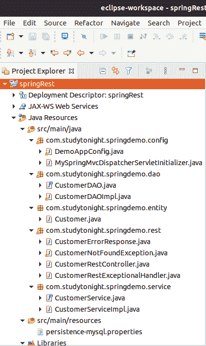
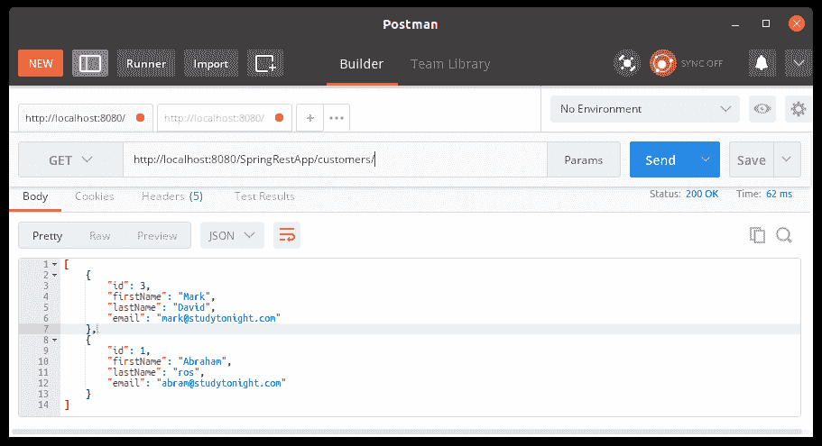
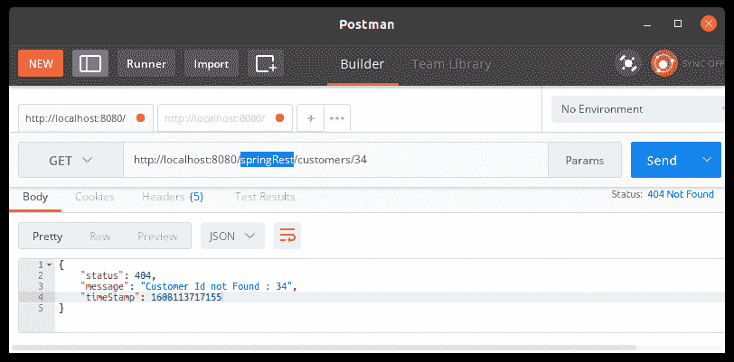
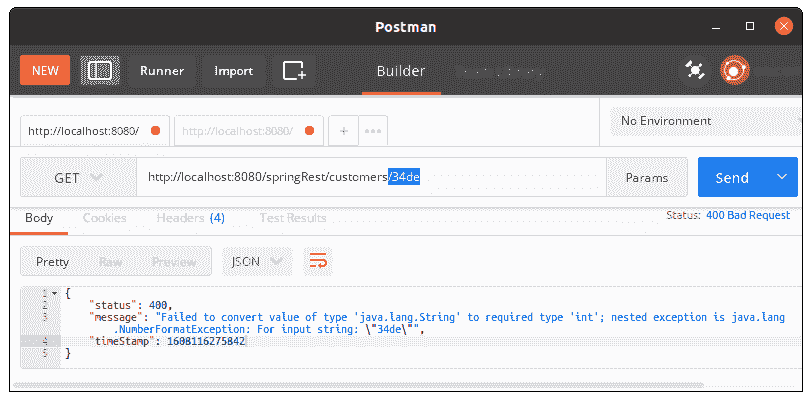

# Spring REST 异常处理

> 原文：<https://www.studytonight.com/spring-framework/spring-rest-exception-handling>

在本文中，我们将在 Spring REST 应用程序中添加**异常处理**。在我们的[上一个主题](https://www.studytonight.com/spring-framework/spring-rest-crud-application)中，我们学习了用一个例子创建一个 REST 应用程序。现在，我们将看到错误/异常处理，以避免应用程序的异常终止。

复制输入错误或未找到资源错误的应用程序非常重要。有时，当用户请求不存在的资源时，他会面临一个 **404 -未找到**。

我们创建了一个包含几个文件的项目，您可以从前面的主题中获得大部分文件代码，这里我们只提供了用于异常处理的代码。

### 项目结构



**//customer error response . Java**

此类用于为用户设计错误消息。它包含状态、消息和时间戳等消息属性，为用户提供有意义的信息。

```java
package com.studytonight.springdemo.rest;

public class CustomerErrorResponse {

	private int status;
	private String message;
	private long timeStamp;
	public CustomerErrorResponse(int status, String message, long timeStamp) {
		super();
		this.status = status;
		this.message = message;
		this.timeStamp = timeStamp;
	}
	public int getStatus() {
		return status;
	}
	public void setStatus(int status) {
		this.status = status;
	}
	public String getMessage() {
		return message;
	}
	public void setMessage(String message) {
		this.message = message;
	}
	public long getTimeStamp() {
		return timeStamp;
	}
	public void setTimeStamp(long timeStamp) {
		this.timeStamp = timeStamp;
	}
}
```

**//customnotfounindexception . Java**

这里，我们正在创建一个自定义异常类来生成一个异常对象。它扩展了 RuntimeException 类，使其对象成为异常。

```java
package com.studytonight.springdemo.rest;

public class CustomerNotFoundException extends RuntimeException{

	public CustomerNotFoundException() {
		super();
	}
	public CustomerNotFoundException(String message, Throwable cause, boolean enableSuppression,
			boolean writableStackTrace) {
		super(message, cause, enableSuppression, writableStackTrace);
	}
	public CustomerNotFoundException(String message, Throwable cause) {
		super(message, cause);

	}
	public CustomerNotFoundException(String message) {
		super(message);

	}
	public CustomerNotFoundException(Throwable cause) {
		super(cause);
	}
} 
```

**//customer rest controller . Java**

如果找不到客户 id，此控制器类将引发自定义异常。看，我们使用了自定义异常 CustomerNotFoundException 来处理应用程序流。

```java
package com.studytonight.springdemo.rest;

import java.util.List;
import org.springframework.beans.factory.annotation.Autowired;
import org.springframework.web.bind.annotation.DeleteMapping;
import org.springframework.web.bind.annotation.GetMapping;
import org.springframework.web.bind.annotation.PathVariable;
import org.springframework.web.bind.annotation.PostMapping;
import org.springframework.web.bind.annotation.PutMapping;
import org.springframework.web.bind.annotation.RequestBody;
import org.springframework.web.bind.annotation.RestController;
import com.studytonight.springdemo.entity.Customer;
import com.studytonight.springdemo.service.CustomerService;

@RestController
public class CustomerRestController {

	@Autowired
	private CustomerService customerService;

	@GetMapping("/customers")
	public List<Customer> getCustomers(){
		return customerService.getCustomers();
	}

	@GetMapping("/customers/{customerId}")
	public Customer getCustomer(@PathVariable int customerId){
		Customer customer = customerService.getCustomer(customerId);
		if(customer == null) {
			throw new CustomerNotFoundException("Customer Id not Found : "+customerId);
		}
		return customerService.getCustomer(customerId);
	}

	@PostMapping("/customers")
	public Customer addCustomer(@RequestBody Customer customer){
		customer.setId(0);
		customerService.saveCustomer(customer);
		return customer;
	}

	@PutMapping("/customers")
	public Customer updateCustomer(@RequestBody Customer customer){
		customerService.saveCustomer(customer);
		return customer;
	}

	@DeleteMapping("/customers/{customerId}")
	public String deleteCustomer(@PathVariable int customerId){
		customerService.deleteCustomer(customerId);
		return "Deleted Customer Id: "+customerId;
	}
}
```

**//customer remainxceptionhandler . Java**

这是一个自定义异常处理程序类，使用 Spring ExceptionHandler 来处理异常。这里，我们通过使用这个类来处理 NOT_FOUND 和 BAD_REQUEST 异常。

```java
package com.studytonight.springdemo.rest;

import org.springframework.http.HttpStatus;
import org.springframework.http.ResponseEntity;
import org.springframework.web.bind.annotation.ControllerAdvice;
import org.springframework.web.bind.annotation.ExceptionHandler;

@ControllerAdvice
public class CustomerRestExceptionalHandler {
	@ExceptionHandler
	public ResponseEntity<CustomerErrorResponse> handleException(CustomerNotFoundException e){
		CustomerErrorResponse error = new CustomerErrorResponse(HttpStatus.NOT_FOUND.value(), e.getMessage(), System.currentTimeMillis());
		return new ResponseEntity<CustomerErrorResponse>(error, HttpStatus.NOT_FOUND);
	}	
	@ExceptionHandler
	public ResponseEntity<CustomerErrorResponse> handleException(Exception e){
		CustomerErrorResponse error = new CustomerErrorResponse(HttpStatus.BAD_REQUEST.value(), e.getMessage(), System.currentTimeMillis());
		return new ResponseEntity<CustomerErrorResponse>(error, HttpStatus.BAD_REQUEST);
	}	
}
```

### 运行应用程序

成功完成项目并添加依赖项后，使用服务器运行应用程序，您将获得如下输出。

为了测试应用程序，我们使用了一个 Postman 应用程序。这是一个检查 web 请求的好应用程序。可以从[官方网站](https://www.postman.com/downloads/)安装后使用。

### 访问所有客户



### 按标识访问单个客户

我们可以通过个人客户的 id 来访问他们，但是如果没有找到记录，我们会收到一条消息。



### 错误输入

有可能，如果用户输入了一个非数字 id，那么我们的应用程序就会处理这个异常，并向用户提供一个适当的消息。



* * *

* * *