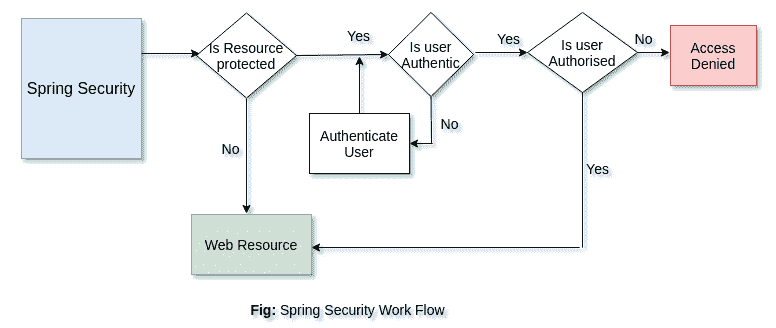
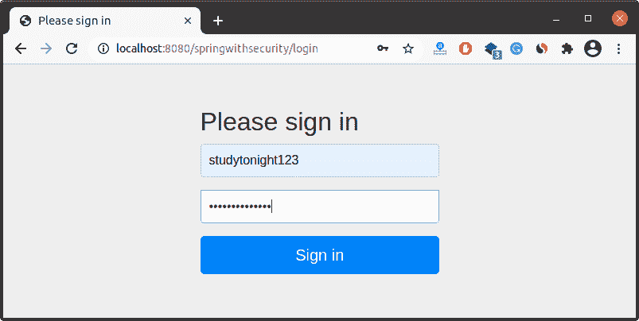
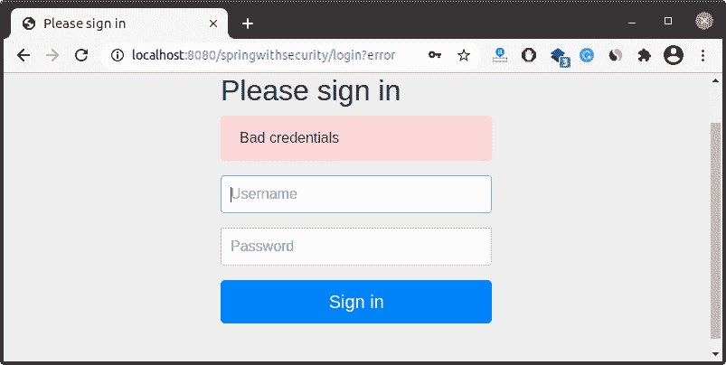
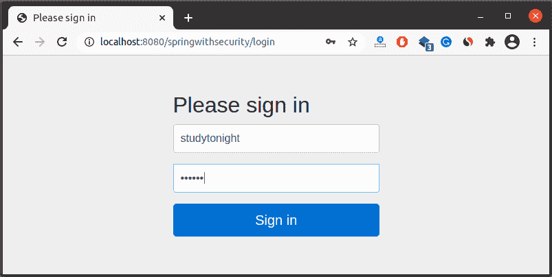
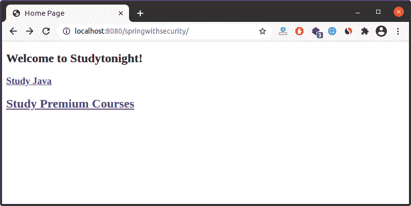

# Spring Security基本示例

> 原文：<https://www.studytonight.com/spring-framework/spring-security-basic-example>

在我们之前的文章中，我们解释了 [Spring Security](https://www.studytonight.com/spring-framework/spring-security-introduction) 以及用于开发可扩展应用的各种工具。

在本文中，我们将学习在 web 应用中实现基本的 Spring Security。

在开始编写代码之前，让我们快速浏览一下给定的图像，该图像显示了 Spring security 如何对用户进行认证，以及如何检查资源授权。

### Spring Security工作



请注意，Spring Security 首先检查用户的认证，然后检查其访问应用资源的授权。如果像 JSP 页面这样的资源没有受到保护，那么它将不会执行认证，而只是让用户访问资源，但是如果资源受到保护，那么它将首先执行认证，然后让用户访问。如果用户不可信，简单地抛出一个消息访问被拒绝。

让我们通过一个例子来理解它，我们创建了一个基于 maven 的 [Spring MVC](https://www.studytonight.com/spring-framework/spring-mvc-introduction) 应用，并实现了 Spring Security 来制作一个安全的 web 应用。

### 项目源代码

以下是该项目的文件。您可以在项目中使用这些来测试应用。

//app config . Java

这是我们的应用配置文件，它实现了`WebMvcConfugurer`接口来制作这个 MVC 应用，并创建了一个方法 viewResolver 来映射我们的视图文件(JSP)。

```java
package com.studytonight;

import org.springframework.context.annotation.Bean;
import org.springframework.context.annotation.ComponentScan;
import org.springframework.context.annotation.Configuration;
import org.springframework.web.servlet.ViewResolver;
import org.springframework.web.servlet.config.annotation.EnableWebMvc;
import org.springframework.web.servlet.config.annotation.WebMvcConfigurer;
import org.springframework.web.servlet.view.InternalResourceViewResolver;

@EnableWebMvc
@Configuration
@ComponentScan("com.studytonight.controller")
public class AppConfig implements WebMvcConfigurer{
	@Bean
	public ViewResolver viewResolver() {
		InternalResourceViewResolver irvr = new InternalResourceViewResolver();
		irvr.setPrefix("WEB-INF/views/");
		irvr.setSuffix(".jsp");
		irvr.setOrder(0);
		return irvr;
	}
}
```

//main app . Java

这个类初始化我们的网络应用，并通过注册我们的 AppConfig 类(上面的文件)来创建`ServletContext`。

```java
package com.studytonight;

import javax.servlet.ServletContext;
import javax.servlet.ServletException;
import javax.servlet.ServletRegistration;
import org.springframework.web.WebApplicationInitializer;
import org.springframework.web.context.support.AnnotationConfigWebApplicationContext;
import org.springframework.web.servlet.DispatcherServlet;
public class MainApp implements WebApplicationInitializer {

	@Override
	public void onStartup(ServletContext servletContext) throws ServletException {
		System.out.println("started");
		AnnotationConfigWebApplicationContext context = new AnnotationConfigWebApplicationContext();
		context.register(AppConfig.class);
		context.setServletContext(servletContext);
		ServletRegistration.Dynamic servlet = servletContext.addServlet("dispatcher", new DispatcherServlet(context));
		servlet.setLoadOnStartup(1);
		servlet.addMapping("/");
		context.close();	
	}
}
```

**//securityappnitizer . Java**

这是扩展抽象安全应用初始化器的安全初始化器类，我们传递了我们的安全配置类，以便它可以读取安全配置。

```java
package com.studytonight;

import org.springframework.security.web.context.AbstractSecurityWebApplicationInitializer;
public class SecurityAppInitializer extends AbstractSecurityWebApplicationInitializer {

	public SecurityAppInitializer() {
		super(SecurityConfig.class);
	}
}
```

**// SecurityConfig.java**

这是我们的安全配置文件，扩展了`WebSecurityConfigurerAdapter`类，提供了`configure()`等几种方法来配置安全性。Spring Security 提供了作为认证管理器的`AuthenticationManagerBuilder`类，并提供了几种方法来验证用户。这里，我们使用`inMemoryAuthentication`概念，它允许映射硬编码的用户值。我们将在下一个教程中讨论使用数据库的用户认证，但是现在，让我们来看一个简单的例子。

```java
package com.studytonight;

import org.springframework.beans.factory.annotation.Autowired;
import org.springframework.context.annotation.Configuration;
import org.springframework.security.config.annotation.authentication.builders.AuthenticationManagerBuilder;
import org.springframework.security.config.annotation.web.configuration.EnableWebSecurity;
import org.springframework.security.config.annotation.web.configuration.WebSecurityConfigurerAdapter;
import org.springframework.security.core.userdetails.User;
import org.springframework.security.core.userdetails.User.UserBuilder;

@Configuration
@EnableWebSecurity
public class SecurityConfig extends WebSecurityConfigurerAdapter{

	@Autowired
	protected void configure(AuthenticationManagerBuilder auth) throws Exception {
		UserBuilder user = User.withDefaultPasswordEncoder();
		auth.inMemoryAuthentication()
		.withUser(user.username("studytonight").password("abc123").roles("admin"));
	}
}
```

//user controller . Java

这是我们的控制器类，它作为用户请求处理程序工作，将用户请求与资源进行映射，并相应地返回响应。我们创建了 home()方法来显示 index.jsp 页面，course()方法来显示 course.jsp 页面。

```java
package com.studytonight.controller;

import org.springframework.stereotype.Controller;
import org.springframework.web.bind.annotation.GetMapping;

@Controller
public class UserController {

	@GetMapping("/")  
	public String home() {
		return "index";
	}

	@GetMapping("/java-course")
	public String course() {
		return "course";
	}

	@GetMapping("/premium-courses")
	public String premiumCourse() {
		return "premium-courses";
	}
}
```

### 查看文件

这些是显示在浏览器中的项目视图文件。查看代码。

**//course.jsp**

```java
<%@ page language="java" contentType="text/html; charset=UTF-8"
	pageEncoding="UTF-8"%>
<!DOCTYPE html>
<html>
<head>
<meta charset="UTF-8">
<title>Course Page</title>
</head>
<body>
	<h2>List of Courses</h2>
	<ul>
		<li>Java</li>
		<li>Python</li>
		<li>C++</li>
		<li>Linux</li>
	</ul>
</body>
</html>
```

**//index.jsp**

```java
<%@ page language="java" contentType="text/html; charset=UTF-8"
	pageEncoding="UTF-8"%>
<!DOCTYPE html>
<html>
<head>
<meta charset="UTF-8">
<title>Home Page</title>
</head>
<body>
	<h2>Welcome to Studytonight!</h2>
	<h3><a href="java-course">Study Java</a></h3>
	<h2><a href="premium-courses">Study Premium Courses</a></h2>
</body>
</html>
```

**//特级 courses.jsp**

```java
<%@ page language="java" contentType="text/html; charset=UTF-8"
	pageEncoding="UTF-8"%>
<!DOCTYPE html>
<html>
<head>
<meta charset="UTF-8">
<title>Course Page</title>
</head>
<body>
	<h2>List of Premium Courses</h2>
	<ul>
		<li>Spring Framework</li>
		<li>Pandas</li>
		<li>Spring Security</li>
	</ul>
</body>
</html>
```

//POM/XML

这个文件包含这个项目的所有依赖项，比如 spring jars、servlet jars 等。将这些依赖项放入项目中以运行应用。

```java
<project 
	xmlns:xsi="http://www.w3.org/2001/XMLSchema-instance"
	xsi:schemaLocation="http://maven.apache.org/POM/4.0.0 https://maven.apache.org/xsd/maven-4.0.0.xsd">
	<modelVersion>4.0.0</modelVersion>
	<groupId>com.studytonight</groupId>
	<artifactId>springwithsecurity</artifactId>
	<version>0.0.1-SNAPSHOT</version>
	<packaging>war</packaging>
	<properties>
		<spring.version>5.2.8.RELEASE</spring.version>
	</properties>
	<dependencies>
		<dependency>
			<groupId>org.springframework</groupId>
			<artifactId>spring-core</artifactId>
			<version>${spring.version}</version>
		</dependency>
		<dependency>
			<groupId>org.springframework</groupId>
			<artifactId>spring-context</artifactId>
			<version>${spring.version}</version>
		</dependency>
		<dependency>
			<groupId>org.springframework</groupId>
			<artifactId>spring-webmvc</artifactId>
			<version>${spring.version}</version>
		</dependency>
		<!-- https://mvnrepository.com/artifact/javax.servlet/servlet-api -->
		<!-- https://mvnrepository.com/artifact/javax.servlet/javax.servlet-api -->
		<dependency>
			<groupId>javax.servlet</groupId>
			<artifactId>javax.servlet-api</artifactId>
			<version>4.0.1</version>
		</dependency>

		<!-- https://mvnrepository.com/artifact/javax.servlet.jsp/javax.servlet.jsp-api -->
		<dependency>
			<groupId>javax.servlet.jsp</groupId>
			<artifactId>javax.servlet.jsp-api</artifactId>
			<version>2.3.3</version>
		</dependency>
		<!-- https://mvnrepository.com/artifact/javax.servlet.jsp.jstl/jstl-api -->
		<dependency>
			<groupId>javax.servlet.jsp.jstl</groupId>
			<artifactId>jstl-api</artifactId>
			<version>1.2</version>
		</dependency>

		<!-- https://mvnrepository.com/artifact/javax.xml.bind/jaxb-api -->
		<dependency>
			<groupId>javax.xml.bind</groupId>
			<artifactId>jaxb-api</artifactId>
			<version>2.3.0</version>
		</dependency>
		<!-- https://mvnrepository.com/artifact/org.springframework.security/spring-security-web -->
		<dependency>
			<groupId>org.springframework.security</groupId>
			<artifactId>spring-security-web</artifactId>
			<version>5.4.2</version>
		</dependency>
		<!-- https://mvnrepository.com/artifact/org.springframework.security/spring-security-config -->
		<dependency>
			<groupId>org.springframework.security</groupId>
			<artifactId>spring-security-config</artifactId>
			<version>5.4.2</version>
		</dependency>
	</dependencies>
	<build>
		<plugins>
			<plugin>
				<artifactId>maven-war-plugin</artifactId>
				<version>3.2.3</version>
				<configuration>
					<warSourceDirectory>WebContent</warSourceDirectory>
				</configuration>
			</plugin>
			<plugin>
				<groupId>org.apache.maven.plugins</groupId>
				<artifactId>maven-compiler-plugin</artifactId>
				<version>3.5.1</version>
				<configuration>
					<source>11</source>
					<target>11</target>
				</configuration>
			</plugin>
		</plugins>
	</build>
</project>
```

### 项目结构

创建这些文件后，我们的项目将如下所示。你可以参考这个来了解项目的目录结构。


### 运行应用

成功完成项目并添加依赖项后，运行应用，您将获得如下输出。

**注意:**在我们的应用中，我们没有创建这个登录页面，而是配置了 Spring Security。这是一个由框架本身提供的内置登录页面，用于对用户进行认证。

它会将用户名和密码与**SecurityConfig.java**文件中提供的凭据进行匹配。


### 提供错误的用户名和密码



### 认证错误:错误的凭据

如果提供的用户名和密码错误，则会显示一条错误消息。见下面截图。



### 提供正确的用户名和密码



### 主页

现在，您已成功登录到应用。这是我们的**index.jsp**文件渲染为浏览器的主页。



至此，我们已经学会了在 Spring web 应用中实现 Spring Security。在下一个主题中，我们将学习呈现我们自己的登录页面，而不是框架提供的内置页面。

* * *

* * *