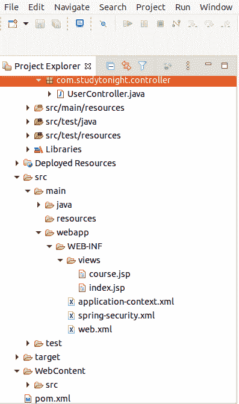
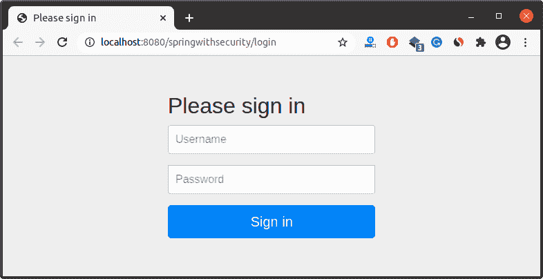
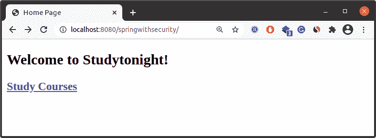
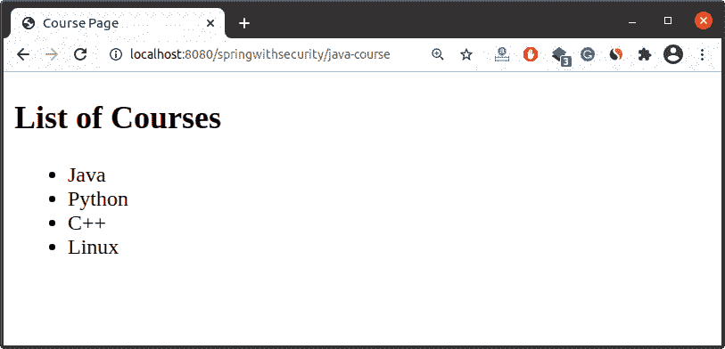

# 使用 XML 的春季安全配置

> 原文：<https://www.studytonight.com/spring-framework/spring-security-configuration-using-xml>

可以通过使用 XML 或 Java 注释来配置 Spring Security。我们已经在[上一篇文章](https://www.studytonight.com/spring-framework/basic-example)中看到了带有 Java 和注释的 Spring Security 配置。现在，我们将学习使用 XML 配置应用程序。如果您使用 java 或 XML，两者都很好，没有区别，但是在现代，使用基于 Java 的配置比使用 XML 更好。

让我们通过例子来理解。创建一个基于 maven 的 spring 应用程序，它将包含以下源文件。

## 项目源代码

//user controller . Java

这是我们的控制器类，它作为用户请求处理程序工作，将用户请求与资源进行映射，并相应地返回响应。我们创建了 home()方法来显示 index.jsp 页面，course()方法来显示 course.jsp 页面。

```java
package com.studytonight.controller;

import org.springframework.stereotype.Controller;
import org.springframework.web.bind.annotation.GetMapping;

@Controller
public class UserController {

	@GetMapping("/")  
	public String home() {
		return "index";
	}

	@GetMapping("/java-course")
	public String course() {
		return "course";
	}
}
```

**//应用-上下文. xml**

该文件用于配置视图页面、组件和控制器类。它类似于 Java 配置项目的 AppConfig.java 文件。

```java
<?xml version="1.0" encoding="UTF-8"?>
<beans 
	xmlns:xsi="http://www.w3.org/2001/XMLSchema-instance" 
	xmlns:context="http://www.springframework.org/schema/context"
	xmlns:mvc="http://www.springframework.org/schema/mvc"
	xsi:schemaLocation="
		http://www.springframework.org/schema/beans
    	http://www.springframework.org/schema/beans/spring-beans.xsd
    	http://www.springframework.org/schema/context
    	http://www.springframework.org/schema/context/spring-context.xsd
    	http://www.springframework.org/schema/mvc
        http://www.springframework.org/schema/mvc/spring-mvc.xsd">

	<!-- Step 3: Add support for component scanning -->
	<context:component-scan base-package="com.studytonight.controller" />

	<!-- Step 4: Add support for conversion, formatting and validation support -->
	<mvc:annotation-driven/>

	<!-- Step 5: Define Spring MVC view resolver -->
	<bean
		class="org.springframework.web.servlet.view.InternalResourceViewResolver">
		<property name="prefix" value="/WEB-INF/views/" />
		<property name="suffix" value=".jsp" />
	</bean>
</beans>
```

**// spring-security.xml**

该文件用于配置用户及其角色。在用户服务标签中，我们设置用户的登录凭证。这种配置类似于 Java 配置项目的 SecurityConfig.java 文件。

```java
<?xml version="1.0" encoding="UTF-8"?>
<b:beans 
	xmlns:b="http://www.springframework.org/schema/beans"
	xmlns:xsi="http://www.w3.org/2001/XMLSchema-instance"
	xsi:schemaLocation="http://www.springframework.org/schema/beans https://www.springframework.org/schema/beans/spring-beans.xsd
						http://www.springframework.org/schema/security https://www.springframework.org/schema/security/spring-security.xsd">

	<http>
		<intercept-url pattern="/" access="hasRole('GUEST')" />
		<intercept-url pattern="/java-courses/**" access="hasAnyRole('GUEST', 'REGISTERED')" />		
		<form-login 
		   login-processing-url="/login"
		   username-parameter="username"
		   password-parameter="password"
		   default-target-url="/"/>
	</http>
	<authentication-manager>
		<authentication-provider>
		    <user-service>
		        <user name="studytonight" password="{noop}abc123" authorities="ROLE_GUEST" />
		        <user name="pro-studytonight" password="{noop}abc123" authorities="ROLE_REGISTERED" />		        
		    </user-service>	
		</authentication-provider>
	</authentication-manager>

</b:beans>
```

**// web.xml**

它用于配置 web 应用程序。这里，我们设置 application-context.xml 和 spring-security.xml，以便应用程序可以在执行过程中找到它们。

```java
<?xml version="1.0" encoding="UTF-8"?>
<web-app version="3.0" 
	xmlns:xsi="http://www.w3.org/2001/XMLSchema-instance"
	xsi:schemaLocation="http://java.sun.com/xml/ns/javaee
  https://java.sun.com/xml/ns/javaee/web-app_3_0.xsd">

	<servlet>
		<servlet-name>dispatcher</servlet-name>
		<servlet-class>org.springframework.web.servlet.DispatcherServlet
		</servlet-class>
		<init-param>
			<param-name>contextConfigLocation</param-name>
			<param-value>/WEB-INF/application-context.xml</param-value>
		</init-param>
		<load-on-startup>1</load-on-startup>
	</servlet>
	<servlet-mapping>
		<servlet-name>dispatcher</servlet-name>
		<url-pattern>/</url-pattern>
	</servlet-mapping>
	<listener>
		<listener-class>org.springframework.web.context.ContextLoaderListener
		</listener-class>
	</listener>
	<context-param>
		<param-name>contextConfigLocation</param-name>
		<param-value>
			/WEB-INF/spring-security.xml
		</param-value>
	</context-param>
	<filter>
		<filter-name>springSecurityFilterChain</filter-name>
		<filter-class>org.springframework.web.filter.DelegatingFilterProxy
		</filter-class>
	</filter>
	<filter-mapping>
		<filter-name>springSecurityFilterChain</filter-name>
		<url-pattern>/*</url-pattern>
	</filter-mapping>
	<listener>
		<listener-class>org.springframework.web.context.ContextLoaderListener
		</listener-class>
	</listener>
</web-app>
```

### 查看文件

这些是显示在浏览器中的项目视图文件。查看代码。

**//course.jsp**

```java
<%@ page language="java" contentType="text/html; charset=UTF-8"
	pageEncoding="UTF-8"%>
<!DOCTYPE html>
<html>
<head>
<meta charset="UTF-8">
<title>Course Page</title>
</head>
<body>
	<h2>List of Courses</h2>
	<ul>
		<li>Java</li>
		<li>Python</li>
		<li>C++</li>
		<li>Linux</li>
	</ul>
</body>
</html>
```

**//index.jsp**

```java
<%@ page language="java" contentType="text/html; charset=UTF-8"
	pageEncoding="UTF-8"%>
	<%@ taglib prefix="form" uri="http://www.springframework.org/tags/form"%>
	<%@ taglib prefix="security" uri="http://www.springframework.org/security/tags"%>
<!DOCTYPE html>
<html>
<head>
<meta charset="UTF-8">
<title>Home Page</title>
</head>
<body>
	<h2>Welcome to Studytonight!</h2>

	<h3>
		<a href="java-course">Study Java</a>
	</h3>
</body>
</html>
```

//POM . XML

这个文件包含这个项目的所有依赖项，比如 spring jars、servlet jars 等。将这些依赖项放入项目中以运行应用程序。

```java
<project 
	xmlns:xsi="http://www.w3.org/2001/XMLSchema-instance"
	xsi:schemaLocation="http://maven.apache.org/POM/4.0.0 https://maven.apache.org/xsd/maven-4.0.0.xsd">
	<modelVersion>4.0.0</modelVersion>
	<groupId>com.studytonight</groupId>
	<artifactId>springwithsecurityXML</artifactId>
	<version>0.0.1-SNAPSHOT</version>
	<packaging>war</packaging>
	<properties>
		<spring.version>5.2.8.RELEASE</spring.version>
	</properties>
	<dependencies>
		<dependency>
			<groupId>org.springframework</groupId>
			<artifactId>spring-core</artifactId>
			<version>${spring.version}</version>
		</dependency>
		<dependency>
			<groupId>org.springframework</groupId>
			<artifactId>spring-context</artifactId>
			<version>${spring.version}</version>
		</dependency>
		<dependency>
			<groupId>org.springframework</groupId>
			<artifactId>spring-webmvc</artifactId>
			<version>${spring.version}</version>
		</dependency>
		<!-- https://mvnrepository.com/artifact/javax.servlet/servlet-api -->
		<!-- https://mvnrepository.com/artifact/javax.servlet/javax.servlet-api -->
		<dependency>
			<groupId>javax.servlet</groupId>
			<artifactId>javax.servlet-api</artifactId>
			<version>4.0.1</version>
		</dependency>
		<!-- https://mvnrepository.com/artifact/jstl/jstl -->
		<dependency>
			<groupId>jstl</groupId>
			<artifactId>jstl</artifactId>
			<version>1.2</version>
		</dependency>

		<!-- https://mvnrepository.com/artifact/javax.servlet.jsp/javax.servlet.jsp-api -->
		<dependency>
			<groupId>javax.servlet.jsp</groupId>
			<artifactId>javax.servlet.jsp-api</artifactId>
			<version>2.3.3</version>
		</dependency>
		<!-- https://mvnrepository.com/artifact/javax.servlet.jsp.jstl/jstl-api -->
		<dependency>
			<groupId>javax.servlet.jsp.jstl</groupId>
			<artifactId>jstl-api</artifactId>
			<version>1.2</version>
		</dependency>

		<!-- https://mvnrepository.com/artifact/javax.xml.bind/jaxb-api -->
		<dependency>
			<groupId>javax.xml.bind</groupId>
			<artifactId>jaxb-api</artifactId>
			<version>2.3.0</version>
		</dependency>
		<!-- https://mvnrepository.com/artifact/org.springframework.security/spring-security-web -->
		<dependency>
			<groupId>org.springframework.security</groupId>
			<artifactId>spring-security-web</artifactId>
			<version>5.4.2</version>
		</dependency>
		<!-- https://mvnrepository.com/artifact/org.springframework.security/spring-security-config -->
		<dependency>
			<groupId>org.springframework.security</groupId>
			<artifactId>spring-security-config</artifactId>
			<version>5.4.2</version>
		</dependency>
		<!-- https://mvnrepository.com/artifact/org.springframework.security/spring-security-taglibs -->
		<dependency>
			<groupId>org.springframework.security</groupId>
			<artifactId>spring-security-taglibs</artifactId>
			<version>5.4.1</version>
		</dependency>
	</dependencies>
	<build>
		<plugins>
			<plugin>
				<artifactId>maven-war-plugin</artifactId>
				<version>3.2.3</version>
				<configuration>
					<warSourceDirectory>WebContent</warSourceDirectory>
				</configuration>
			</plugin>
			<plugin>
				<groupId>org.apache.maven.plugins</groupId>
				<artifactId>maven-compiler-plugin</artifactId>
				<version>3.5.1</version>
				<configuration>
					<source>11</source>
					<target>11</target>
				</configuration>
			</plugin>
		</plugins>
	</build>
</project>
```

### 项目结构

创建这些文件后，我们的项目将如下所示。你可以参考这个来了解项目的目录结构。



### 运行应用程序

成功完成项目并添加依赖项后，运行应用程序，您将获得如下输出。它呈现一个登录页面来验证用户。

它会将用户名和密码与 **spring-security.xml** 文件中提供的凭据进行匹配。



### 提供正确的用户名和密码


### 主页

现在，您已成功登录到应用程序。这是我们的**index.jsp**文件渲染为浏览器的主页。





看，应用程序也可以很好地使用 XML 配置。因此，您可以为您的应用程序使用任何配置。

* * *

* * *