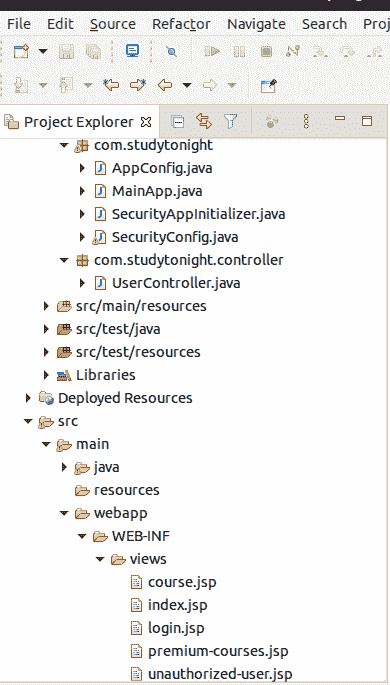
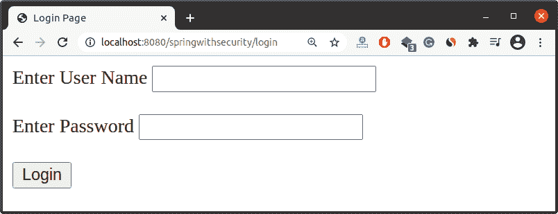
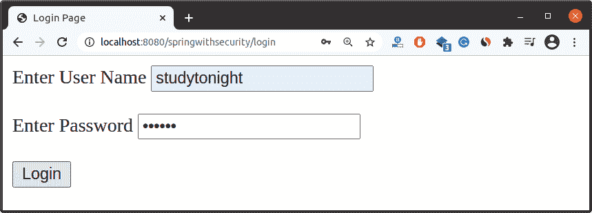
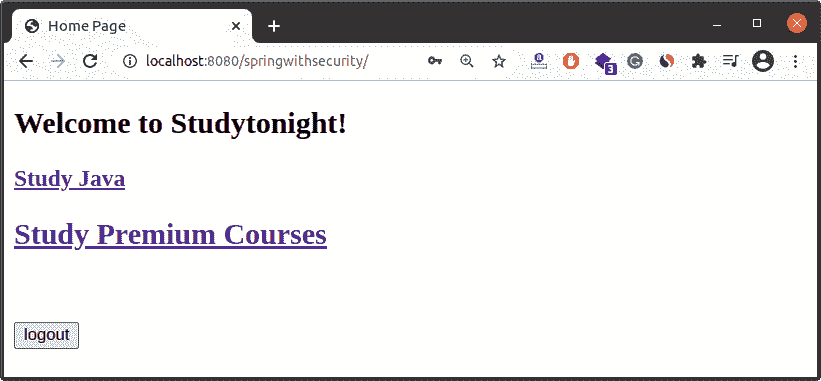

# 在 Spring Security应用中创建自定义拒绝访问页面

> 原文：<https://www.studytonight.com/spring-framework/create-custom-access-denied-page-in-spring-security-application>

在 spring Security 应用中，当用户输入错误的登录凭据时，Spring 会向浏览器返回自动生成的消息“错误的凭据”，如果用户试图访问任何他无法访问的资源，那么 Spring 会返回一个异常，如访问被拒绝或 HTTP 状态 403 -禁止。这是 Spring Security 的内部错误处理机制。除了给用户提供一个更有意义或者有点花哨的信息，让用户理解错误之外，我们不能做更多的事情。

在这里，我们将向项目添加我们自己的自定义错误页面，这样当用户试图访问任何未授权的资源时，就会得到一条自定义错误消息。

## 举个例子

现在，让我们通过例子来理解。我们创建了一个基于 maven 的 Spring Security 项目，其中包含以下文件。

//app config . Java

这是我们的应用配置文件，它实现了`WebMvcConfugurer`接口来制作这个 MVC 应用，并创建了一个方法 viewResolver 来映射我们的视图文件(JSP)。

**@EnableWebMvc** 注释用于使我们的应用成为具有 Mvc 模式的 web 应用。

**@Configuration** 注释用于将这个类声明为一个配置类， **@ComponentScan** 注释用于扫描我们应用的组件类。

```java
package com.studytonight;

import org.springframework.context.annotation.Bean;
import org.springframework.context.annotation.ComponentScan;
import org.springframework.context.annotation.Configuration;
import org.springframework.web.servlet.ViewResolver;
import org.springframework.web.servlet.config.annotation.EnableWebMvc;
import org.springframework.web.servlet.config.annotation.WebMvcConfigurer;
import org.springframework.web.servlet.view.InternalResourceViewResolver;

@EnableWebMvc
@Configuration
@ComponentScan("com.studytonight.controller")
public class AppConfig implements WebMvcConfigurer{
	@Bean
	public ViewResolver viewResolver() {
		InternalResourceViewResolver irvr = new InternalResourceViewResolver();
		irvr.setPrefix("WEB-INF/views/");
		irvr.setSuffix(".jsp");
		irvr.setOrder(0);
		return irvr;
	}
}
```

//main app . Java

这个类初始化我们的网络应用，并通过注册我们的 **AppConfig** 类来创建`ServletContext`(上图文件)。

```java
package com.studytonight;

import javax.servlet.ServletContext;
import javax.servlet.ServletException;
import javax.servlet.ServletRegistration;
import org.springframework.web.WebApplicationInitializer;
import org.springframework.web.context.support.AnnotationConfigWebApplicationContext;
import org.springframework.web.servlet.DispatcherServlet;
public class MainApp implements WebApplicationInitializer {

	@Override
	public void onStartup(ServletContext servletContext) throws ServletException {
		System.out.println("started");
		AnnotationConfigWebApplicationContext context = new AnnotationConfigWebApplicationContext();
		context.register(AppConfig.class);
		context.setServletContext(servletContext);
		ServletRegistration.Dynamic servlet = servletContext.addServlet("dispatcher", new DispatcherServlet(context));
		servlet.setLoadOnStartup(1);
		servlet.addMapping("/");
		context.close();	
	}
}
```

**//securityappnitizer . Java**

这是扩展`AbstractSecurityWebApplicationInitializer`的安全初始化器类，我们传递了`SecurityConfig`类，这样它就可以读取安全配置。

```java
package com.studytonight;

import org.springframework.security.web.context.AbstractSecurityWebApplicationInitializer;
public class SecurityAppInitializer  extends AbstractSecurityWebApplicationInitializer {

	public SecurityAppInitializer() {
		super(SecurityConfig.class);
	}
}
```

**// SecurityConfig.java**

这是我们的安全配置文件，扩展了`WebSecurityConfigurerAdapter`类，提供了`configure()`等几种方法来配置安全性。Spring Security 提供了作为认证管理器的`AuthenticationManagerBuilder`类，并提供了几种方法来验证用户。这里，我们使用`inMemoryAuthentication`概念，它允许映射硬编码的用户值。

我们使用`roles()`方法设置用户角色。在这里，我们设置了一个用户 GUEST 角色，另一个是 REGESTERED 角色。

我们使用`HttpSecurity`类来配置登录页面。`loginPage()`方法用于指定我们的**login.jsp**页面。我们还可以为登录表单使用任何其他名称，如 login-form.jsp 或 user-login.jsp，然后指定到该方法的映射。这里传递的**"/登录"**值将映射到控制器的动作，然后呈现 JSP 页面。

这里，我们使用`accessDeniedPage()`方法来配置我们的自定义错误处理页面。

```java
package com.studytonight;

import org.springframework.beans.factory.annotation.Autowired;
import org.springframework.context.annotation.Configuration;
import org.springframework.security.config.annotation.authentication.builders.AuthenticationManagerBuilder;
import org.springframework.security.config.annotation.web.builders.HttpSecurity;
import org.springframework.security.config.annotation.web.configuration.EnableWebSecurity;
import org.springframework.security.config.annotation.web.configuration.WebSecurityConfigurerAdapter;
import org.springframework.security.core.userdetails.User;
import org.springframework.security.core.userdetails.User.UserBuilder;

@Configuration
@EnableWebSecurity	
public class SecurityConfig extends WebSecurityConfigurerAdapter{

	@Override
	protected void configure(AuthenticationManagerBuilder auth) throws Exception {

		UserBuilder users = User.withDefaultPasswordEncoder();		
		auth.inMemoryAuthentication()
		.withUser(users.username("studytonight").password("abc123").roles("GUEST"))
		.withUser(users.username("pro-studytonight").password("abc123").roles("REGISTERED"));
	}

	@Autowired
	protected void configure(HttpSecurity hs) throws Exception {
		hs.authorizeRequests()
		.antMatchers("/").hasAnyRole("GUEST","REGISTERED")
		.antMatchers("/java-course").hasRole("GUEST")
		.antMatchers("/premium-courses").hasRole("REGISTERED")
		.and()
		.formLogin()
		.loginPage("/login")
		.loginProcessingUrl("/authenticateTheUser")
		.permitAll()
		.and()
		.logout()
		.permitAll()
		.and()
		.exceptionHandling().accessDeniedPage("/unauthorized");
	}
}
```

//user controller . Java

这是我们的控制器类，它作为用户请求处理程序工作，将用户请求与资源进行映射，并相应地返回响应。我们创建了 login()方法来呈现登录页面，home()方法来显示**index.jsp**页面，当然()方法来显示**course.jsp**页面。

```java
package com.studytonight.controller;

import org.springframework.stereotype.Controller;
import org.springframework.web.bind.annotation.GetMapping;

@Controller
public class UserController {

	@GetMapping("/login")
	public String login() {
		return "login";
	}

	@GetMapping("/")  
	public String home() {
		return "index";
	}

	@GetMapping("/java-course")
	public String course() {
		return "course";
	}

	@GetMapping("/premium-courses")
	public String premiumCourse() {
		return "premium-courses";
	}

	@GetMapping("/unauthorized")
	public String unauthorized() {
		return "unauthorized-user";
	}
}
```

### 查看文件

这些是显示在浏览器中的项目视图文件。查看代码。

**//course.jsp**

```java
<%@ page language="java" contentType="text/html; charset=UTF-8"
	pageEncoding="UTF-8"%>
<!DOCTYPE html>
<html>
<head>
<meta charset="UTF-8">
<title>Course Page</title>
</head>
<body>
	<h2>List of Courses</h2>
	<ul>
		<li>Java</li>
		<li>Python</li>
		<li>C++</li>
		<li>Linux</li>
	</ul>
</body>
</html>
```

**//index.jsp**

```java
<%@ page language="java" contentType="text/html; charset=UTF-8"
	pageEncoding="UTF-8"%>
	<%@ taglib prefix="form" uri="http://www.springframework.org/tags/form"%>
	<%@ taglib prefix="security" uri="http://www.springframework.org/security/tags"%>
<!DOCTYPE html>
<html>
<head>
<meta charset="UTF-8">
<title>Home Page</title>
</head>
<body>
	<h2>Welcome to Studytonight!</h2>
	<h3>
		<a href="java-course">Study Java</a>
	</h3>
	<h2>
		<a href="premium-courses">Study Premium Courses</a>
	</h2>
	<br><br>
	<form:form
		action="${pageContext.request.contextPath}/logout"
		method="post">
		<input type="submit" value="logout">
	</form:form>
</body>
</html>
```

**//login.jsp**

```java
<%@ page language="java" contentType="text/html; charset=UTF-8"
	pageEncoding="UTF-8"%>
<%@ taglib prefix="form" uri="http://www.springframework.org/tags/form"%>
<%@ taglib uri="http://java.sun.com/jsp/jstl/core" prefix="c"%>

<!DOCTYPE html>
<html>
<head>
<meta charset="UTF-8">
<title>Login Page</title>
</head>
<body>
	<form:form
		action="${pageContext.request.contextPath}/authenticateTheUser"
		method="post">
		<c:if test="${param.error!=null}">
			<p style="color: red">You entered wrong credentials!</p>

		</c:if>
		<c:if test="${param.logout!=null}">
			<p style="color: green">You have successfully logged out.!</p>
		</c:if>
		<label for="name">Enter User Name</label>
		<input type="text" name="username">
		<br>
		<br>
		<label for="password">Enter Password</label>
		<input type="password" name="password">
		<br>
		<br>
		<input type="submit" value="Login">
	</form:form>
</body>
</html>
```

**//premium-courses.jsp**

```java
<%@ page language="java" contentType="text/html; charset=UTF-8"
	pageEncoding="UTF-8"%>
<!DOCTYPE html>
<html>
<head>
<meta charset="UTF-8">
<title>Course Page</title>
</head>
<body>
	<h2>List of Premium Courses</h2>
	<ul>
		<li>Spring Framework</li>
		<li>Pandas</li>
		<li>Spring Security</li>
	</ul>
</body>
</html>
```

**//unauthorize-user.jsp**

```java
<%@ page language="java" contentType="text/html; charset=UTF-8"
    pageEncoding="UTF-8"%>
<!DOCTYPE html>
<html>
<head>
<meta charset="UTF-8">
<title>Unauthorized Page</title>
</head>
<body>
<h2>Error: You are not Authorized to access this Page</h2>
</body>
</html>
```

//POM . XML

这个文件包含这个项目的所有依赖项，比如 spring jars、servlet jars 等。将这些依赖项放入项目中以运行应用。

```java
<project 
	xmlns:xsi="http://www.w3.org/2001/XMLSchema-instance"
	xsi:schemaLocation="http://maven.apache.org/POM/4.0.0 https://maven.apache.org/xsd/maven-4.0.0.xsd">
	<modelVersion>4.0.0</modelVersion>
	<groupId>com.studytonight</groupId>
	<artifactId>springwithsecurity</artifactId>
	<version>0.0.1-SNAPSHOT</version>
	<packaging>war</packaging>
	<properties>
		<spring.version>5.2.8.RELEASE</spring.version>
	</properties>
	<dependencies>
		<dependency>
			<groupId>org.springframework</groupId>
			<artifactId>spring-core</artifactId>
			<version>${spring.version}</version>
		</dependency>
		<dependency>
			<groupId>org.springframework</groupId>
			<artifactId>spring-context</artifactId>
			<version>${spring.version}</version>
		</dependency>
		<dependency>
			<groupId>org.springframework</groupId>
			<artifactId>spring-webmvc</artifactId>
			<version>${spring.version}</version>
		</dependency>
		<!-- https://mvnrepository.com/artifact/javax.servlet/servlet-api -->
		<!-- https://mvnrepository.com/artifact/javax.servlet/javax.servlet-api -->
		<dependency>
			<groupId>javax.servlet</groupId>
			<artifactId>javax.servlet-api</artifactId>
			<version>4.0.1</version>
		</dependency>
		<!-- https://mvnrepository.com/artifact/jstl/jstl -->
		<dependency>
			<groupId>jstl</groupId>
			<artifactId>jstl</artifactId>
			<version>1.2</version>
		</dependency>

		<!-- https://mvnrepository.com/artifact/javax.servlet.jsp/javax.servlet.jsp-api -->
		<dependency>
			<groupId>javax.servlet.jsp</groupId>
			<artifactId>javax.servlet.jsp-api</artifactId>
			<version>2.3.3</version>
		</dependency>
		<!-- https://mvnrepository.com/artifact/javax.servlet.jsp.jstl/jstl-api -->
		<dependency>
			<groupId>javax.servlet.jsp.jstl</groupId>
			<artifactId>jstl-api</artifactId>
			<version>1.2</version>
		</dependency>

		<!-- https://mvnrepository.com/artifact/javax.xml.bind/jaxb-api -->
		<dependency>
			<groupId>javax.xml.bind</groupId>
			<artifactId>jaxb-api</artifactId>
			<version>2.3.0</version>
		</dependency>
		<!-- https://mvnrepository.com/artifact/org.springframework.security/spring-security-web -->
		<dependency>
			<groupId>org.springframework.security</groupId>
			<artifactId>spring-security-web</artifactId>
			<version>5.4.2</version>
		</dependency>
		<!-- https://mvnrepository.com/artifact/org.springframework.security/spring-security-config -->
		<dependency>
			<groupId>org.springframework.security</groupId>
			<artifactId>spring-security-config</artifactId>
			<version>5.4.2</version>
		</dependency>
		<!-- https://mvnrepository.com/artifact/org.springframework.security/spring-security-taglibs -->
		<dependency>
			<groupId>org.springframework.security</groupId>
			<artifactId>spring-security-taglibs</artifactId>
			<version>5.4.1</version>
		</dependency>
	</dependencies>
	<build>
		<plugins>
			<plugin>
				<artifactId>maven-war-plugin</artifactId>
				<version>3.2.3</version>
				<configuration>
					<warSourceDirectory>WebContent</warSourceDirectory>
				</configuration>
			</plugin>
			<plugin>
				<groupId>org.apache.maven.plugins</groupId>
				<artifactId>maven-compiler-plugin</artifactId>
				<version>3.5.1</version>
				<configuration>
					<source>11</source>
					<target>11</target>
				</configuration>
			</plugin>
		</plugins>
	</build>
</project>
```

### 项目结构

创建这些文件后，我们的项目将如下所示。你可以参考这个来了解项目的目录结构。



### 运行应用

成功完成项目并添加依赖项后，运行应用，您将获得如下输出。

这是我们自己的登录页面，将提交至**/authenticatheuser**URL，并将用户名和密码与**SecurityConfig.java**文件中提供的凭据进行匹配。



### 提供正确的用户名和密码



### 主页

现在，您已成功登录到应用。这是我们的**index.jsp**文件渲染为浏览器的主页。



点击第一个链接“学习 Java”，下面的网页将会打开。


### 拒绝访问

如果用户访客用户试图访问高级课程，那么他会收到拒绝访问的消息。这是我们在配置文件中使用 **accessDeniedPage()** 方法创建和配置的页面。


* * *

* * *