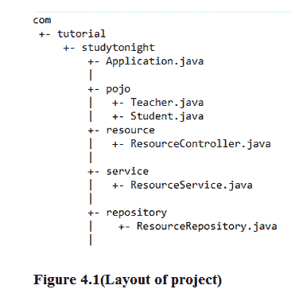

# Spring Boot 自动配置和项目结构

> 原文：<https://www.studytonight.com/spring-boot/spring-boot-autoconfiguration-and-project-structure>

在本教程中，我们将详细了解自动配置和 web 项目的结构。有必要遵循编码约定，例如使用命名包而不是默认包。spring-boot 将扫描这些包，以识别项目中定义的 beans 和实体。下面是目录结构以及我们将要创建的 Java 类文件。



## 根包的重要性

*   为了启动应用，我们将使用 main 方法运行类(通常放在根包中)，并用`@SpringBootApplication`进行注释。

*   `@SpringBootApplication`注释负责引导应用。

*   如果我们对比一下上面的项目结构，**Application.java**是用`@SpringBootApplication`注解的文件，在包**com . study south . tutory**(根包)中。

*   像**学生**和**老师**这样的实体会被 Spring 开机扫描，因为它们的包在根包里面，如下所示。

    *   **Application.java**(*网上教程今晚学习*

    *   **Student.java**(*com . tutorial . study south . POJO*)

    *   **Teacher.java**(*com . tutorial . study south . POJO*)

我们可以观察到今晚在**Student.java**和**Teacher.java**班很常见。任何放置在根包下的组件都会被 spring-boot 自动扫描。

## 什么是自动配置？

它在扫描类路径后启用。`@EnableAutoConfiguration`等注解负责自动配置。例如，当项目具有诸如**spring-boot-starter-data-JPA**之类的依赖项时，spring-boot 期望用户名、密码、url 之类的数据库详细信息，如果没有这些信息，应用将无法启动，因为 spring-boot 会扫描类路径中的*spring-boot-starter-data-JPA*依赖项，并假设项目将使用数据库。请记住，我们已经在项目设置中添加了 H2 依赖项(spring boot 会自动配置 H2 的数据库属性)。

在某些情况下，为了测试应用，我们更喜欢在最终部署到生产中之前使用内存数据库和关系数据库。

## 豆子是什么？

1.  这些对象构成了 spring 应用的主干。有些 beans 是 spring 自己在启动时根据自动配置创建的。

2.  程序员也可以使用注释`@Bean`定义他/她自己的 beans，这将在后面讨论。

3.  需要时，这些 beans 可以用于自动装配。**自动连接**只不过是将 beans 注入到其他 java 类文件中，这是 spring 自己完成的。

例如，每个学生都与一个老师相关联，在下面的班级中，我们在班级学生中实例化班级老师，这是**紧耦合**的一个例子。

```java
class Teacher {

   private String name;
   private String subject;

   //setter and getter methods

}

class Student {

   private String name;
   private int age;
   private Teacher teacher = new Teacher();

   //setter and getter methods

}
```

要自动连接**教师 bean** ，我们需要创建一个教师类的 bean(将由 spring 管理)。

```java
@Configuration
class BeanList{

    @Bean
    public Teacher teacherBean(){
         Teacher teacher = new Teacher();
         return teacher;
    }
}
```

上面的类用`@Configuration`注解，这样 spring boot 就会在类内查找任何配置。创建的 bean 将由 spring 管理，当学生类中需要自动连接时，它将被注入。

```java
class Student {

    private String name;
    private int age;

    @Autowired
    private Teacher teacher;   //Instance will be autowired by spring

}
```

## 条件自动配置:

在某些情况下，我们可以通过使用注释来限制自动配置。让我们假设，我们需要创建一个学生的 bean，但是我们需要首先创建教师类的 bean，因此，如果教师 bean 可用，则创建学生 bean。让我们使用注释来实现这一点。

```java
@Bean
@ConditionalOnBean(Teacher.class)
public Student studentBean() {
    Student student = new Student();
    return student;
}
```

只有当**教师程序**可用时，上面的代码片段才会创建**学生豆**。同样，当缺少一个 bean 时，可以使用`@ConditionalOnMissingBean`来创建一个 bean。

**结论:**在本教程中，我们已经看到了 spring-boot 中可用的项目布局和自动配置功能。

* * *

* * *