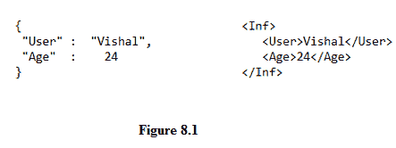
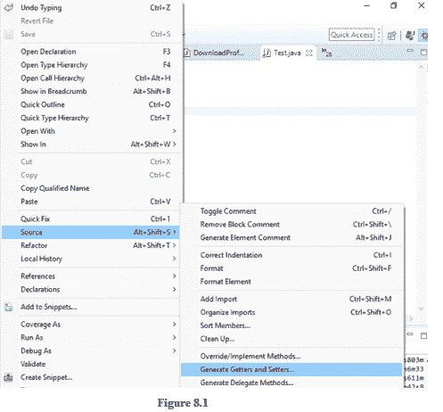
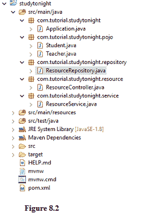
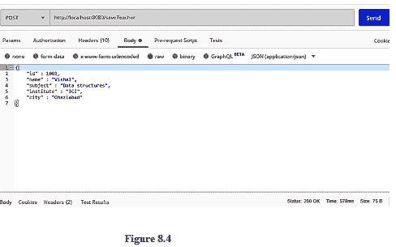

# 与 Spring Boot 一起创建休息应用

> 原文：<https://www.studytonight.com/spring-boot/creating-a-rest-application-with-spring-boot>

在本教程中，我们将开发一个 Rest 网络服务，并测试 Rest 客户端的应用编程接口。

### 什么是 REST API？

*   **REST** 代表**表征状态转移**，这是一种有效利用 **http** 协议的架构风格。

*   数据传输主要以两种格式进行( **JSON** / **XML** )。

*   JSON ( **Javascript 对象符号**)遵循**键:值对**的模式，而 XML ( **可扩展标记语言**)遵循根和分支(标签)模式。

*   每个应用都处理数据，它可能是用户配置文件、用户订单、产品信息(对于电子商务应用)等。因此，有一个需要有效处理的数据仓库。

*   应用需要一些可以处理的输入来生成输出。输出需要返回给请求数据的客户端。

*   网络服务只不过是通过网络提供的服务。REST 有助于构建称为 RESTful 网络服务的网络服务。下图分别显示了 JSON 和 XML 结构。



*   REST API 文档可以由 Swagger 生成，这将在接下来的教程中讨论。

### REST 应用编程接口的开发:

将使用注释`@RestController`扫描所有 REST 端点。

需要用端点能够处理的请求类型(GET、POST、DELETE 等)来标记您的端点。

让我们创建一些名为**学生**和**老师**的 POJOs，如下所示。这两个班级都被放在“T4”网站.教程.今晚学习. pojo 包下

<u>**Student.java**T3】</u>

```java
public class Student{
    private int id;
    private String name;
    private String institute;
    private LocalDate birthdate;
    private String city;

    //Setters and Getters
}
```

<u>**Teacher.java**T3】</u>

```java
public class Teacher{
    private int id;
    private String name;
    private String subject;
    private String institute;
    private String city;

    //Setters and Getters
}
```

上面的类是创建的 POJOs，我们需要一个 RestController 类来扫描可用的 REST 端点。在 POJOs 中，设置器和获取器可以在右击 Java 文件后从 IDE 自动生成。(如图 8.1 所示)。

****

让我们创建**资源控制器**类，它将有`@RestController`注释，

```java
@RestController
public class ResourceController{

    @Autowired
    ResourceService resourceService;

    @PostMapping("/saveTeacher")
    public void saveTeacher(@RequestBody Teacher  teacher){
        resourceService.saveTeacher(teacher);
    }

    @GetMapping("/getTeacherDetails/{id}")
    public Teacher getTeacherDetails(@PathVariable("id") int id){
        return resourceService.getTeacherDetails(id);
    }
} 
```

上面的类是用`@RestController`注释的 ResourceController，用来扫描 REST 端点。

通常在开发中，我们遵循分层架构，其中我们有用于定义端点的 RestController、所有操作发生的服务层和存储数据的存储库层。

让我们创建一个**服务层**(T2】业务逻辑所在的地方)和一个**存储库层**(用于*数据库事务*)。在本例中，我们不使用任何数据库来存储值，我们将在即将到来的教程中使用内存数据库(H2)。

我们将把值存储在一个哈希表中，并使用一个获取请求从其中检索，而不是数据库。

```java
@Service
public class ResourceService{

    @Autowired
    ResourceRepository repository;

    public void saveTeacher(Teacher teacher){
        repository.saveTeacher(teacher);
    }

    public Teacher getTeacherDetails(int id ){
        return repository.getTeacherDetails(id);
    }
}
```

现在让我们创建存储库层类，

```java
?@Service
public class ResourceService{

    @Autowired
    ResourceRepository repository;

    public void saveTeacher(Teacher teacher){
        repository.saveTeacher(teacher);
    }

    public Teacher getTeacherDetails(int id ){
        return repository.getTeacherDetails(id);
    }
}
```

以上两个类显示了服务和存储库层，分别在**com . tutorial . study now . Service**和**com . tutorial . study now . Repository**包中创建。

## 已开发项目设置的结构:

让我们探究一下目前为止我们项目的结构，



上图 8.2 显示了开发的设置的结构。要运行该应用，右键单击**Application.java**，然后单击**作为 Java 应用运行**。


上图 8.3 显示了应用已经启动并准备好接收请求。让我们使用 Rest 客户端 Postman 测试应用。



上图是 POSTMAN 观察到的截图，URL 作为`localhost:8080/saveTeacher`传递，用于保存教师详细信息(参考 ResourceController 类中的端点)。

选择 **Body** 选项卡，然后选择单选按钮 raw，将上面的 JSON 结构放置在 POSTMAN 中，并点击发送按钮(右上角)。我们可以看到收到的状态是右下角的 **200 OK** ，表示请求成功。

JSON 结构将被映射到**教师**实例，该实例是端点中的参数(参见资源控制器类)。`@RequestBody`是帮助将 JSON 结构绑定到教师类实例的注释。

请注意，我们不是使用数据库，而是将详细信息存储在哈希表中，**整数是我们在上面声明的关键字**，它应该是一个唯一的值。因此，当发出多个请求时，请确保整数值是唯一的。
T3】

上图显示了来自 POST MAN 的 GET 请求，并观察到 ID 值在 URL 中作为**路径变量传递。**

要描述路径变量，请参考上面创建的 ResourceController 类，它有端点`/getTeacherDetails/{id}`。这里的 PathVariable 是包含在大括号中的 id。Spring-boot 提供了一个注释`@PathVariable`，用于捕获网址中的路径变量。

我们将这个标识传递给存储库，并从地图中获取值。请注意，该值只不过是返回的教师类的一个实例，可以在邮递员的响应正文中看到。

**结论:**在本教程中，我们已经看到了使用 spring-boot 的 REST-API 开发和使用 Rest-client 的测试的开发。

* * *

* * *