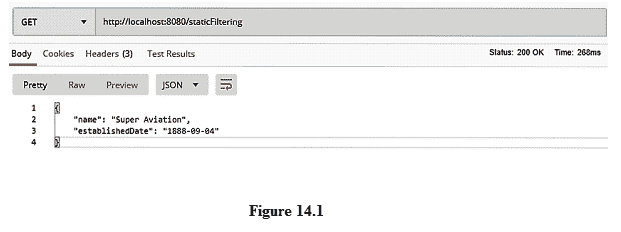
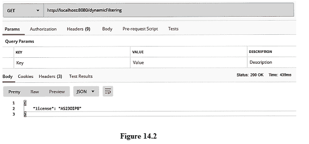

# Spring Boot 过滤器

> 原文：<https://www.studytonight.com/spring-boot/spring-boot-filtering>

在本教程中，我们将讨论 pojos 中的属性过滤及其使用 spring boot 的实现。在某些情况下，我们不会向客户发送完整的信息，如密码、许可证等机密信息，以避免系统的任何漏洞。在这种情况下，需要过滤数据。在 spring boot 中，过滤可以有两种类型:

*   静态过滤
*   动态过滤

## Spring Boot -静态过滤:

让我们在套餐`com.tutorial.studytonight.pojo`下创建一个等级**航空公司**

```java
public class Airline {

    private String name;
    @JsonIgnore   //annotation used to ignore the field
    private String license;
    private LocalDate establishedDate;

    public Airline(String name,String license,LocalDate establishedDate){
        this.name = name;
        this.license = license;
        this.establishedDate = establishedDate;
    }

    //Setters and Getters
}
```

让我们将**ResourceController.java**更改如下:

```java
@RestController
public class ResourceController {

    @GetMapping("/staticFiltering")
    public Airline staticFiltering() {

        LocalDate establishedDate=LocalDate.parse("1888-09-04"); 
        AirlineairLine = new Airline("Super Aviation","AS23OIP8", establishedDate );
        return airLine;
    }
}
```

我们在**Airline.java**中用`@JsonIgnore`注解了字段许可证，因此该字段在发送到客户端时会被忽略。启动应用来测试这个应用编程接口。



上图显示了发送的静态过滤请求，响应主体没有“**许可证**字段，因为它在 pojo 类中用`@JsonIgnore`进行了注释。

## Spring Boot -动态过滤:

我们可以通过分别修改**Airline.java**和**ResourceController.java**来实现动态级别的过滤，如下图所示:

```java
@JsonFilter("dynamicfilter")
public class Airline {

    private String name;
    private String license;
    private LocalDate establishedDate;

    public Airline(String name, String license, LocalDate establishedDate){
        this.name = name;
        this.license = license;
        this.establishedDate = establishedDate;
    }

    //Setters and Getters
}

@RestController
public class ResourceController {

    @GetMapping("/dynamicFiltering")
    public MappingJacksonValue dynamicFiltering() {

        LocalDate date = LocalDate.parse("1888-09-04");

        SimpleBeanPropertyFilter propertyFilter = SimpleBeanPropertyFilter.filterOutAllExcept("license");
        // Adding filter using a id name
        FilterProvider filter = new SimpleFilterProvider().addFilter("dynamicfilter", propertyFilter);    

        Airline airLine = new Airline("Super Aviation", "AS23", date);
        // Setting a filter
        MappingJacksonValue value = new MappingJacksonValue(airLine);
value.setFilters(filter);    
        return value;    
    }
}
```

`SimpleBeanPropertFilter`是提供如`filterOutAllExcept`等方法的类，用于过滤 pojo 中的字段。在上述方法中，字段**许可证**作为参数被传递，这意味着过滤除许可证之外的所有字段。

`FilterProvider`是另一个类，它在上面的代码中添加了一个唯一的 id 名为`dynamicfilter`的`SimpleBeanPropertyFilter`。

请注意，上面的 pojo 也被注释为`@JsonFilter`传递与`dynamicfilter`相同的 Id 名称。

`MappingJacksonValue`将被反序列化以向客户端返回响应。启动要测试的应用。



上图显示为动态过滤发送的 GET 请求。请注意，由于在此字段上设置了**简单属性过滤器**方法**过滤除**以外的所有字段。

**结论:**这样，从使用 spring boot 发送到客户端就可以完成对机密信息的过滤。

* * *

* * *