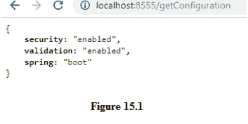
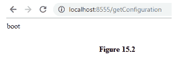

# 读取 Spring 配置的方法

> 原文：<https://www.studytonight.com/spring-boot/methods-to-read-spring-configuration>

在本教程中，我们将学习阅读 spring boot 配置的方法。我们已经了解到，spring boot 会根据项目设置时选择的依赖关系自动配置项目。编写自定义配置的另一种方式是使用 **application.properties** 文件，在该文件中可以定义用户属性。

我们将在**应用中编写一些自定义属性。属性**将创建一个**组件**来读取应用中的细节。

让我们在 application.properties 文件中添加以下属性。

```java
custom.property.security=enabled
custom.property.validation=enabled
custom.property.spring=boot
```

在根包下创建一个类，如下所示:

```java
@Component
@ConfigurationProperties("custom.property")
public class ApplicationConfiguration {

    private String security;
    private String validation;
    private String spring;

    //Setters and Getters

}
```

该类用`@Component`和`@ConfigurationProperties`注解。`@Component`注释用于标记类而不是方法，而`@Bean`用于方法。上面创建的类将由 spring 作为一个组件来管理。我们已经讨论了用于扫描所有可用组件的`@ComponentScan`。它可以用`@SpringBootApplication`代替，因为它也可以执行`@ComponentScan`功能。`@ConfigurationProperties`提供了一个字符串，其格式类似于 **application.properties** 中提到的属性，这些属性的最后一个前缀被声明为上述类中的字段(比较 application.properties 和 ApplicationConfiguration 类)。

我们现在将开发一个小的应用编程接口，允许我们使用上面的`@Component`注释类显示配置。

Spring boot 允许我们自动连接**应用配置**类，并观察下面的应用编程接口代码。

```java
public class ResourceController {
    @Autowired
    ApplicationConfiguration applicationConfiguration;

    @GetMapping("/getConfiguration")
    public ApplicationConfiguration getConfiguration(){
        return applicationConfiguration;
    }
}
```

上面的类返回由 spring boot 自动连接的 ApplicationConfiguration 的引用。由于请求是一个 GET 请求，让我们从浏览器点击应用编程接口:



具有上述配置的应用配置字段已返回浏览器。

## 使用注释获取应用配置:

读取配置的另一种方法是使用`@Value`注解。`@Value`根据传递的字符串读取配置，观察下面的代码:

```java
public class ResourceController{ 

    @Value("${custom.property.spring}")
    String val;

        @GetMapping("/getConfigurationProperty")
        public String getConfigurationProperty() {
            return val;
        }
} 
```

上面的代码读取指定的`custom.property.spring`属性，并将该值绑定到字符串变量。

上面的代码有一个 GET 请求处理程序，它将值返回给客户端。



当应用需要一些初始化参数，如安全令牌验证时间等时，它非常有用。例如，让我们假设用户发送了一个 JWT 令牌，并且它应该在 24 小时内有效。我们可以在我们的**应用中设置属性。属性**文件可以在用户尝试使用 JWT 令牌进行认证时使用。Spring Security 模块提供了一种处理 JWT 的方法。当遵循微服务架构时，处理配置管理是非常重要的。

**结论:**在本教程中，我们已经看到了用户在 **application.properties** 中定义的自定义配置，以及使用 ConfigurationProperties 类和`@Value`注释读取应用配置的方法。

* * *

* * *