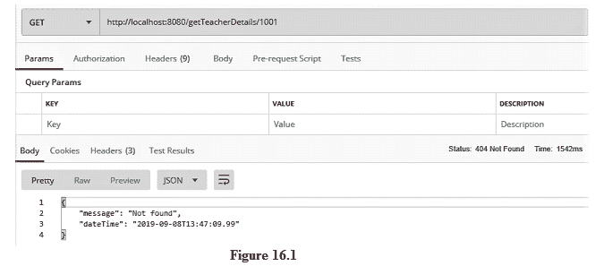

# Spring Boot 全球异常处理

> 原文：<https://www.studytonight.com/spring-boot/spring-boot-global-exception-handling>

在本教程中，我们将讨论 spring boot 提供的定制异常处理。在 Java 中，[异常处理](https://www.studytonight.com/java/exception-handling.php)是由 [try，catch 块](https://www.studytonight.com/java/try-and-catch-block.php)完成的，但是 spring boot 也允许我们提供定制的全局异常处理，在这里我们不需要添加 try catch 块 everwhere，我们可以创建一个单独的类来处理异常，它还将异常处理代码与业务逻辑代码分开。

## Spring Boot 的全球异常处理:

我们需要创建一些类来实现 spring 启动异常处理。我们的**ResourceController.java**文件有许多端点，我们在之前的教程中使用 Rest 客户端测试了这些端点。其中一个端点允许我们在 **Id** 的基础上获取**教师详细信息**，该 Id 作为**路径变量**传递。在某些情况下，如果 Id 没有存储在我们的`java.util.HashMap` (在我们的存储库层中使用)中，它**返回空引用，状态为 200 Ok**。让我们返回 404 未找到的响应状态，并在找不到教师时显示一条定制的异常消息。

在**com . tutorial . study south . exception**包中创建以下类。

**TeacherNotFoundException.java 类:**这是一个用户定义的类，扩展了**Java . lang . runtimeexception**类。

```java
public class TeacherNotFoundException extends RuntimeException {
    // Exception class 
}
```

**ExceptionResponse.java 类:**该类属性将作为定制异常处理的一部分返回给客户端。

```java
public class ExceptionResponse {

    private String message;
    private LocalDateTime dateTime;

    public String getMessage() {
        return message;
    }
    public void setMessage(String message) {
        this.message = message;
    }
    public LocalDateTime getDateTime() {
        return dateTime;
    }
    public void setDateTime(LocalDateTime dateTime) {
        this.dateTime = dateTime;
    }    
}
```

**CustomizedExceptionHandling.java 类:**该类用`@ControllerAdvice`注解，这意味着该类将能够处理任何**控制器**发生的异常(不仅限于**ResourceController.java**)。它扩展了类`ResponseEntityExceptionHandler`，公开了实现该特性所需的功能。需要`@ExceptionHandler`注释来处理抛出的异常类型，相应的方法将能够处理异常。

```java
@ControllerAdvice
public class CustomizedExceptionHandling extends ResponseEntityExceptionHandler {

    @ExceptionHandler(TeacherNotFoundException.class)
    public ResponseEntity<Object> handleExceptions( TeacherNotFoundException exception, WebRequest webRequest) {
        ExceptionResponse response = new ExceptionResponse();
        response.setDateTime(LocalDateTime.now());
        response.setMessage("Not found");
        ResponseEntity<Object> entity = new ResponseEntity<>(response,HttpStatus.NOT_FOUND);
        return entity;
    }
}
```

Spring boot 提供了**响应实体****HttpResponse**等类，用于设置响应代码，可以将异常实体作为消息发送给客户端。在上面的代码中，用`@ExceptionHandler`注释的方法足以处理**示教不发现异常**。创建了**响应实体**对象，并传递了异常响应和 HttpStatus，这将反映在定制消息中。

让我们测试一下我们之前创建的`getTeacherDetails`服务方法，注意下面分别在控制器、服务和存储库层的代码。

```java
@RestController
public class ResourceController {

    @Autowired
    ResourceService resourceService;

    @GetMapping("/getTeacherDetails/{id}")
    public Teacher getTeacherDetails(@PathVariable("id") int id){
        Teacher teacher = resourceService.getTeacherDetails(id);
        if(teacher == null)
            throw new TeacherNotFoundException();

        return teacher;
    }
}

@Service
public class ResourceService {

    @Autowired
    ResourceRepository repository;

    public Teacher getTeacherDetails(int id){
        return repository.getTeacherDetails(id);
    }
}    

@Repository
public class ResourceRepository {

    private Map<Integer,Teacher> teacherMap = new HashMap<Integer,Teacher>();

    public Teacher getTeacherDetails(int id){
        Teacher teacher = teacherMap.get(id);
        return teacher;
    }
}
```

运行应用，并使用 POSTMAN 测试应用编程接口。



从上图可以看出，收到的响应包含**异常响应**字段，状态代码为 **404 未找到**。我们暂时没有保存 id 为 1001 的任何详细信息，因此，上述响应已返回给客户端。

**结论:**在本教程中，我们已经看到了使用 spring-boot 和注释的定制异常处理。

* * *

* * *