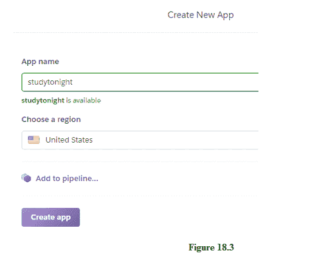
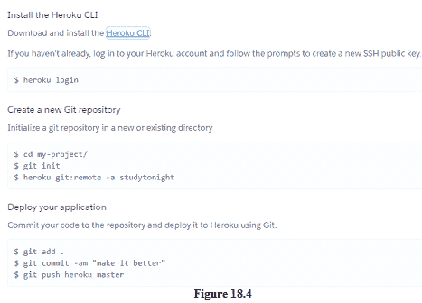
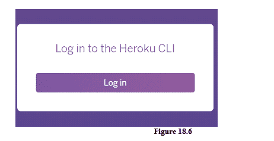
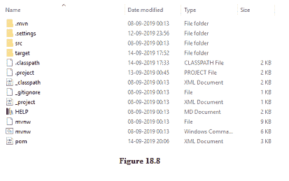
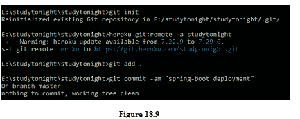
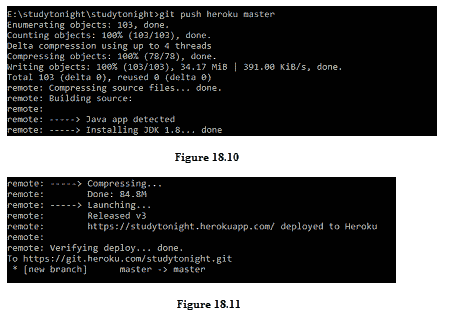
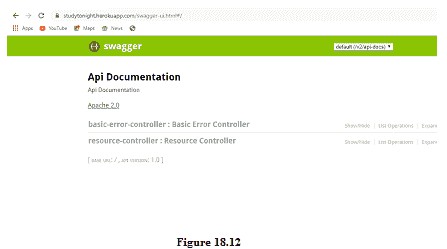

# Spring Boot 云部署

> 原文：<https://www.studytonight.com/spring-boot/spring-boot-cloud-deployment>

在本教程中，我们将在云环境中部署 spring-boot 应用。应用开发通常经历三个阶段，即**开发**、**测试**和生产**部署**。我们将在 **Heroku 云**上部署应用。

### 托管我们服务的云注册

我们需要在提供托管云服务的 heroku 上注册: **[注册/登录](https://signup.heroku.com/login)** 后登录使用 Heroku 服务。

## 在云上部署 Spring Boot 应用

Heroku 为云上不同的部署提供服务，我们需要 Git ( [在你的本地机器上安装 Git](https://www.studytonight.com/github/install-git))和 Heroku CLI(命令行界面)安装在机器上。登录后，我们将被重定向到 heroku 仪表板，类似于下图 18.1:

 

上面的仪表板显示了部署在云上的可用应用，要部署新应用，请单击右上角的**新建**按钮，该按钮显示了下图所示的两个选项。

点击**创建新应用**选项，该选项会将您重定向至如下所示的屏幕:

输入 **App 名称**后，会显示消息是否可用(您必须为您的 App 选择一个唯一的名称)，所选区域如上图所示。点击**创建应用**后，将显示以下屏幕，描述要遵循的程序。如上所述，Heroku CLI 更倾向于在 Heroku 上部署应用，可以从这里安装- [Heroku CLI](https://devcentre.heroku.com/articles/heroku-command-line) 。

下面的屏幕截图显示了部署时应遵循的说明。

切换到创建我们项目的工作区，并在该位置打开 **CMD** 。键入命令 **heroku 登录**(确保系统中正确安装了 GIT 和 herkou CLI)。它显示如下图所示的信息，并输入任意键。

浏览器上将打开一个新窗口，要求用户登录。由于我们已经登录，登录屏幕将类似于下图。

上图显示了登录后将在 CMD 上显示的认证过程，如图 18.6 所示。CMD 是在切换到工作区后打开的，如果是其他目录，请确保将目录更改到工作区。

上图 18.8 是创建项目的工作区内容。

按照上图所示的上述命令进行操作:

*   `git init` = >初始化指定目录中的 Git 存储库。
*   `heroku git:remote -a studytonight` = >与英雄库云建立远程。
*   `git add .` = >添加部署所需的所有文件。
*   `git commit` = >添加文件后提交。
*   我们需要使用 git push heroku master 命令将项目推送到 Heroku 云。

上图 18.11 显示了部署成功后的最终部署消息，访问我们云上应用的链接是`https://studytonight.herokuapp.com`，可以用来击中 Rest 端点。

让我们在云上测试应用，如下所示。我们已经启用了显示应用的可用资源端点的 swagger。

注意图 18.12 中 heroku 云提供的网址。

**结论:**在本教程中，我们已经看到了 spring-boot 项目在 heroku 云上的部署。该应用有许多特定于云的状态，如Hibernate、唤醒、睡眠，这些状态特定于 heroku 云，并且取决于使用该应用的活跃用户数量

* * *

* * *