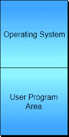
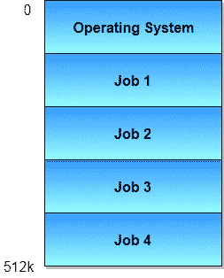
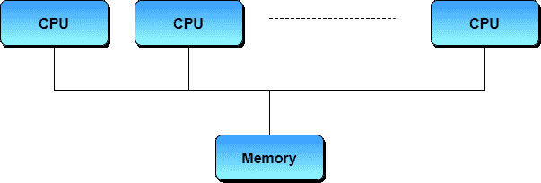

# 操作系统的类型

> 原文：<https://www.studytonight.com/operating-system/types-of-os>

以下是一些最广泛使用的操作系统类型。

如果你不知道什么是操作系统，可以从[这里](introduction-operating-systems)学习。

1.  简单批量系统
2.  多道程序批处理系统
3.  多处理机系统
4.  桌面系统
5.  分布式操作系统
6.  集群系统
7.  实时操作系统
8.  手持系统

* * *

## 简单批处理系统

*   在这种类型的系统中，用户和计算机之间没有**直接交互。**
*   用户必须向计算机操作员提交作业(写在卡片或磁带上)。
*   然后计算机操作员在输入设备上放置一批几个作业。
*   根据语言和需求的类型，作业被分批放在一起。
*   然后一个特殊的程序，监视器，管理批处理中每个程序的执行。
*   监视器始终在主内存中，可供执行。

#### 简单批处理系统的优势

1.  用户和计算机之间没有交互。
2.  没有确定流程优先级的机制。

* * *

## 多道程序批处理系统

*   在这种情况下，操作系统从内存中获取并开始执行其中一个作业。
*   一旦这个作业需要一个输入/输出操作，操作系统就会切换到另一个作业(CPU和操作系统总是很忙)。
*   内存中的作业总是少于磁盘上的作业数量(作业池)。
*   如果几个作业准备同时运行，那么系统通过 **[CPU 调度](cpu-scheduling)** 的过程选择运行哪一个。
*   在非多道程序系统中，有时CPU处于空闲状态，不做任何工作。
*   在多道程序设计系统中，CPU永远不会空闲并继续处理。

**分时系统**与多道程序批处理系统非常相似。事实上，分时系统是多道程序系统的延伸。

在分时系统中，主要关注的是最小化响应时间，而在多道程序设计中，主要关注的是最大化CPU的使用。

* * *

## 多处理器系统

多处理器系统由共享一个公共物理内存的几个处理器组成。多处理器系统提供了更高的计算能力和速度。在多处理器系统中，所有处理器都在单一操作系统下运行。处理器的多样性以及它们如何协同工作对其他处理器来说是透明的。

#### 多处理器系统的优势

1.  增强的性能
2.  不同处理器同时执行几个任务，在不加快单个任务执行速度的情况下提高了系统的吞吐量。
3.  如果可能，系统将任务分成许多子任务，然后这些子任务可以在不同的处理器中并行执行。从而加快单个任务的执行速度。

* * *

## 桌面系统

早些时候，CPU和个人电脑缺乏保护操作系统免受用户程序攻击所需的功能。因此，个人电脑操作系统既不是**多用户**也不是**多任务**。然而，这些操作系统的目标随着时间而改变；这些系统没有最大限度地提高 CPU 和外围设备的利用率，而是选择最大限度地提高用户的便利性和响应能力。这些系统被称为**桌面系统**，包括运行`Microsoft Windows`和`Apple Macintosh`的电脑。这些计算机的操作系统在几个方面受益于**主机**操作系统的开发。

**微型计算机**能够立即采用为更大的操作系统开发的一些技术。另一方面，微型计算机的硬件成本足够低，个人可以单独使用计算机，CPU的利用率不再是首要考虑的问题。因此，在大型机操作系统中做出的一些设计决策可能不适合较小的系统。

* * *

## 分布式操作系统

开发分布式操作系统背后的动机是强大而廉价的微处理器的可用性和通信技术的进步。

这些技术进步使得设计和开发分布式系统成为可能，该系统由许多通过通信网络相互连接的计算机组成。分布式系统的主要好处是它的低性价比。

#### 分布式操作系统的优势

1.  由于涉及多个系统，一个站点的用户可以利用其他站点的系统资源来执行资源密集型任务。
2.  快速处理。
3.  主机上的负载更少。

* * *

### 分布式操作系统的类型

下面是使用的两种分布式操作系统:

1.  客户端-服务器系统
2.  对等系统

#### 客户端-服务器系统

**集中式系统**今天充当**服务器系统**，以满足**客户端系统**生成的请求。客户端-服务器系统的一般结构如下图所示:

服务器系统可以大致分为:**计算服务器**和**文件服务器**。

*   **计算服务器系统**提供了一个接口，客户端可以向该接口发送执行操作的请求，作为响应，它们执行操作并将结果发送回客户端。
*   **文件服务器系统**，提供了一个文件系统界面，客户端可以在其中创建、更新、读取和删除文件。

#### 对等系统

计算机网络的发展——尤其是互联网和万维网——对操作系统的最新发展产生了深远的影响。当个人电脑在 20 世纪 70 年代推出时，它们是为个人使用而设计的，通常被认为是独立的电脑。随着 20 世纪 90 年代互联网开始广泛用于电子邮件和FTP协议，许多个人电脑连接到计算机网络。

与紧密耦合的系统不同，这些应用中使用的计算机网络由不共享内存或时钟的处理器集合组成。相反，每个处理器都有自己的本地内存。处理器通过各种通信线路相互通信，例如高速总线或电话线。这些系统通常被称为松耦合系统(或分布式系统)。客户端-服务器系统的一般结构如下图所示:

* * *

## 集群系统

*   像并行系统一样，集群系统聚集多个 CPU 来完成计算工作。
*   然而，集群系统与并行系统的不同之处在于，它们由两个或多个耦合在一起的独立系统组成。
*   术语集群的定义是**不是具体的；**普遍接受的定义是集群计算机共享存储，并通过局域网紧密连接。
*   通常执行集群以提供**高可用性**。
*   一层集群软件在集群节点上运行。每个节点可以监控一个或多个其他节点。如果受监控机器发生故障，监控机器可以获得其存储的所有权，并重新启动在故障机器上运行的应用程序。出现故障的机器可以保持停机，但是应用程序的用户和客户端只能看到短暂的服务中断。
*   **非对称集群-** 在这种情况下，一台机器处于热备用模式，而另一台机器正在运行应用程序。热备用主机(机器)除了监视活动服务器之外什么也不做。如果该服务器出现故障，热备用主机将成为活动服务器。
*   **对称集群-** 在这种情况下，两台或多台主机正在运行应用程序，并且它们正在相互监视。这种模式显然更有效，因为它使用了所有可用的硬件。
*   **并行集群-** 并行集群允许多个主机访问共享存储上的相同数据。因为大多数操作系统缺乏对多台主机同时进行数据访问的支持，所以并行集群通常由特殊版本的软件和特殊版本的应用程序来完成。

集群技术正在迅速变化。随着存储区域网络的发展，集群系统的使用和功能应该会大大扩展。San 允许多个主机轻松连接到多个存储单元。由于将主机连接到共享存储的复杂性，当前的群集通常仅限于两台或四台主机。

* * *

## 实时操作系统

它被定义为一个操作系统，已知它为它执行的每个关键操作提供最大的时间，如操作系统调用和中断处理。

保证关键操作的最大时间并按时完成的实时操作系统被称为**硬实时操作系统。**

而实时操作系统只能保证最大的时间，即关键任务将优先于其他任务，但不能保证在规定的时间内完成。这些系统被称为**软实时操作系统**。

* * *

## 手持系统

手持系统包括**个人数字助理(PDAs)** ，如`Palm-Pilots`或`Cellular Telephones`，可连接互联网等网络。它们通常尺寸有限，因此大多数手持设备都只有少量内存，包括慢速处理器，并且具有小显示屏。

*   很多手持设备的内存在 **512 KB** 到 **8 MB** 之间。因此，操作系统和应用程序必须有效地管理内存。这包括当内存不再被使用时，将所有分配的内存返回给内存管理器。
*   目前，许多手持设备不使用虚拟内存技术，因此迫使程序开发人员在有限的物理内存范围内工作。
*   大多数手持设备的处理器运行速度通常只有个人电脑处理器的一小部分。更快的处理器需要**更多的功率**。在手持设备中加入更快的处理器需要更大的 T2 电池，而这需要更频繁的更换。
*   手持设备的程序设计人员面临的最后一个问题是通常可用的小显示屏。在网页中显示内容的一种方法是**网页剪辑**，其中只有网页的一小部分被传送并显示在手持设备上。

一些手持设备可能使用无线技术，如**蓝牙**，允许远程访问电子邮件和网页浏览。**与互联网连接的手机**就属于这一类。随着网络连接变得更加可用，以及其他选项(如`cameras`和`MP3 players`)扩大了它们的效用，它们的使用继续扩大。

* * *

* * *