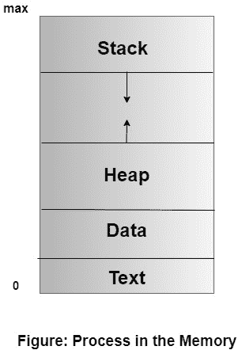
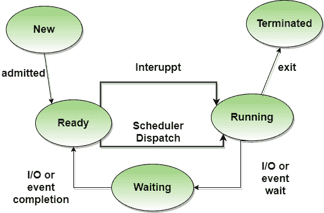

# 操作系统中的进程

> 原文：<https://www.studytonight.com/operating-system/operating-system-processes>

进程是一个正在执行的程序，它构成了所有计算的基础。这个进程和程序代码不一样，但要比它多得多。一个进程是一个“主动”实体，而不是被认为是“被动”实体的程序。进程持有的属性包括硬件状态、内存、CPU 等。

**进程记忆**为高效工作分为四个部分:

*   **文本部分**由编译后的程序代码组成，在程序启动时从非易失性存储器中读入。

*   **数据段**由全局变量和静态变量组成，在执行 main 之前进行分配和初始化。

*   **堆**用于动态内存分配，通过调用 new、delete、malloc、free 等进行管理。

*   **栈**用于局部变量。声明局部变量时，堆栈上的空间会保留给它们。

## 不同的进程状态

操作系统中的进程可以处于以下任何状态:

*   `NEW` -正在创建进程。

*   `READY` -进程正在等待分配给处理器。

*   `RUNNING` -指令正在执行。

*   `WAITING` -进程正在等待某个事件发生(如输入/输出完成或信号接收)。

*   `TERMINATED` -进程已经执行完毕。

## 进程控制块

每个进程都有一个进程控制块，包含了关于进程的所有信息。它也被称为任务控制块。它是一种数据结构，包含以下内容:

*   **进程状态**:可以是运行、等待等。

*   **进程标识**和**父进程标识**。

*   CPU 寄存器和程序计数器。**程序计数器**保存该进程要执行的下一条指令的地址。

*   **CPU 调度**信息:如优先级信息、调度队列指针等。

*   **内存管理信息**:例如页表或段表。

*   **计费信息**:消耗的用户和内核 CPU 时间、账号、限额等。

*   **输入输出状态信息**:设备分配、打开文件表等。

## 进程与程序

让我们来看看进程和计划之间的区别:

| 进程 | 程序 |
| --- | --- |
| 该进程基本上是正在执行的计算机程序的一个实例。 | 程序基本上是指令的集合，当由计算机执行时，主要执行特定的任务。 |
| 一个进程的寿命较短。 | 程序的寿命更长。 |
| 一个进程需要内存、CPU、输入输出设备等资源。 | 程序由硬盘存储，不需要任何资源。 |
| 进程有一个代码和数据的动态实例 | 程序有静态代码和静态数据。 |
| 基本上，一个进程就是代码的**运行实例**。 | 另一方面，程序是**可执行代码**。 |

### 进程调度

当有两个或多个可运行的进程时，由操作系统决定先运行哪个进程，然后称为进程调度。

调度器用于通过使用一些调度算法来做出决策。

下面给出了一个**好的调度算法**的属性:

*   用户的响应时间应该最短。

*   每小时处理的作业数量应该是最大的，即好的调度算法应该提供最大的吞吐量。

*   CPU 的利用率应该是 100%。

*   每个进程都应该得到一个公平的 CPU 份额。

* * *

* * *