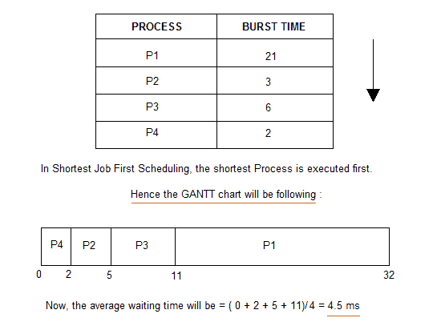

# 最短作业优先(SJF)计划

> 原文：<https://www.studytonight.com/operating-system/shortest-job-first>

最短作业优先调度首先处理具有最短**突发时间**或**持续时间**的流程。

*   这是减少等待时间的最佳方法。
*   这在[批处理系统](types-of-os)中使用。
*   它有两种类型:
    1.  非预防性
    2.  抢先
*   为了成功地实现它，进程的突发时间/持续时间应该预先为处理器所知，这实际上并不总是可行的。
*   如果所有作业/流程同时可用，则此调度算法是最佳的。(要么所有人的到达时间为`0`，要么所有人的到达时间相同)

* * *

## 非优先最短作业优先

考虑就绪队列中可供执行的以下流程，其中**到达时间**为所有流程的`0`，给定**突发时间**。



在上面的**甘特图**中可以看到，进程 **P4** 会因为爆发时间最短而先被拾取，然后是 **P2** ，接着是 **P3** ，最后是 **P1** 。

我们在前面的教程中使用[先来先服务](first-come-first-serve)算法安排了相同的一组流程，得到的平均等待时间为`18.75 ms`，而对于 SJF，平均等待时间为`4.5 ms`。

* * *

### 非先发制人的 SJF 的问题

如果进程的**到达时间**不同，这意味着所有进程在时间`0`都不在就绪队列中可用，并且一些作业在一段时间后到达，在这种情况下，有时突发时间短的进程必须等待当前进程的执行完成，因为在非先发制人的 SJF，当持续时间短的进程到达时，现有作业/进程的执行不会暂停/停止以首先执行短的作业。

这就导致了**饥饿**的问题，较短的进程需要等待很长时间，直到当前较长的进程被执行。如果更短的工作不断出现，就会出现这种情况，但这可以通过**老化**的概念来解决。

* * *

## 先发制人的最短作业优先

在抢占式最短作业优先调度中，作业到达时被放入就绪队列，但当**短突发时间**的进程到达时，现有进程被抢占或从执行中移除，较短的作业被首先执行。


平均等待时间为((5-3)+(6-2)+(12-1))/4=8.75

抢先最短作业优先调度的平均等待时间小于非抢先 SJF 调度和 FCFS 调度

在上面的**甘特图**中可以看到，由于 **P1** 先到达，因此立即开始执行，但是就在`1 ms`之后，进程 **P2** 到达时`3 ms`的**突发时间**小于 **P1** 的突发时间，因此进程 **P1** (完成 1 毫秒，还剩 20 毫秒)被抢占，进程 **P2** 被执行。

随着 **P2** 被执行，在`1 ms`之后， **P3** 到达，但是其爆发时间大于 **P2** ，因此 **P2** 的执行继续。但是又过了一毫秒， **P4** 到达，突发时间为`2 ms`，结果 **P2** (2 毫秒完成，还剩 1 毫秒)被抢占，执行 **P4** 。

**P4** 完成后，拿起 **P2** 完成，然后 **P2** 执行，最后 **P1** 。

先发制人的 SJF 也被称为**最短剩余时间优先**，因为在任何给定的时间点，剩余时间最短的作业都会首先执行。

* * *

## SJF 计划

在下面的程序中，我们将所有工作的**到达时间**视为`0`。

此外，在程序中，我们将根据所有作业的**爆发时间**对它们进行**排序，然后逐个执行它们，就像我们在 FCFS 调度程序中所做的那样。**

```
// c++ program to implement Shortest Job first

#include<bits/stdc++.h>

using namespace std;

struct Process
{
   int pid;     // process ID
   int bt;      // burst Time
};

/* 
    this function is used for sorting all
    processes in increasing order of burst time
*/
bool comparison(Process a, Process b)
{
    return (a.bt < b.bt);
}

// function to find the waiting time for all processes
void findWaitingTime(Process proc[], int n, int wt[])
{
    // waiting time for first process is 0
    wt[0] = 0;

    // calculating waiting time
    for (int i = 1; i < n ; i++)
    {
        wt[i] = proc[i-1].bt + wt[i-1] ;
    }
}

// function to calculate turn around time
void findTurnAroundTime(Process proc[], int n, int wt[], int tat[])
{
    // calculating turnaround time by adding bt[i] + wt[i]
    for (int i = 0; i < n ; i++)
    {
        tat[i] = proc[i].bt + wt[i];
    }
}

// function to calculate average time
void findAverageTime(Process proc[], int n)
{
    int wt[n], tat[n], total_wt = 0, total_tat = 0;

    // function to find waiting time of all processes
    findWaitingTime(proc, n, wt);

    // function to find turn around time for all processes
    findTurnAroundTime(proc, n, wt, tat);

    // display processes along with all details
    cout << "\nProcesses "<< " Burst time "
         << " Waiting time " << " Turn around time\n";

    // calculate total waiting time and total turn around time
    for (int i = 0; i < n; i++)
    {
        total_wt = total_wt + wt[i];
        total_tat = total_tat + tat[i];
        cout << " " << proc[i].pid << "\t\t"
             << proc[i].bt << "\t " << wt[i]
             << "\t\t " << tat[i] <<endl;
    }

    cout << "Average waiting time = "
         << (float)total_wt / (float)n;
    cout << "\nAverage turn around time = "
         << (float)total_tat / (float)n;
}

// main function
int main()
{
    Process proc[] = {{1, 21}, {2, 3}, {3, 6}, {4, 2}};
    int n = sizeof proc / sizeof proc[0];

    // sorting processes by burst time.
    sort(proc, proc + n, comparison);

    cout << "Order in which process gets executed\n";
    for (int i = 0 ; i < n; i++)
    {
        cout << proc[i].pid <<" ";
    }

    findAverageTime(proc, n);

    return 0;
}
```

进程执行的顺序 4 2 3 1 进程突发时间等待时间周转时间 4 2 0 2 3 5 3 6 5 11 21 11 32 平均等待时间= 4.5 平均周转时间= 12.5

试着为不同的工作，你自己，用可变的**到达时间**为 SJF 实现这个程序。

* * *

* * *