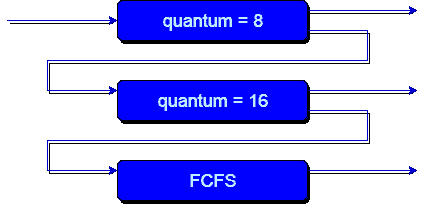

# 多级反馈队列调度

> 原文：<https://www.studytonight.com/operating-system/multilevel-feedback-queue-scheduling>

在多级队列调度算法中，进程在进入系统时被永久分配给一个队列。进程不会在队列之间移动。这种设置的优点是调度开销低，但缺点是不灵活。

然而，多级反馈队列调度允许进程在队列之间移动。其思想是分离具有不同 CPU 突发特性的进程。如果一个进程使用太多的 CPU 时间，它将被移动到一个低优先级队列。类似地，在低优先级队列中等待太久的进程可能会被移动到高优先级队列。这种形式的衰老可以防止饥饿。

通常，多级反馈队列调度器由以下参数定义:

*   队列的数量。

*   每个队列的调度算法。

*   用于确定何时将进程升级到更高优先级队列的方法。

*   用于确定何时将进程降级到低优先级队列的方法。

*   用于确定进程需要服务时将进入哪个队列的方法。

多级反馈队列调度器的定义使其成为最通用的 CPU 调度算法。它可以配置为匹配设计中的特定系统。不幸的是，它还需要一些为所有参数选择值的方法来定义最佳调度程序。虽然多级反馈队列是**最通用的方案**，但也是**最复杂的**。

**上图可以看到一个多级反馈队列的例子。**

**说明:**

首先，假设队列 1 和 2 分别遵循时间量为 8 和 16 的循环，队列 3 遵循 FCFS。多级反馈队列调度的实现之一如下:

1.  如果任何进程开始执行，那么它首先进入队列 1。

2.  在队列 1 中，该进程执行 8 个单元，如果它在这 8 个单元中完成，或者它在这 8 个单元中为输入/输出操作提供了 CPU，则该进程的优先级不会改变，并且如果由于某些原因它再次进入就绪队列，则它再次在队列 1 中开始执行。

3.  如果队列 1 中的进程没有在 8 个单元内完成，那么它的优先级会降低，并转移到队列 2。

4.  以上第 2 点和第 3 点同样适用于队列 2 中的进程，但时间量为 16 个单位。通常，如果任何进程没有在给定的时间段内完成，那么它将被转移到较低优先级的队列中。

5.  之后，在最后一个队列中，所有进程都以 FCFS 方式进行调度。

6.  需要注意的是，低优先级队列中的进程只能在高优先级队列为空时执行。

7.  低优先级队列中的任何正在运行的进程都可能被到达高优先级队列的进程中断。

此外，对于最后一个队列将遵循**循环调度的示例，上述实现可能有所不同。**

**在上面的实现中，有一个问题，那就是；**由于一些短进程占用了所有的 CPU 时间，处于低优先级队列中的任何进程都必须遭受饥饿。

**而这个问题的解决方案是:**
有一个解决方案是在有规律的间隔后提升所有进程的优先级，然后将所有进程放在优先级最高的队列中。

## 多级反馈队列调度的需求(MFQS)

以下是理解这种复杂调度需求的一些要点:

*   这种调度比多级队列调度更灵活。

*   该算法有助于缩短响应时间。

*   为了优化周转时间，需要 SJF 算法，该算法基本上需要进程的运行时间来调度它们。众所周知，进程的运行时间是事先不知道的。此外，这种调度主要在一个时间段内运行一个进程，之后，如果进程很长，它可以改变进程的优先级。因此，该调度算法主要从进程的过去行为中学习，然后可以预测进程的未来行为。通过这种方式，MFQS 试图先运行一个更短的进程，从而优化周转时间。

## MFQS 的优势

*   这是一种灵活的调度算法

*   这种调度算法允许不同的进程在不同的队列之间移动。

*   在该算法中，在较低优先级队列中等待太久的进程可以被移动到较高优先级队列，这有助于防止饥饿。

## MFQS 的缺点

*   这个算法太复杂了。

*   由于进程在不同的队列中移动，这导致产生更多的 CPU 开销。

*   为了选择最佳调度器，该算法需要一些其他手段来选择值

* * *

* * *