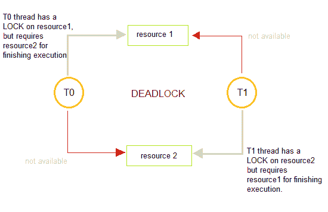

# 操作系统中的死锁介绍

> 原文：<https://www.studytonight.com/operating-system/deadlocks>

死锁是一组阻塞的进程，每个进程都持有一个资源，并等待获取另一个进程持有的资源。

在上图中，进程 T0 有资源 1，它需要资源 2 来完成它的执行。同样，进程 T1 有资源 2，它也需要获取资源 1 来完成它的执行。这样，T0 和 T1 就陷入了僵局，因为它们都需要别人的资源来完成它们的执行，但它们都不愿意放弃自己的资源。

一般来说，进程必须在使用资源之前请求它，并且在使用资源之后释放它。为了完成指定的任务，任何进程都可以请求所需的资源。并且有一个条件，即请求的资源数量不能超过系统中可用资源的总数。

基本上，在正常操作模式下，流程对资源的利用顺序如下:

1.  **请求:**
    首先，进程请求资源。在这种情况下，如果不能立即批准请求(例如:资源正被任何其他进程使用)，则请求进程必须等待，直到它可以获取资源。

2.  **使用:**
    进程可以对资源进行操作(例如:如果资源是打印机，那么在这种情况下进程可以在打印机上打印)。

3.  **释放:**
    流程释放资源。

让我们来看看饥饿和僵局之间的区别。

## 饥饿 vs 死锁

| 饿死 | 僵局 |
| --- | --- |
| 当所有低优先级进程被阻塞，而高优先级进程执行时，这种情况被称为饥饿。 | 死锁是当其中一个进程被阻塞时发生的情况。 |
| 饥饿是一个漫长的等待，但它不是一个无限的过程。 | 死锁是一个无限的过程。 |
| 没有必要说每一次饥饿都是僵局。 | 每个僵局都有饥饿。 |
| 饥饿是由于不受控制的优先级和资源管理。 | 在死锁期间，抢占和循环等待不会同时发生。 |

资源调度程序可以检测到死锁的发生。

在下一节中，我们将讨论导致死锁的条件。

## 必要条件

只有当以下四个条件同时成立时，才会出现死锁情况:

### 1.互斥现象

根据此条件，至少有一个资源应该是不可共享的(不可共享的资源是一次只能由一个进程使用的资源。)

### 2.保持等待

根据这种情况，进程至少持有一个资源，并且正在等待其他资源。

### 3.禁止抢占

不能从流程中获取资源，因为资源只能由持有它们的流程自愿释放。

### 4.循环等待

在这种情况下，一组进程以循环形式相互等待。

上述四个条件并不是完全独立的，因为循环等待条件意味着保持和等待条件。我们强调，所有四个条件都必须适用于僵局。

死锁情况可以通过许多方法来避免。让我们来看看其中的一些方法。

## 处理死锁的方法

用于处理死锁问题的方法如下:

### 1.忽略死锁

根据这种方法，假设死锁永远不会发生。这种方法被许多操作系统使用，它们假设死锁永远不会发生，这意味着操作系统完全忽略死锁。这种方法对于那些仅用于浏览和正常任务的系统是有益的。因此，忽略死锁方法在许多情况下可能是有用的，但是为了从操作系统中消除死锁，它并不完美。

### 2.死锁预防

正如我们在上面一节中所讨论的，所有四个条件:互斥、保持和等待、无抢占和循环等待，如果被系统保持，就会导致死锁的发生。死锁预防方法的主要目的是违反四个条件中的任何一个；因为如果任何一个条件被违反，那么死锁的问题将永远不会发生。因为这种方法背后的思想很简单，但是在系统中物理实现这种方法的过程中会出现困难。

### 3.避免僵局

操作系统使用此方法来检查系统是处于安全状态还是不安全状态。此方法检查操作系统执行的每个步骤。任何进程都会继续执行，直到系统处于安全状态。一旦系统进入不安全状态，操作系统就必须后退一步。

基本上，在这种方法的帮助下，操作系统会关注每一次分配，并确保分配不会在系统中造成任何死锁。

### 4.死锁检测和恢复

该方法首先利用资源分配图的一些算法来检测死锁。该图主要用于表示各种资源对不同进程的分配。检测到死锁后，可以使用许多方法来从死锁中恢复。

一种方法是**抢占**，借助于此，一个进程持有的资源被提供给另一个进程。

第二种方式是**回滚**，因为操作系统保存了进程状态的记录，它可以很容易地使进程回滚到其先前的状态，从而可以很容易地消除死锁情况。

克服死锁情况的第三种方法是杀死一个或多个进程。

在接下来的教程中，我们将逐一详细介绍每种方法。

* * *

* * *