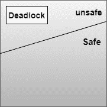

> 原文：<https://www.studytonight.com/operating-system/deadlock-avoidance-in-operating-system>

# 操作系统中死锁的避免

在本教程中，我们将介绍如何在操作系统中避免死锁。

操作系统使用死锁避免方法来检查系统是处于安全状态还是不安全状态，为了避免死锁，进程必须告诉操作系统进程可以请求的最大资源数量，以便完成其执行。

## 死锁避免是如何工作的？

在这种方法中，对任何资源的请求只有在系统的最终状态不会导致系统死锁的情况下才会被授予。此方法检查操作系统执行的每个步骤。任何进程都会继续执行，直到系统处于安全状态。一旦系统进入不安全状态，操作系统就必须后退一步。

借助死锁避免算法，您可以动态评估资源分配状态，这样就永远不会出现循环等待的情况。

根据最简单和有用的方法，任何进程都应该声明它将需要的每种类型的资源的最大数量。避免死锁的算法主要检查资源分配，以便永远不会出现循环等待条件。

死锁避免主要可以借助银行家算法来完成。

让我们首先理解安全和不安全状态的概念

## 安全状态和不安全状态

如果系统能够以某种顺序为每个进程分配资源(达到其最大需求)，并且仍然避免死锁，则状态是安全的。从形式上来说，系统只有在存在安全序列的情况下才处于安全状态。所以安全状态不是死锁状态，相反死锁状态是不安全状态。

在不安全状态下，操作系统无法阻止进程以任何死锁发生的方式请求资源。不一定所有的不安全状态都是死锁；不安全的状态可能会导致死锁。

上图显示了安全、不安全和死锁状态空间

## 避免死锁示例

让我们考虑一个有 12 盘磁带和三个进程的系统 P1、P2、P3。P1 进程需要 10 盘磁带，P2 进程可能需要多达 4 盘磁带，P3 进程可能需要多达 9 盘磁带。假设在时间 t0，进程 P1 持有 5 盘磁带，进程 P2 持有 2 盘磁带，进程 P3 持有 2 盘磁带。(有 3 盘免费磁带)

| 处理 | 最大需求 | 当前需求 |
| --- | --- | --- |
| 第一亲代 | Ten | five |
| P2 | four | Two |
| P3 | nine | Two |

所以在时间 t0，系统处于安全状态。顺序为<p2>满足安全条件。进程 P2 可以立即被分配其所有磁带驱动器，然后返回它们。返回后，系统将有 5 盘可用磁带，然后 process P1 可以获得所有磁带并将其返回(系统将有 10 盘磁带)；最后，process P3 可以获取其所有磁带并将其退回(系统将有 12 盘可用磁带)。</p2>

系统可以从安全状态进入不安全状态。假设在时间 t1，处理 P3 请求，并被分配多一个磁带。系统不再处于安全状态。此时，只有进程 P2 可以分配其所有磁带。当它返回时，系统将只有 4 个可用磁带。由于 P1 被分配了 5 个磁带，但最多有 10 个磁带，因此它可能会请求另外 5 个磁带。如果这样做，它将不得不等待，因为它们不可用。同样，进程 P3 可能会请求其额外的 6 盘磁带，并且必须等待，这将导致死锁。

错误在于答应了 P3 再要一盘磁带的请求。如果我们让 P3 等到其他进程完成并释放其资源，那么我们就可以避免僵局

**注意:**在一种情况下，如果系统不能满足所有进程的请求，那么系统的状态被称为不安全。

死锁避免方法的主要关键是每当请求资源时，只有在**结果状态**是**安全状态**的情况下，请求才必须被批准。

在下一个教程中，我们将介绍避免死锁的银行家算法的概念。

* * *

* * *