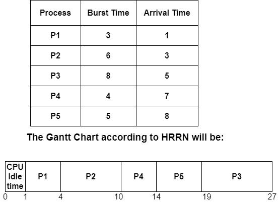

> 原文：<https://www.studytonight.com/operating-system/highest-response-ratio-next-hrrn-scheduling>

# 最高响应率下一次(HRRN)调度

**HRRN** (最高响应比 Next)调度是操作系统中的一种非抢占式调度算法。它是用于调度的最佳算法之一。

由于 **HRRN 是一种非抢占式调度算法**，所以如果有任何进程**当前正在与 CPU** 一起执行，并且在其执行期间，如果任何新的进程以小于当前正在运行的进程的突发时间到达存储器，那么此时当前正在运行的进程将不会被放入就绪队列&中，没有任何中断地完成其执行。

**HRRN** 基本上是**最短作业 Next(SJN)** 为了减少饥饿问题的修改。

在 HRRN 调度算法中，CPU被分配给下一个具有最高响应比的进程，而不是具有较少突发时间的进程。

现在，让我们先来看看如何计算响应比。

**响应比= (W+S)/S**

哪里，

**W**=表示等待时间。

**S**=表示服务时间为突发时间。

## HRNN 算法

*   在 **HRNN** 调度算法中，一旦一个进程被选择执行，它将一直运行到完成。

*   第一步是计算所有进程的等待时间。等待时间只是指进程在就绪队列中等待的时间总和。

*   每次都安排进程执行，以便找到每个可用进程的响应比率。

*   然后在处理器首先执行具有最高响应率的处理之后。

*   在一种情况下，如果两个进程具有相同的响应比率，则使用 FCFS 调度算法断开连接。

现在我们来看一个同样的例子:

## HRRN 调度示例

这里，我们有几个具有不同突发和数组时间的进程，以及一个代表 CPU 分配时间的甘特图。

  

### 说明

下面是对上述例子的解释

*   在时间=0 时，就绪队列中没有可用的进程，因此从 0 到 1 的 CPU 处于空闲状态。因此，0 到 1 被认为是 CPU 空闲时间。

*   在时间=1 时，就绪队列中只有进程 P1 可用。因此，P1 进程一直执行到完成。

*   在进程 P1 之后，在时间=4 时，只有进程 P2 到达，因此进程 P2 被执行，因为操作系统没有任何其他选项。

*   在时间=10 时，进程 P3、P4 和 P5 在就绪队列中。因此，为了安排 P2 会议后的下一个进程，我们需要计算响应率。

*   在这一步中，我们将计算 P3、P4 和 P5 的响应率。

**响应比= W+S/S**

RR(P3) = [(10-5) +8]/8

= 1.625

RR(P4) = [(10-7) +4]/4

= 1.75

RR(P5) = [(10-8) +5]/5

= 1.4

从以上结果可以看出，P4 进程的响应率最高，因此 P4 进程排在 P2 之后。

*   在时间 t=10 时，由于响应比的值较大，执行进程 P4。

*   现在在就绪队列中，我们有两个进程 P3 和 P5，在执行 P4 之后让我们计算 P3 和 P5 的响应比率

RR (P3) = [(14-5) +8]/8

=2.125

RR (P5) = [(14-8) +5]/5

=2.2

从以上结果可以看出，流程 P5 的响应率最高，因此流程 P5 排在 P4 之后

*   在 t=14 时，执行过程 P5。

*   在 P5 完全执行之后，P3 在就绪队列中，因此在时间 t=19，P3 被执行。

在下表中，我们将计算所有流程的周转时间、等待时间和完成时间。

| 过程 | 到达时间 | 突发时间 | 完成时间 | 

解题时间

**周转时间=完成时间-到达时间**

 | 

等待时间

**等待时间=周转时间-突发时间**

 |
| --- | --- | --- | --- | --- | --- |
| 第一亲代 | one | three | four | 4-1=3 | 3-3=0 |
| P2 | three | six | Ten | 10-3=7 | 7-6=1 |
| P3 | five | eight | Twenty-seven | 27-5=22 | 22-8=14 |
| P4 | seven | four | Fourteen | 14-7=7 | 7-4=3 |
| 孕烯醇酮 | eight | five | Nineteen | 19-8=11 | 11-5=6 |

平均等待时间的计算方法是将所有进程的等待时间相加，然后除以进程数。

**平均等待时间=所有进程的等待时间/进程数**

**平均等待时间**= 0+1+14+3+6/5 = 24/5 =**4.8 毫秒**

## C 语言中的 HRRN 调度示例

下面是 HRRN 调度的 C 程序:

```
// C program for the Highest Response Ratio Next (HRRN) Scheduling 
#include <stdio.h> 

// This structure defines the details of the process
struct process { 
	char name; 
	int at, bt, ct, wt, tt; 
	int complete; 
	float ntt; 
} p[10]; 

int m; 

//The Sorting of Processes by Arrival Time 
void sortByArrival() 
{ 
	struct process temp; 
	int i, j; 

	// Selection Sort applied 
	for (i = 0; i < m - 1; i++) { 
		for (j = i + 1; j < m; j++) { 

			// This condition is used to Check for the lesser arrival time 
			if (p[i].at > p[j].at) { 

				// Swaping of earlier process to front 
				temp = p[i]; 
				p[i] = p[j]; 
				p[j] = temp; 
			} 
		} 
	} 
} 

void main() 
{ 
	int i, j, t, sum_bt = 0; 
	char c; 
	float avgwt = 0, avgtt = 0; 
	m = 5; 

	// the predefined arrival times 
	int arriv[] = { 1, 3, 5, 7, 8 }; 

	// the predefined burst times 
	int burst[] = { 3, 7, 8, 4, 2}; 

	// Initialize the structure variables 
	for (i = 0, c = 'A'; i < m; i++, c++) { 
		p[i].name = c; 
		p[i].at = arriv[i]; 
		p[i].bt = burst[i]; 

		// Variable for Completion status 
		// for Pending = 0 
		// for Completed = 1 
		p[i].complete = 0; 

		// the Variable for the sum of all Burst Times 
		sum_bt += p[i].bt; 
	} 

	// Let us Sort the structure by the arrival times 
	sortByArrival(); 
	printf("\nName\tArrival Time\tBurst Time\tWaiting Time"); 
	printf("\tTurnAround Time\t Normalized TT"); 
	for (t = p[0].at; t < sum_bt;) { 

		// Now Set the lower limit to response ratio 
		float hrr = -9999; 

		//The Response Ratio Variable 
		float temp; 

		// Variable used to store the next processs selected 
		int loc; 
		for (i = 0; i < m; i++) { 

			// Check if the process has arrived and is Incomplete 
			if (p[i].at <= t && p[i].complete != 1) { 

				// Calculating the Response Ratio 
				temp = (p[i].bt + (t - p[i].at)) / p[i].bt; 

				// Checking for the Highest Response Ratio 
				if (hrr < temp) { 

					// Storing the Response Ratio 
					hrr = temp; 

					// Storing the  Location 
					loc = i; 
				} 
			} 
		} 

		// Updating the time value 
		t += p[loc].bt; 

		// Calculation of the waiting time 
		p[loc].wt = t - p[loc].at - p[loc].bt; 

		// Calculation of the Turn Around Time 
		p[loc].tt = t - p[loc].at; 

		// Sum of Turn Around Time for the average 
		avgtt += p[loc].tt; 

		// Calculation of the Normalized Turn Around Time 
		p[loc].ntt = ((float)p[loc].tt / p[loc].bt); 

		// Updating  the Completion Status 
		p[loc].complete = 1; 

		// Sum of the Waiting Time to calculate the average 
		avgwt += p[loc].wt; 
		printf("\n%c\t\t%d\t\t", p[loc].name, p[loc].at); 
		printf("%d\t\t%d\t\t", p[loc].bt, p[loc].wt); 
		printf("%d\t\t%f", p[loc].tt, p[loc].ntt); 
	} 
	printf("\nThe Average waiting time:%f\n", avgwt / m); 
	printf("The Average Turn Around time:%f\n", avgtt / m); 
} 
```

### 输出


## HRNN 调度的优势

HRNN 调度算法的优点如下:

1.  HRRN 调度算法比最短作业优先调度算法具有更好的性能。

2.  有了这个算法，等待更长工作的时间减少了，同时也鼓励了更短的工作。

3.  使用该算法，吞吐量增加。

## HRNN 时间表的缺点

HRNN 调度算法的缺点如下:

1.  HRRN 调度的实际实现是不可能的，因为我们不能提前知道每个进程的突发时间。

2.  在这种调度中，处理器上可能会产生开销。


* * *

* * *