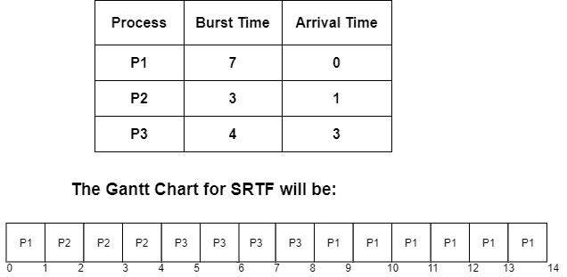
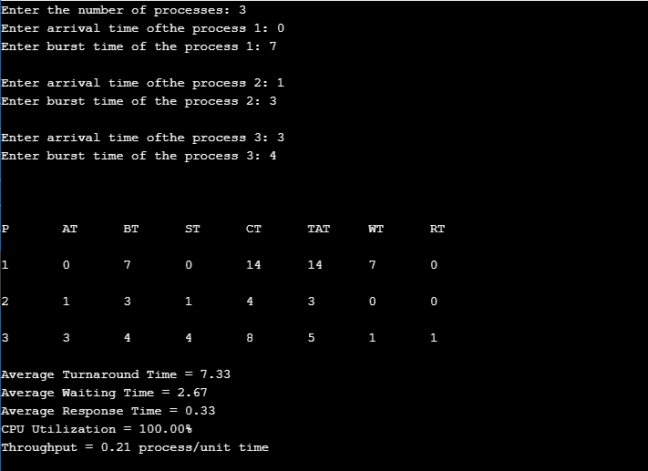

> 原文：<https://www.studytonight.com/operating-system/shortest-remaining-time-first-scheduling-algorithm>

[← Prev](/operating-system/highest-response-ratio-next-hrrn-scheduling "HRRN Scheduling")[Next →](/operating-system/longest-job-first-scheduling-algorithm "Longest Job First Scheduling")

<nav aria-label="breadcrumb">

1.  [家](/)
2.  [操作系统](/operating-system)
3.  最短剩余时间优先调度算法

</nav>

<article>

# 最短剩余时间优先调度算法

最短作业优先(SJF)调度的抢先版本被称为最短剩余时间优先(SRTF)。在 SRTF 算法的帮助下，具有最短剩余时间的进程被首先选择来执行。

所以基本上在 SRTF，流程是根据最短的剩余时间来安排的。

然而，SRTF 算法比最短作业优先(SJF)调度涉及更多的开销，因为在 SRTF 操作系统经常需要监控**就绪**队列中作业的CPU时间并执行上下文切换。

在 **SRTF 调度算法**中，任何进程的执行都可以在一定时间后停止。在每个进程到达时，短期调度器从可用进程列表&中调度那些剩余突发时间最少的运行进程。

在就绪队列中的所有进程都可用之后，就不会进行抢占，然后算法将像 SJF 调度一样工作。在进程控制块中，当进程从执行中移除时，以及当调度下一个进程时，进程的上下文被保存。印刷电路板在下一次执行该过程时被访问。

### SRTF 的优势

SRTF 算法的主要优点是它使作业的处理比 SJF 算法更快，提到它的间接费用不计算在内。

### SRTF 的缺点

在 SRTF，上下文切换的次数要比在 SJN 多得多，这是因为 CPU 的宝贵处理时间被消耗得更多。CPU 消耗的时间加起来就是它的处理时间，这就减少了该算法快速处理的优势。

## 例子



## 说明

*   在 CPU 的第 0 个单位，只有一个进程是 **P1** ，所以 P1 被执行了 1 个时间单位。

*   在CPU的第一个单元，进程 **P2** 到达。现在， **P1** 需要多执行 6 个单位， **P2** 只需要 3 个单位。所以， **P2** 先被抢先 **P1** 执行。

*   第 3 个时间单位，进程 **P3** 到达，P3 的爆发时间是 4 个单位，比 P2 的完成时间多 1 个单位，所以 P2 继续执行。

*   现在 **P2** 完工后， **P3** 的爆发时间为 **4 台**也就是说只需要 4 台就能完工，而 P1 需要 6 台才能完工。

*   因此，由于 P3 的完成时间少于 P1 的原因，该算法选取了 **P1 上方的 **P3****

*   P3 在时间单元 8 完成，没有新的过程到达。

*   再次， **P1** 被送去执行，在第 14 单元完成。

由于上图中给出了 P1、P2 和 P3 三个过程的到达时间和爆发时间。让我们计算周转时间、完成时间和等待时间。

| 

过程

 | 

到达时间

 | 

突发时间

 | 

完成时间

 | 

解题时间

周转时间=完成时间-到达时间

 | 

等待时间

等待时间=周转时间-突发时间

 |
| --- | --- | --- | --- | --- | --- |
| 第一亲代 | Zero | seven | Fourteen | 14-0=14 | 14-7=7 |
| P2 | one | three | four | 4-1=3 | 3-3=0 |
| P3 | three | four | eight | 8-3=5 | 5-4=1 |

平均等待时间的计算方法是将所有进程的等待时间相加，然后除以进程数。

**平均等待时间=所有进程的等待时间/进程数**

**平均等待时间**= 7+0+1 = 8/3 =**2.66 毫秒**

## 履行

下面是最短剩余时间优先调度的 C++实现:

```
#include <iostream>
#include <algorithm> 
#include <iomanip>
#include <string.h> 
using namespace std;
struct process {
    int pid;
    int arrival_time;
    int burst_time;
    int start_time;
    int completion_time;
    int turnaround_time;
    int waiting_time;
    int response_time;
};
int main() {

    int x;
    struct process p[100];
    float avg_turnaround_time;
    float avg_waiting_time;
    float avg_response_time;
    float cpu_utilization;
    int total_turnaround_time = 0;
    int total_waiting_time = 0;
    int total_response_time = 0;
    int total_idle_time = 0;
    float throughput;
    int burst_remaining[100];
    int is_completed[100];
    memset(is_completed,0,sizeof(is_completed));

    cout << setprecision(2) << fixed;

    cout<<"Enter the number of processes: ";
    cin>>x;

    for(int i = 0; i < x; i++) {
        cout<<"Enter arrival time ofthe process "<<i+1<<": ";
        cin>>p[i].arrival_time;
        cout<<"Enter burst time of the process "<<i+1<<": ";
        cin>>p[i].burst_time;
        p[i].pid = i+1;
        burst_remaining[i] = p[i].burst_time;
        cout<<endl;
    }

    int current_time = 0;
    int completed = 0;
    int prev = 0;

    while(completed != x) {
        int idx = -1;
        int mn = 10000000;
        for(int i = 0; i < x; i++) {
            if(p[i].arrival_time <= current_time && is_completed[i] == 0) {
                if(burst_remaining[i] < mn) {
                    mn = burst_remaining[i];
                    idx = i;
                }
                if(burst_remaining[i] == mn) {
                    if(p[i].arrival_time < p[idx].arrival_time) {
                        mn = burst_remaining[i];
                        idx = i;
                    }
                }
            }
        }

        if(idx != -1) {
            if(burst_remaining[idx] == p[idx].burst_time) {
                p[idx].start_time = current_time;
                total_idle_time += p[idx].start_time - prev;
            }
            burst_remaining[idx] -= 1;
            current_time++;
            prev = current_time;

            if(burst_remaining[idx] == 0) {
                p[idx].completion_time = current_time;
                p[idx].turnaround_time = p[idx].completion_time - p[idx].arrival_time;
                p[idx].waiting_time = p[idx].turnaround_time - p[idx].burst_time;
                p[idx].response_time = p[idx].start_time - p[idx].arrival_time;

                total_turnaround_time += p[idx].turnaround_time;
                total_waiting_time += p[idx].waiting_time;
                total_response_time += p[idx].response_time;

                is_completed[idx] = 1;
                completed++;
            }
        }
        else {
             current_time++;
        }  
    }

    int min_arrival_time = 10000000;
    int max_completion_time = -1;
    for(int i = 0; i < x; i++) {
        min_arrival_time = min(min_arrival_time,p[i].arrival_time);
        max_completion_time = max(max_completion_time,p[i].completion_time);
    }

    avg_turnaround_time = (float) total_turnaround_time / x;
    avg_waiting_time = (float) total_waiting_time / x;
    avg_response_time = (float) total_response_time / x;
    cpu_utilization = ((max_completion_time - total_idle_time) / (float) max_completion_time )*100;
    throughput = float(x) / (max_completion_time - min_arrival_time);

    cout<<endl<<endl;

    cout<<"Process\t"<<"Arrival Time\t"<<"Burst Time\t"<<"ST\t"<<"CT\t"<<"TAT\t"<<"WT\t"<<"RT\t"<<"\n"<<endl;

    for(int i = 0; i < x; i++) {
        cout<<p[i].pid<<"\t"<<p[i].arrival_time<<"\t"<<p[i].burst_time<<"\t"<<p[i].start_time<<"\t"<<p[i].completion_time<<"\t"<<p[i].turnaround_time<<"\t"<<p[i].waiting_time<<"\t"<<p[i].response_time<<"\t"<<"\n"<<endl;
    }
    cout<<"Average Turnaround Time = "<<avg_turnaround_time<<endl;
    cout<<"Average Waiting Time = "<<avg_waiting_time<<endl;
    cout<<"Average Response Time = "<<avg_response_time<<endl;
    cout<<"CPU Utilization = "<<cpu_utilization<<"%"<<endl;
    cout<<"Throughput = "<<throughput<<" process/unit time"<<endl;

} 
```

## 输出

上述代码的输出如下；



</article>

* * *

* * *