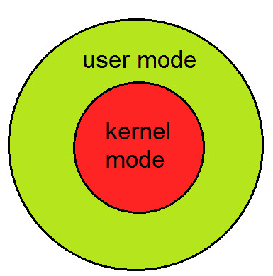

# 系统调用简介

> 原文：<https://www.studytonight.com/operating-system/system-calls>

要理解系统调用，首先需要理解一个 CPU 的**内核模式**和**用户模式**的区别。每个现代操作系统都支持这两种模式。



**操作系统支持的模式**

### 核心态

*   当 CPU 处于**内核模式**时，正在执行的代码可以访问任何内存地址和任何硬件资源。
*   因此内核模式是一种非常特权和强大的模式。
*   如果一个程序在内核模式下崩溃，整个系统将被暂停。

### 用户状态

*   当 CPU 处于**用户模式**时，程序不能直接访问内存和硬件资源。
*   在用户模式下，如果任何程序崩溃，只有那个特定的程序被暂停。
*   这意味着即使处于用户模式的程序崩溃，系统也将处于安全状态。
*   因此，操作系统中的大多数程序都以用户模式运行。

* * *

## 系统调用

当处于用户模式的程序需要访问内存或硬件资源时，它必须请求内核提供对该资源的访问。这是通过一个叫做**系统调用**的东西来完成的。

当程序进行系统调用时，模式从用户模式切换到内核模式。这被称为**上下文切换**。

然后内核提供程序请求的资源。之后，另一个上下文切换发生，导致模式从内核模式改变回用户模式。

通常，系统调用由用户级程序在以下情况下进行:

*   在文件系统中创建、打开、关闭和删除文件。
*   创建和管理新进程。
*   在网络中建立连接，发送和接收数据包。
*   请求访问硬件设备，如鼠标或打印机。

在典型的 UNIX 系统中，大约有 300 个系统调用。下文介绍了其中一些在这方面很重要的问题。

* * *

### 叉子()

`fork()`系统调用用于创建进程。当进程(执行中的程序)发出`fork()`调用时，会创建该进程的精确副本。现在有两个进程，一个是**父**进程，另一个是**子**进程。

调用`fork()`调用的进程称为**父**进程，新创建的进程称为**子**进程。子进程将与父进程完全相同。请注意父进程的状态，即地址空间、变量、打开的文件等。被复制到子进程中。这意味着父进程和子进程具有相同但物理上不同的地址空间。父母进程中价值观的改变不会影响孩子，反之亦然。

两个进程都从下一行代码开始执行，即`fork()`调用后的那一行。让我们看一个例子:

```
// example.c
#include <stdio.h>
void main() 
{
    int val;  
    val = fork();   // line A
    printf("%d", val);  // line B
}
```

执行上述示例代码时，当执行**行**时，会创建一个子进程。现在两个进程都从**B 线**开始执行。为了区分子进程和父进程，我们需要查看`fork()`调用返回的值。

不同的是，在父进程中，fork()返回一个代表子进程的**进程标识**的值。但是在子进程中，`fork()`返回值 0。

这意味着根据上面的程序，父进程的输出将是子进程的**进程 ID** ，子进程的输出将是 0。

* * *

### Exec()

`exec()`系统调用也用于创建进程。但是`fork()`和`exec()`通话有一个很大的区别。`fork()`调用在保留父进程的同时创建一个新进程。但是，`exec()`调用代替了地址空间、文本段、数据段等。当前进程与新进程的对比。

这意味着，在一个`exec()`调用之后，只有新的进程存在。进行系统调用的进程是不存在的。

UNIX 中的`exec()`有很多种口味，一种是`exec1()`，下面以此为例:

```
// example2.c
#include <stdio.h>
void main() 
{
    execl("/bin/ls", "ls", 0);      // line A
    printf("This text won't be printed unless an error occurs in exec().");
}
```

如上图所示，execl()函数的第一个参数是需要执行的程序的地址，在本例中是 UNIX 中 **ls** 实用程序的地址。然后是程序名，在这种情况下是 **ls** ，后面是可选参数。那么列表应该由空指针(0)终止。

当执行上述示例时，在行 A 处，调用并执行 **ls** 程序，并且当前进程被暂停。因此`printf()`函数永远不会被调用，因为进程已经停止。唯一的例外是，如果 **execl()** 函数导致错误，则执行`printf()`函数。

* * *

* * *