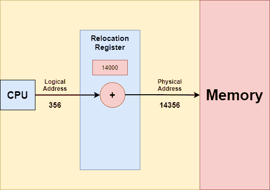

# 操作系统中的逻辑和物理地址空间

> 原文：<https://www.studytonight.com/operating-system/os-logical-and-physical-address-space>

在本教程中，我们将介绍逻辑和物理地址空间的概念。

由 CPU 产生的地址通常被称为**逻辑地址**。它基本上是一个虚拟地址。逻辑地址基本上是任何程序使用的指令或数据的地址。

由任何程序生成的所有逻辑地址的集合被称为**逻辑地址空间。**

加载到存储器的**存储器地址** **寄存器**中的地址通常被称为**物理地址**。用户不能直接访问物理地址，但用户可以借助**逻辑地址计算物理地址。**

用户的程序主要生成逻辑地址，用户认为程序在这个逻辑地址运行，但程序主要需要物理内存才能完成执行。

对应于**逻辑地址**的所有**物理地址**的集合通常被称为**物理地址空间。**

### 操作系统中的内存管理单元

它是一个硬件设备，执行从虚拟地址到物理地址的运行时映射。它位于 CPU 内。

让我们借助一个简单的 MMU 方案来理解映射的概念，这就是**基寄存器方案**。

在上图中，基本寄存器被称为**重定位寄存器。**重定位寄存器是 CPU 中的一个特殊寄存器，用于将程序使用的逻辑地址映射到系统主存储器的物理地址。

当地址被发送到存储器时，重定位寄存器中的值被加到用户进程生成的每个地址上。

### 内存管理单元示例

假设**基地在 14000** ，则用户对地址位置 **0** 的尝试被动态地重新定位到**14000**；因此对位置 **356** 的访问被映射到 **14356。**

需要注意的是，用户程序永远看不到真实的物理地址。该程序可以创建一个指向位置 356 的指针，并将其存储在内存中，然后在此之后对其进行操作，将其与其他地址(如数字 356)进行比较。

用户程序总是处理逻辑地址。**内存映射单元**主要将逻辑地址转换为物理地址。引用的存储器地址的最终位置直到引用时才确定**。**

我们有两种类型的地址:

**逻辑地址**(范围从 0 到最大值)。

**物理地址**(位于基值 R 的 R+0 至 R+最大值范围内)

如上所述，用户只生成一个逻辑地址，然后认为进程在位置 **0 到 max 运行。**但是，这些逻辑地址在使用前必须映射到物理地址。

### 逻辑地址和物理地址的区别

现在让我们讨论一下操作系统中逻辑地址和物理地址之间的区别

| S.No | 逻辑地址 | 物理地址 |
| --- | --- | --- |
| 1. | 用户可以访问程序的**逻辑地址**。 | 用户永远不能访问程序的**物理地址** |
| 2. | 逻辑地址由 CPU 生成。 | 物理地址位于存储单元中。 |
| 3. | 用户可以在逻辑地址的帮助下访问物理地址。 | 用户可以间接访问物理地址，但不能直接访问。 |
| 4. | 逻辑地址在物理上不存在于存储器中，因此被称为虚拟地址。 | 另一方面，物理地址是内存中的一个位置。因此它可以被物理访问。 |
| 5. | 由任何程序生成的所有逻辑地址的集合被称为**逻辑地址空间。** | 对应于**逻辑地址**的所有**物理地址**的集合通常被称为**物理地址空间。** |
| 6. | 该地址由 CPU 生成。 | 它由内存管理单元计算。 |

* * *

* * *