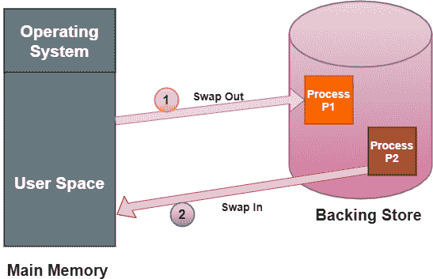

> 原文：<https://www.studytonight.com/operating-system/swapping-in-operating-system>

[← Prev](/operating-system/os-logical-and-physical-address-space "Logical and Physical Address")[Next →](/operating-system/contiguous-memory-allocation-in-operating-system "Contiguous Memory Allocation")

<nav aria-label="breadcrumb">

1.  [家](/)
2.  [操作系统](/operating-system)
3.  换入操作系统

</nav>

<article>

# 换入操作系统

在本教程中，我们将介绍操作系统中交换的概念。

交换是一种内存管理技术，用于从计算机系统的主内存中暂时删除不活动的程序。任何进程都必须在内存中才能执行，但可以暂时从内存中交换到后备存储中，然后再放回内存中完成执行。进行交换是为了让其他进程获得执行所需的内存。

由于交换技术，性能通常会受到影响，但它也有助于并行运行多个大型进程。**交换**过程也称为**记忆压缩技术。**基本上，低优先级进程可以被换出，使得具有较高优先级的进程可以被加载和执行。

让我们借助下图来理解这项技术:

上图显示了磁盘用作后备存储的两个进程的交换。

在上图中，假设有一个采用循环调度算法的多道程序环境；每当时间量到期时，内存管理器就开始换出那些刚刚完成的进程，并将另一个进程换入已经释放的内存。同时，CPU调度器将时间片分配给内存中的其他进程。

内存管理器交换进程的速度足够快，当CPU调度器想要重新调度CPU时，一些进程会在内存中，准备执行。

交换技术的一种变体是基于优先级的调度算法。如果有更高优先级的进程到达并需要服务，那么内存管理器会换出较低优先级的进程，然后加载较高优先级的进程并执行它们。当优先级较高的进程完成时。那么具有较低优先级的进程交换回来并继续执行。这种变体有时被称为滚入和滚出。

交换技术中还有两个概念，它们是:**换入**和**换出。**

## 在操作系统中换入和换出

将任何进程从**硬盘**中取出并放入**主内存或内存**的过程，通常称为**换入。**

另一方面，**换出**是从**主存或 RAM** 中取出一个进程，然后将其添加到**硬盘中的方法。**

## 交换的优势

交换技术的优势/好处如下:

1.  交换技术主要帮助CPU在一个主内存中管理多个进程。

2.  这项技术有助于创建和使用虚拟内存。

3.  借助这种技术，CPU可以同时执行几项任务。因此，流程在执行之前不需要等待太长时间。

4.  这种技术很经济。

5.  这种技术可以很容易地应用于基于优先级的调度，以提高其性能。

## 交换的缺点

交换技术的缺点如下:

1.  如果资源或变量通常被参与交换过程的那些过程所使用，那么在这种情况下可能会出现低效率。

2.  如果用于交换的算法不好，那么整个方法会增加页面错误的数量，从而降低处理的整体性能。

3.  如果计算机系统在高交换活动时断电，那么用户可能会丢失与程序相关的所有信息。

</article>

* * *

* * *