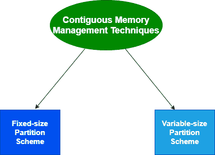
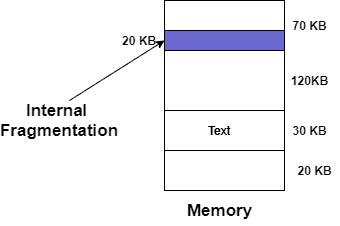
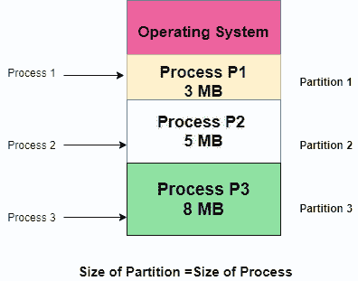

> 原文：<https://www.studytonight.com/operating-system/contiguous-memory-allocation-in-operating-system>

[← Prev](/operating-system/swapping-in-operating-system "Swapping in OS")[Next →](/operating-system/paging-in-operating-systems "Paging in OS")

<nav aria-label="breadcrumb">

1.  [家](/)
2.  [操作系统](/operating-system)
3.  操作系统中的连续内存分配

</nav>

<article>

# 操作系统中的连续内存分配

在本教程中，我们将介绍操作系统中连续内存分配的概念。

在连续内存分配中，每个进程都包含在内存的单个连续部分中。在这种内存分配中，所有可用的内存空间一起保留在一个地方，这意味着自由可用的内存分区不会分散在整个内存空间中。

在**连续内存分配**中，这是一种内存管理技术，每当用户进程请求内存时，就会根据该进程的要求将连续内存块的单个部分分配给该进程。连续内存分配只需将内存划分到**固定大小的分区中即可实现。**

为了给用户进程分配连续的空间，内存可以分为**固定大小的分区或**可变大小的分区。

我们将逐一介绍不同连续内存分配技术的概念。

## 固定大小的分区方案

这种技术也被称为**静态分区**。在这个方案中，系统将内存划分为固定大小的分区。分区大小可能相同，也可能不同。每个分区的大小是固定的，如技术名称所示，不能更改。

在这个分区方案中，每个分区可以恰好包含一个进程。有一个问题是，这种技术将限制多道程序设计的程度，因为分区的数量将基本上决定进程的数量。

每当任何进程终止时，该分区就可用于另一个进程。

### 例子

让我们举一个固定大小分区方案的例子，我们将把 15 KB 的内存大小分成固定大小的分区:

需要注意的是，这些分区是在进程到达时分配给它们的，分配给到达进程的分区基本上取决于所遵循的算法。

如果分区内存在一些浪费，则称之为**内部碎片**。

### 固定大小分区方案的优点

*   该方案简单，易于实现

*   它支持多道程序设计，因为多个进程可以存储在主内存中。

*   使用这个方案管理起来很容易

### 固定大小分区方案的缺点

使用该方案的一些缺点如下:

**1。内部碎片**

假设进程的大小小于分区的大小，在这种情况下，某个大小的分区会被浪费并保持未使用。内存中的这种浪费通常被称为内部碎片

如上图所示，70 KB 分区用于加载 50 KB 的进程，因此剩余的 20 KB 被浪费了。

**2** 。**对流程规模的限制**

如果一个进程的大小大于最大分区的大小，那么这个进程就不能被加载到内存中。因此，对进程的大小强加了一个条件:进程的大小不能大于最大分区的大小。

**3。外部碎片**

固定大小分区方案的另一个缺点是各种分区的总未用空间不能用于加载进程，即使有可用空间，但不是以连续的方式。

**4。多道程序的程度更少**

在这种分区方案中，由于分区的大小不能根据进程的大小而改变。因此，多道程序设计的程度非常低，而且是固定的。

## 可变大小分区方案

这个方案也被称为**动态分区**，它的出现是为了克服**静态分区**造成的内部碎片的缺点。在这种划分中，方案分配是动态完成的。

分区的大小最初没有声明。每当任何进程到达时，都会创建一个大小等于该进程大小的分区，然后将其分配给该进程。因此，每个分区的大小等于进程的大小。

由于分区大小根据进程的需要而变化，因此在该分区方案中不存在**内部碎片。**

### 可变大小分区方案的优点

使用这种分区方案的一些优点如下:

1.  **无内部碎片**
    由于在这个分区方案中，主内存中的空间是严格按照进程的要求分配的，因此没有内部碎片的可能。此外，分区中将没有未使用的空间。

2.  **多道程序设计的程度是动态的**
    因为在这个分区方案中没有内部碎片，因此内存中没有未使用的空间。因此，更多的进程可以同时加载到内存中。

3.  **对进程大小没有限制**
    在这个分区方案中，由于分区是动态分配给进程的，因此进程的大小不能受到限制，因为分区大小是根据进程大小决定的。

### 可变大小分区方案的缺点

使用这种分区方案的一些缺点如下:

1.  **外部碎片**
    由于没有内部碎片，这是使用这种分区方案的一个优点，但这并不意味着没有外部碎片。让我们借助一个例子来理解这一点:在上图中，流程 P1(3MB)和流程 P3(8MB)完成了它们的执行。因此，剩下两个空间，即 3MB 和 8MB。让我们有一个大小为 15 MB 的进程 P4 来了。但是不能分配内存中的空白空间，因为在连续分配中不允许跨越。因为规则规定进程必须持续存在于主内存中才能被执行。因此，它导致外部碎片。

2.  **难以实现**
    与固定分区方案相比，该分区方案的实现是困难的，因为它涉及运行时而不是系统配置期间的内存分配。正如我们所知，操作系统跟踪所有分区，但在这里，分配和解除分配非常频繁，分区大小每次都会改变，因此操作系统很难管理一切。

</article>

* * *

* * *