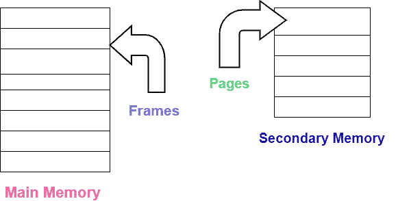
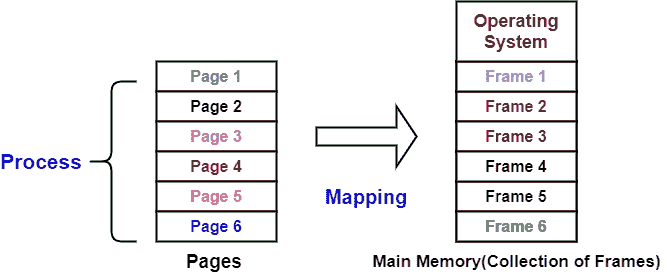
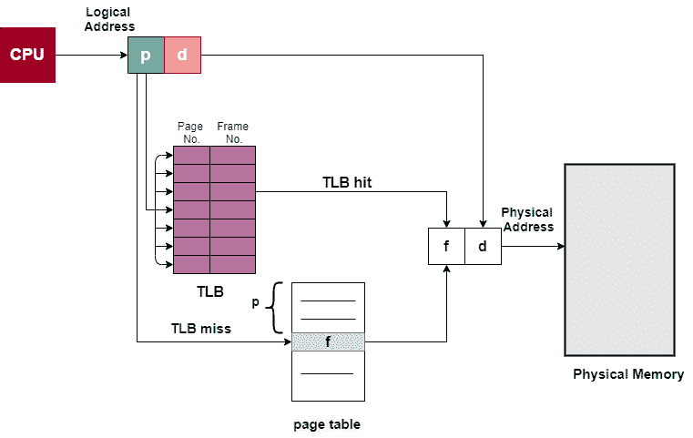
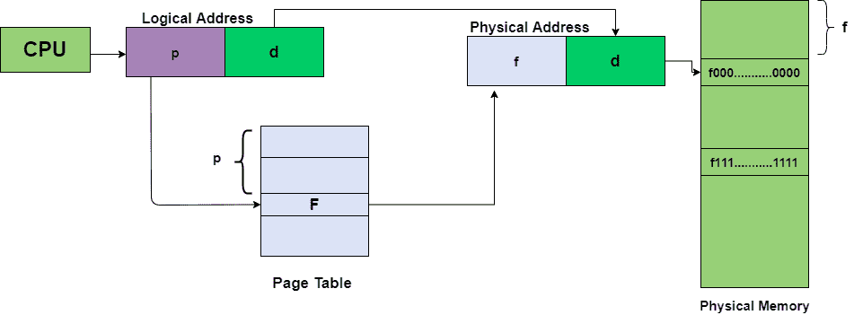
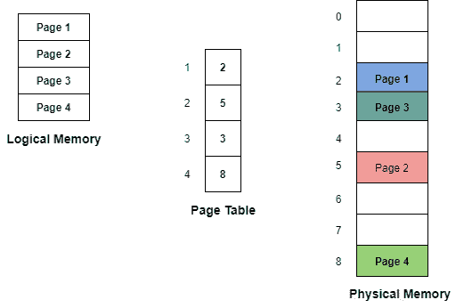
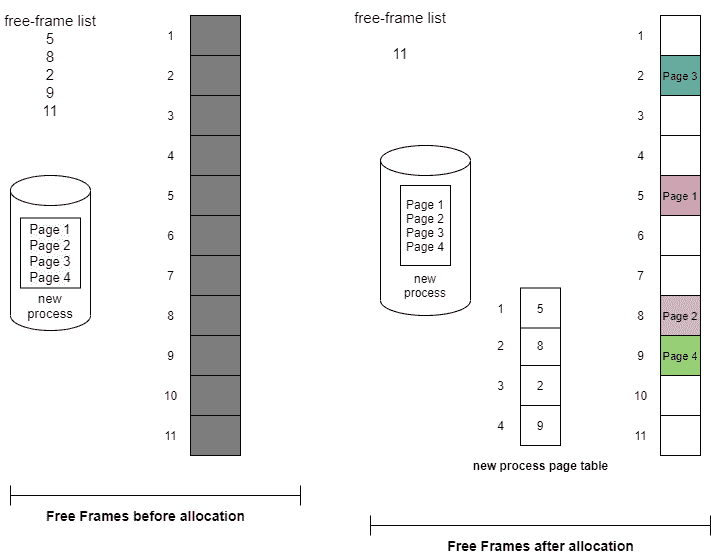

# 操作系统中的分页

> 原文：<https://www.studytonight.com/operating-system/paging-in-operating-systems>

在本教程中，我们将介绍操作系统中分页的概念。

分页允许进程的**物理地址空间**是非连续的**。**是**固定大小分区方案**。在分页技术中，辅助内存和主内存被分成相等的固定大小的分区。

分页解决了将不同大小的内存块放在后备存储上的问题，许多内存管理方案都遇到了这个问题。

分页有助于**避免外部碎片**和**需要压缩**。

## 分页的基本方法

分页技术将物理内存(主内存)划分为固定大小的块，称为**帧**，也将**逻辑内存(辅助内存)划分为相同大小的块**，称为**页。**

这项技术跟踪所有的空闲帧。

框架的大小与页面的大小相同。框架基本上是(逻辑)页面可以(物理)放置的地方。

每个流程主要分为几个部分，每个部分的大小与页面大小相同。

最后一部分的大小可能小于页面大小。

*   一个进程的页面只有在有要求时才被放入主存储器，否则它们就驻留在辅助存储器中。

*   一个进程的一页主要存储在存储器的一个帧中。此外，页面可以存储在内存的不同位置，但首要任务始终是找到连续的帧。

现在让我们讨论一下**将逻辑地址转换为物理地址的概念:**

## 逻辑地址到物理地址的转换

在继续之前，有一些要点需要注意:

*   CPU 总是生成一个逻辑地址。

*   为了访问主存储器，总是需要一个物理地址。

CPU 生成的**逻辑地址总是由两部分组成:**

1.  页码

2.  页面偏移量(d)

哪里，

**页码**用于指定 CPU 要从中读取数据的进程的具体页面。它也被用作页表的索引。

而**页面偏移量**主要用于指定 CPU 想要读取的页面上的具体单词。

现在让我们了解**什么是页表？**

## 操作系统中的页表

页表主要**包含物理内存中每页**的基址。然后将基址与页面偏移量相结合，以定义**物理存储器地址**，然后将其发送到存储器单元。

因此，页表主要提供相应的帧号(帧的基址)，其中该页存储在主存储器中。

如上所述，**帧号**与**页面偏移量**相结合，形成了**所需的物理地址。**

所以，**物理地址由两部分组成:**

1.  页面偏移量(d)

2.  帧号(f)

哪里，

**帧号**用于指示存储所需页面的具体帧。

**页面偏移**表示必须从该页面读取的特定单词。

页面大小(如框架大小)是在硬件的帮助下定义的。这里需要注意的是，页面的大小通常是 2 的幂，每页在 512 字节和 16 MB 之间变化，它主要取决于计算机的架构。

如果**逻辑地址空间**的大小是 2 的幂 m，而**页面大小**是的 2 的幂 n 寻址单元，那么**逻辑地址的高位`m-n`位表示页码**，低位`n`位表示页面偏移量。

逻辑地址如下:

其中 **p** 表示进入页面表的索引， **d** 表示页面内的位移。

上图显示了逻辑地址到物理地址的转换。上图中的 **PTBR** 是指页表基址寄存器，它基本上保存了当前进程页表的基址。

**PTBR** 主要是处理器寄存器，由操作系统管理。通常，处理器上运行的每个进程都需要自己的逻辑地址空间。

但是这种方法有一个问题，那就是访问用户存储位置所需的时间。假设如果我们想找到位置 I，我们必须首先通过使用 PTBR 中的值加上 I 的页码来找到页表中的索引。然后，它向我们提供帧号，帧号与页面偏移量相结合，以产生实际地址。之后，我们就可以访问内存中想要的位置了。

利用上述方案，需要两次存储器访问来访问一个字节(一次用于页表条目，一次用于字节)。因此，内存访问速度慢了 2 倍，在大多数情况下，该方案慢了 2 倍。

## 后备缓冲器的翻译(TLB)

对于上述问题，有一个标准的解决方案，那就是使用一个特殊的、小的、快速查找的硬件缓存，也就是通常所说的后备缓冲区转换(TLB)。

*   TLB 是联想和高速记忆。

*   TLB 中的每个条目主要由两部分组成:一个键(即标签)和一个值。

*   当关联记忆中出现一个项目时，该项目将同时与所有键进行比较。如果找到该项，则返回相应的值。

*   尽管硬件昂贵，但 TLB 的搜索速度很快。

*   TLB 的条目数量很少，一般在 64 到 1024 个之间。

**TLB** 与**页表**的使用方式如下:

TLB 号只包含了几个页表条目。每当逻辑地址由CPU生成时，它的页码就会呈现给 TLB。

*   如果找到了页码，则它的帧号立即可用，并用于访问存储器。与使用未映射的内存引用相比，上述整个任务花费的时间可能少于 10%。

*   如果页码不在 TLB(称为 **TLB 错过**，则必须对页表进行内存引用。

*   当获得帧号时，它可以用来访问存储器。此外，页码和帧号被添加到 TLB，以便在下一次引用时可以快速找到它们。

*   如果 **TLB 已经满了条目**，那么操作系统必须选择 o **ne 进行替换。**

*   TLB 允许一些条目通过有线连接到“T1”，这意味着它们不能从 TLB 移除。典型地，内核代码的 TLB 条目是**有线连接的。**

## 带 TLB 的寻呼硬件

## 分页的优点

下面给出了操作系统中分页技术的一些优点:

*   分页主要允许以不连续的方式存储单个进程的部分。

*   借助**分页，解决了**外部碎片的问题。

*   分页是最简单的内存管理算法之一。

## 分页的缺点

分页技术的缺点如下:

*   在分页中，有时页表会消耗更多的内存。

*   内部碎片是由这种技术引起的。

*   由于现在需要两次存储器访问，提取指令所花费的时间增加了。

## 寻呼硬件

**CPU 生成的每个地址主要由两部分组成:**

1.  页码

2.  页面偏移量(d)

哪里，

**页号**作为索引**进入页表**，页表一般包含物理内存中每页的基址。

**页面偏移量**与基址相结合，以定义物理内存地址，然后发送到内存单元。

如果**逻辑地址空间**的大小是 2 的幂 m，而**页面大小**是的 2 的幂 n 寻址单元，那么**逻辑地址的高位`m-n`位表示页码**，低位`n`位表示页面偏移量。

逻辑地址如下:

其中 p 表示页表中的索引，d 表示页内的位移。页面大小通常由硬件定义。页面的大小通常是 2 的幂，每页在 512 字节和 16 MB 之间变化。

现在我们来看一个分页的例子:

## 分页示例

为了实现分页，最简单的方法之一是将页表实现为一组寄存器。由于寄存器的大小有限，但页表的大小通常很大，因此页表保存在主存储器中。

此方案不会导致外部碎片；任何空闲的帧都可以分配给任何需要它的进程。但内部的割裂依然存在。

*   如果任何进程需要 n 个页面，那么至少需要 n 个帧。

*   流程的**第一页**是**加载到**自由帧列表**中列出的第一帧**，然后**帧数**放入**页表中。**

**帧表**是一种数据结构，它保存了哪些帧被分配或哪些帧可用等信息。该表主要针对每个物理页面帧有一个条目。

操作系统维护每个进程的页表副本的方式与维护指令计数器和寄存器内容的副本的方式相同。此外，每当操作系统手动将逻辑地址映射到物理地址时，该副本用于将逻辑地址转换为物理地址。

CPU调度程序也使用这个副本，以便在进程分配给CPU时定义硬件页表。

* * *

* * *