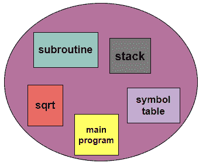
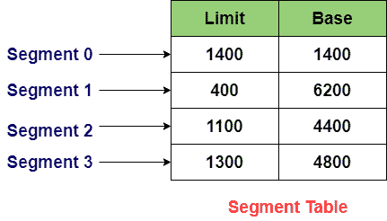
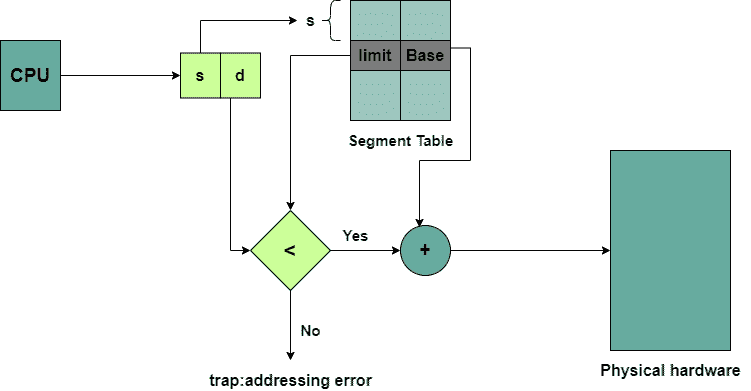
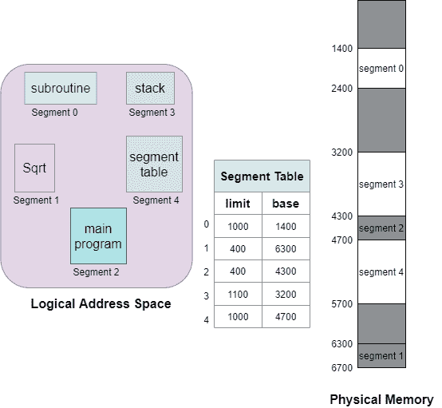

# 操作系统中的分段

> 原文：<https://www.studytonight.com/operating-system/segmentation-in-operating-systems>

在本教程中，我们将介绍操作系统中的分段。

分段是划分可寻址内存的另一种方式。这是内存管理的另一种方案，它通常支持内存的用户视图。逻辑地址空间基本上是段的集合。每个片段都有名称和长度。

基本上，一个进程被分成几个部分。像分页一样，分段会分割内存。但是有一个区别，那就是当**分页**将内存划分为**固定大小的**时，另一方面，分段将**内存划分为可变段**，然后这些可变段被加载到逻辑内存空间中。

一个程序基本上是一个片断的集合。段是一个逻辑单元，例如:

*   主程序

*   程序

*   功能

*   方法

*   目标

*   局部变量和全局变量。

*   符号表

*   公共块

*   堆

*   数组

## 分割的类型

下面给出了分段的类型:

*   **虚拟内存分割**
    有了这种类型的分割，每个进程都被分割成 n 个分区，最重要的是它们不会一次全部分割。

*   **简单分割**
    借助于这种类型，每个进程被分割成 n 个分割，并且它们都被一次准确地分割在一起，但是在运行时，并且可以是非连续的(也就是说，它们可能分散在内存中)。

## 分割的特征

分割技术的一些特征如下:

*   分段划分方案是**可变大小的。**

*   辅助存储器的分区通常被称为**段**。

*   分区大小主要取决于模块的长度。

*   因此，在这种技术的帮助下，辅助存储器和主存储器被分成大小不等的分区。

## 分段需求

操作系统中内存管理的一个重要缺点是用户对内存的看法与实际物理内存相分离。分页是一种分离这两种存储器的技术。

用户视图基本上被映射到物理存储上。这种映射允许区分物理内存和逻辑内存。

操作系统可能会将同一功能分成不同的页面，这些页面可能会也可能不会同时加载到内存中，而且操作系统也不关心用户对进程的看法。由于这种技术，系统的效率降低。

分段是一种更好的技术，因为它将进程分成多个部分。

## 用户对程序的看法

下图显示了用户对分段的看法:

**逻辑地址**

## 基本方法

使用分段的计算机系统有一个逻辑地址空间，可以看作是多个分段。线段的大小是可变的，它可能会增长，也可能会收缩。正如我们已经告诉你的，在执行进程中，每个片段都有一个名称和长度。地址主要指定段的事物名称和段内的位移。

因此，用户借助两个量来指定每个地址:段名和偏移量。

对于简化的实施，对分段进行编号；因此被称为段号而不是段名。

因此，逻辑地址由两个元组组成:

**<段-号，偏移>**

哪里，

**段号:**
段号用于表示表示段所需的位数。

**偏移量(d)**
段偏移量用于表示表示段大小所需的位数。

## 分段架构

### 段表

用于存储进程所有环节信息的表通常称为环节表。通常，在该方案中，逻辑地址和物理地址之间没有简单的关系。

*   二维逻辑地址到一维物理地址的映射是使用段表完成的。

*   该表主要作为独立的段存储在主存储器中。

*   存储段表基址的表通常称为段表基址寄存器

在段表中，每个条目都有:

1.  **段基/基址:**
    段基主要包含 **s** 段驻留在内存中的起始物理地址。

2.  **线段限制:**
    线段限制主要用于指定线段的长度。

**段表基址寄存器(STBR)**
STBR 寄存器用于指向段表在内存中的位置。

**段表长度寄存器(STLR)**
该寄存器指示程序使用的段数。如果 **s < STLR** 分段编号 s 是合法的

****

## 分割硬件

下图显示了分割硬件:

CPU 产生的逻辑地址由两部分组成:

段号:用作段表的索引。

偏移量(d):它必须在“0”和“段限制”之间。在这种情况下，如果偏移超过段限制，则生成陷阱。

因此；**校正偏移量+段基址=物理内存中的地址**

而段表基本上是基限制寄存器对数组。

## 分段的优势

分割技术的优势如下:

*   在分段技术中，段表主要用于保存段的记录。此外，与分页表相比，段表占用的空间更少。

*   没有内部碎片。

*   分段通常允许我们将程序分成提供更好可视化的模块。

*   线段大小不一。

## 分割的缺点

这种技术的一些缺点如下:

*   为每个进程维护一个段表会导致开销

*   这项技术很昂贵。

*   由于现在需要两次存储器访问，提取指令所花费的时间增加了。

*   分段大小不等，因此不适合交换。

*   这种技术会导致外部碎片，因为随着进程被加载并从主内存中移除，空闲空间被分解成更小的块，这将导致大量内存浪费。

## 分割示例

下面是分段的例子，有五个分段，编号从 0 到 4。这些段将存储在物理内存中，如图所示。段表中的每个段都有一个单独的条目，它包含物理内存中该段的起始条目地址(表示为基数)，还包含该段的长度(表示为限制)。

段 2 有 400 字节长，从位置 4300 开始。因此，在这种情况下，对段 2 的字节 53 的引用被映射到位置 4300 (4300+53=4353)。对段 3 的引用，字节 85 被映射到 3200(段 3 的基数)+852=4052。

对段 0 的字节 1222 的引用将导致对操作系统的陷阱，因为该段的长度是 1000 字节。

* * *

* * *