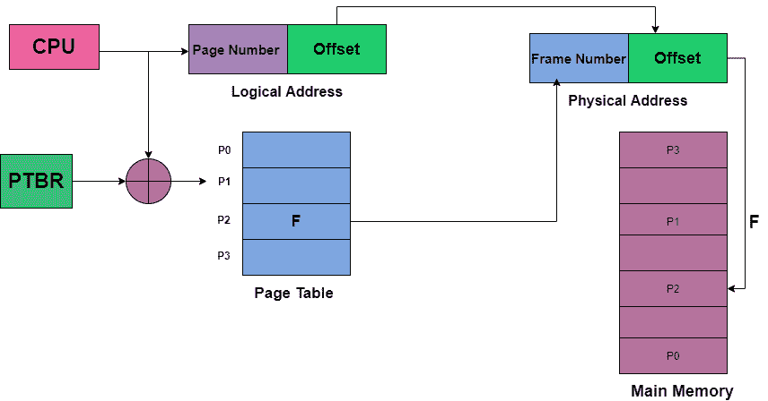

# 分页和分段的区别

> 原文：<https://www.studytonight.com/operating-system/difference-between-paging-and-segmentation>

在本教程中，我们将介绍分页和分段的区别，这是操作系统中两种不同的内存管理技术。

## 操作系统中的分页

**分页**基本上是操作系统内存管理的一种技术。在这种技术中，操作系统将进程从辅助存储器检索到主存储器中，并且该存储器是页面形式的。分页是一个逻辑概念。

在这种技术的帮助下，主内存被分割成物理内存的小块，通常称为帧。在分页中，帧的大小是固定的。为了防止外部碎片并最大限度地利用主内存，帧大小必须与页面大小相同。这项技术有助于更快地访问数据。

## 操作系统中的分段

**分段**是内存管理的另一种技术。这种技术类似于分页，除了在分段中进程的段是可变长度的，但是在分页中页面是固定大小的。

在分段中，内存被分成可变长度的部分。每个部分通常被称为段。与每个段相关的信息存储在一个表中，该表通常被称为**段表。**与**分页表相比，**段表**一般占用较少的空间。**

****

## **分页和分段的区别**

现在，我们将在下表中介绍分页和分段之间的区别:

| 分页 | 分割 |
| --- | --- |
| 分页是一种内存管理技术，其中内存被划分为固定大小的块，通常称为**页。** | 分段也是一种内存管理技术，其中内存被划分为大小可变的块，通常称为**段**。 |
| 在分页的帮助下，逻辑地址被分成一个**页码**和**页偏移**。 | 借助分段，将逻辑地址分为**段号**和**段偏移量**。 |
| 这种技术可能会导致**内部分裂**。 | 分割可能导致**外部碎片化**。 |
| 在分页中，页面大小由硬件决定。 | 而在分段中，分段的大小由用户决定。 |
| 为了维护页面数据，页面表是在分页中创建的 | 为了维护段数据，在分页中创建段表 |
| 页表主要包含每页的基址。 | 段表主要包含段号和偏移量。 |
| 这种技术比分段更快。 | 另一方面，分段比分页慢。 |
| 在分页中，操作系统维护一个空闲帧列表。 | 在分段中，漏洞列表由操作系统维护。 |
| 在这种技术中，为了计算绝对地址页码和偏移量，两者都是必需的。 | 在这种技术中，为了计算绝对地址段号和偏移量，两者都是必需的。 |

* * *

* * *