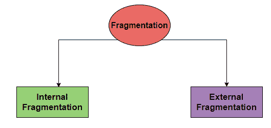
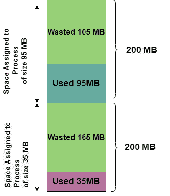
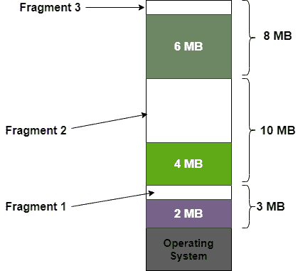

# 内部和外部碎片的区别

> 原文：<https://www.studytonight.com/operating-system/difference-between-internal-and-external-fragmentation>

在本教程中，我们将介绍操作系统中内部和外部碎片的区别。

让我们首先了解什么是碎片化以及碎片化的原因。

## 操作系统中的碎片

在计算机的存储系统中，当进程被加载时，空间被分配给它们，并且该空间基于**固定分区**(其中分区的大小在任何进程被加载到内存中之前是固定的)和**动态分区**(其中分区的大小在运行时决定，并且它主要根据进程的大小来决定)。

同样，进程被加载，然后从内存中移除，因此内存中的空闲空间被分解成更小的块。这主要会产生很小的未被利用的碎片内存空间，由于这些空间太小，正常的进程无法容纳它们。

内存空间根本得不到利用的问题在操作系统中通常被称为**碎片**。

碎片进一步分为两种类型:

## 操作系统中的内部碎片

内部碎片是当进程被分配给一个内存块时出现的问题，该内存块的大小大于该进程的大小，因此内存的某些部分未被使用。因此，分配的内存块内浪费的空间是由于对分配的块的允许大小的限制。

**上图为操作系统**内部碎片

在上图中，进程分配的内存与所需空间或内存之间的差异称为**内部碎片**。

## 操作系统中的外部碎片

当系统中的内存空间很容易满足进程的需求，但是这个可用的内存空间是**不连续的**，所以不能进一步利用。那么这个问题就被称为**外部碎片化。**

****

**上图为操作系统**中的外部碎片

假设，我们想为大小为 8 MB 的进程分配内存，如上图所示，我们可以看到，有足够的 9 MB 空间来运行大小为 8MB 的进程，但是碎片内存不连续。

外部碎片问题有一个解决方案，就是**压实**。主要目标是对内存内容进行洗牌，以便将所有空闲内存放在一个大块中。

此外，压缩并不总是可能的。假设重新定位是静态的，并且是在加载时完成的，那么在这种情况下就不能进行压缩。因为只有当重新定位是动态的并且在执行时完成时，压缩才是可能的。

## **内部**和**外部碎片**的区别

现在让我们讨论一下**内部碎片**和**外部碎片**之间的主要区别。

| 内部碎片 | 外部碎片 |
| --- | --- |
| 当固定大小的内存块分配给进程时，就会发生内部碎片。 | 当可变大小的内存块被动态分配给进程时，就会发生外部碎片。 |
| 这种类型的碎片主要发生在当固定大小的分区被分配给一个进程时，该进程的大小小于该分区的大小，因此该分区中的剩余空间变得不可用。 | 当系统中的内存空间很容易满足进程的需求，但是这个可用的内存空间是**不连续的**，所以不能进一步利用。 |
| 已分配内存和进程所需内存之间的差异称为内部碎片。 | 非连续内存片段之间未使用的内存空间太小，无法为新进程提供服务，称为外部碎片。 |
| 主要指分区中驻留在已分配区域的未使用空间；如名字所示。 | 它主要是指内存中不连续的未使用的块，因此无法满足进程的要求。 |
| 最佳拟合块可用于克服内部碎片问题。 | 压缩、分段和分页可以用来克服外部碎片问题。 |
| 分页受到内部碎片的影响。 | 第一适合和最佳适合遭受外部分裂。 |

* * *

* * *