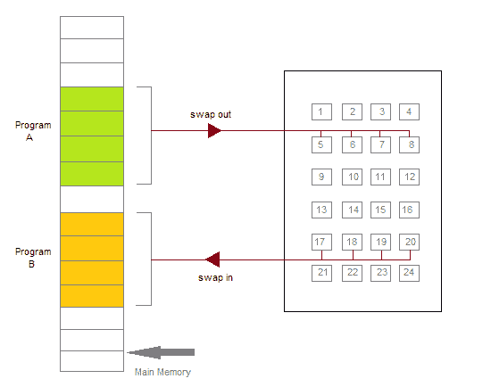
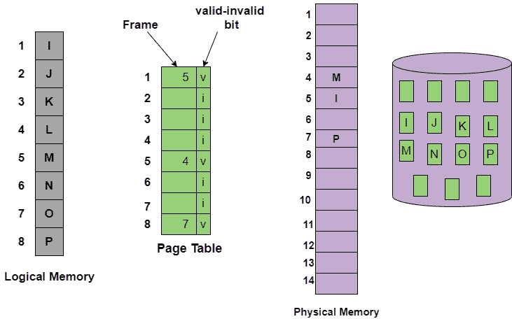

# 操作系统中的按需分页

> 原文：<https://www.studytonight.com/operating-system/os-demand-paging>

在本教程中，我们将介绍操作系统中需求分页的概念。

虚拟内存中的每个进程都包含大量页面，在某些情况下，一次为该进程交换所有页面可能效率不高。因为程序可能只需要某个页面就可以运行。这里我们举一个例子，假设有一个 500 MB 的应用程序，它可能只需要 100MB 的页面就可以交换，所以在这种情况下，不需要一次交换所有的页面。

按需分页系统在某种程度上类似于带有交换的分页系统，其中进程主要驻留在主内存中(通常在硬盘中)。因此，按需分页是仅通过按需交换页面来解决上述问题的过程。这也被称为**惰性交换程序**(除非需要，否则它不会将页面交换到内存中)。

处理进程中各个页面的分页器被称为**分页器。**

按需分页是一种技术，其中页面通常仅在CPU需要或要求时才被带入主内存。最初，只加载进程立即需要的那些页面。那些从未被访问过的页面因此从未被加载到物理内存中。

图:将分页内存传输到连续磁盘空间。

什么时候需要一页？引用它；

*   如果引用无效**，则中止引用。**

***   如果页面不在内存中，则将其带入内存。** 

 **## 有效-无效位

某种形式的硬件支持用于区分内存中的页面和磁盘上的页面。因此，为此目的，使用了有效-无效方案:

*   对于每个页表条目，有效-无效位是相关联的(其中 **1** 表示存储器中的**，而 **0** 表示存储器**中没有的

***   最初，所有表条目的有效-无效位都设置为 0。** 

 **1.  如果该位被设置为“**有效**，则相关页面是**合法的并且在内存中。**

2.  如果该位设置为“**无效**，则表示**页面无效**或页面有效**但当前不在磁盘上**。

*   对于被**带入内存**、**的**页**，页表照常设置。**

*   但是对于当前不在内存中的**页****，则**页表**要么被**简单地标记为无效**，要么包含磁盘上该页的**地址**。**

在地址转换过程中，如果页表条目中的有效-无效位为 0，则导致**页错误。**

上图是为了表示一些页面不在主存时的页表。

## 按需分页是如何工作的？

首先，需求分页过程中涉及的组件如下:

*   主存储器

*   CPU

*   辅助存贮器

*   中断

*   物理地址空间

*   逻辑地址空间

*   操作系统

*   页表

1.  如果页面在其活动状态下在主存储器中不可用；则可以向CPU请求该页面。因此，为此，它必须产生一个中断。

2.  此后，当中断发生时，操作系统将进程移动到阻塞状态。

3.  然后，操作系统在逻辑地址空间中搜索给定的页面。

4.  最后，在页面替换算法的帮助下，在物理地址空间中进行替换。页表同时更新。

5.  之后，CPU被告知该更新，然后被要求继续执行，并且进程返回到其就绪状态。

当该过程需要任何未加载到存储器中的页面时，触发页面错误陷阱并遵循以下步骤，

1.  首先检查进程请求的内存地址，以验证进程发出的请求。

2.  如果发现无效，则终止该过程。

3.  如果进程的请求是有效的，则可能从自由框架列表中找到一个自由框架，所需页面将被移动到其中。

4.  计划执行一项新操作，将必要的页面从磁盘移动到指定的内存位置。(这通常会在输入/输出等待时阻止进程，同时允许一些其他进程使用CPU。)

5.  当输入/输出操作完成时，进程的页表用新的帧号更新，无效位变为有效。

6.  导致页面错误的指令现在必须从头重新启动。

## 按需分页的优势

使用按需分页技术的好处如下:

*   在按需分页的帮助下，内存得到了有效利用。

*   按需分页避免了外部碎片。

*   按需分页需要较少的输入/输出。

*   这个过程不受物理内存大小的限制。

*   通过按需分页，共享页面变得更加容易。

*   使用这种技术，流程中从未被调用的部分永远不会被加载。

*   按需分页不需要压缩。

## 按需分页的缺点

按需分页的缺点如下:

*   由于中断和页表，开销增加了。

*   按需分页中的内存访问时间更长。

## 纯需求分页

在一些情况下，当最初没有页面被加载到存储器中时，在这种情况下的页面仅在进程通过产生页面错误来要求时才被加载。然后称之为**纯需求寻呼**。

*   在纯请求分页的情况下，最初甚至没有一个页面加载到内存中。因此纯请求分页导致了页面错误。

*   当进程的执行在内存中没有页面的情况下开始时，操作系统将指令指针设置为进程的第一条指令，该指令位于非内存驻留页面上，然后在这种情况下，进程立即为该页面出错。

*   之后，当这个页面进入内存时，进程继续执行，页面错误是必要的，直到它需要的每个页面都在内存中。

*   在这一点上，它可以在没有更多错误的情况下执行。

*   这种方案被称为纯需求分页:意味着在需要之前，永远不要将页面带入内存。**** 

* * *

* * *