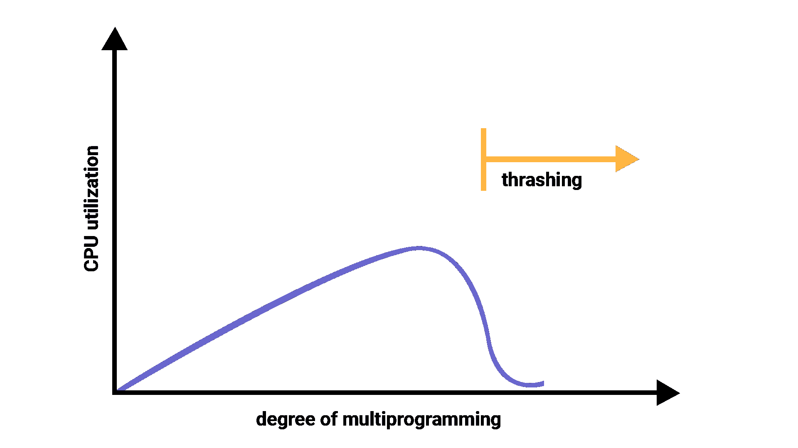
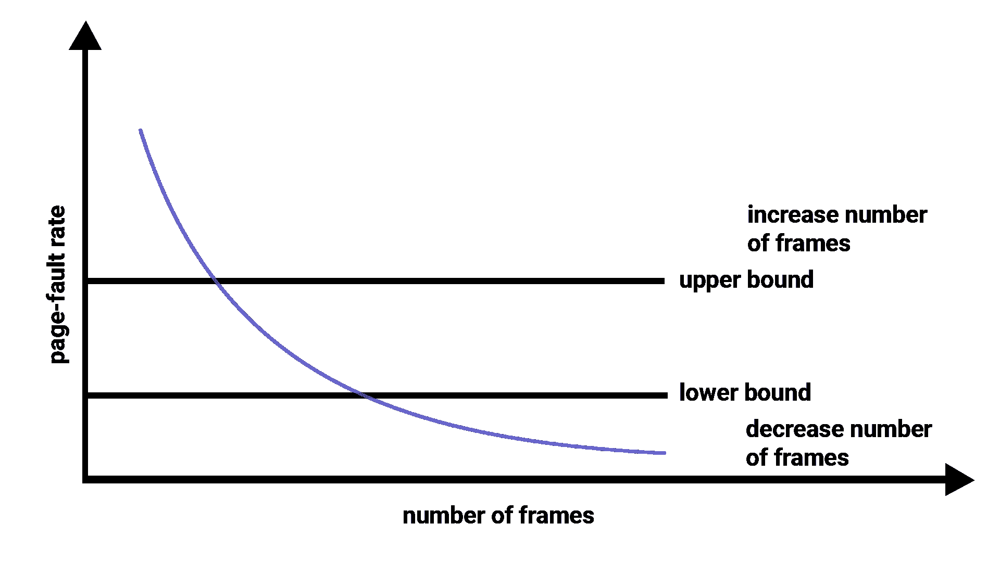

> 原文：<https://www.studytonight.com/operating-system/thrashing-in-operating-system>

[← Prev](/operating-system/page-replacement-algorithms-in-operating-system "Page Replacement Algorithm")[Next →](/operating-system/)

<nav aria-label="breadcrumb">

1.  [家](/)
2.  [操作系统](/operating-system)
3.  操作系统中的抖动

</nav>

<article>

# 操作系统中的抖动

在本教程中，我们将介绍操作系统中抖动的概念。

在这种情况下，如果页面错误和交换以更高的速率频繁发生，那么操作系统必须花费更多的时间来交换这些页面。操作系统中的这种状态称为抖动。由于抖动，CPU 利用率将会降低。

让我们通过一个例子来理解，如果任何进程没有支持活动页面所需的帧数，那么它将很快出现页面错误。而此时，流程必须替换一些页面。由于流程的所有页面都在使用中，它必须立即替换一个需要的页面。因此，这个过程很快就会一次又一次地出错，替换掉它必须立即返回的页面。进程的这种高分页活动称为抖动。

在颠簸期间，中央处理器花在一些实际生产工作上的时间更少，花在交换上的时间更多。

**图:颠簸**

## 颠簸的原因

抖动会影响操作系统的执行性能。此外，抖动会导致操作系统出现严重的性能问题。

当 CPU 利用率较低时，进程调度机制会尝试同时将多个进程加载到内存中，这样可以提高多道程序设计的程度。现在在这种情况下，与内存中可用的帧数相比，内存中有更多的进程。将有限数量的帧分配给每个进程。

每当任何具有高优先级的进程到达存储器时，并且如果该帧在那个时候不是自由可用的，那么已经占用该帧的另一个进程驻留在该帧中，将移动到二级存储器，并且在那之后，该自由帧将被分配给更高优先级的进程。

我们还可以说，一旦内存填满，这个过程就开始花费大量时间来交换所需的页面。同样，由于大多数进程都在等待页面，CPU 的利用率变得很低。

因此，高度的多道程序设计和缺少帧是操作系统抖动的两个主要原因。

## 颠簸的影响

此时，当系统颠簸开始时，操作系统会尝试应用**全局页面替换**算法或**本地页面替换**算法。

### 全局页面替换

全局页面替换可以带来任何页面，只要系统发现它试图带来更多的页面。实际上，由于这一点，没有任何进程可以获得足够的帧，结果，抖动会越来越大。因此，每当发生抖动时，全局页面替换算法是不合适的。

### 本地页面替换

与全局页面替换不同，本地页面替换将选择仅属于该进程的页面。因此，系统颠簸有可能会减少。事实也证明，本地页面替换有很多缺点。因此，本地页面替换只是全局页面替换的一种替代。

## 用于处理颠簸的技术

正如我们已经告诉你的，本地页面替换比全局页面替换好，但是本地页面替换也有很多缺点，所以它不是受暗示的。因此，下面给出了一些使用的其他技术:

### 工作集模型

这个模型是基于局部性的假设。它利用了参数？以便定义工作集窗口。主要思路是考察最近的？页面参考。什么地方在说，最近使用的页面可以再次使用，并且在这个页面附近的页面也会被使用？

### 1.工作组

最近的一组页面？页面引用被称为工作集。如果一个页面正在使用中，那么它将在工作集中。如果页面不再被使用，那么它将从工作集中删除？上次引用后的时间。

工作集主要给出程序局部性的近似值。

工作集的准确性主要取决于？选择什么？

这种工作集模型避免了抖动，同时保持了尽可能高的多道程序设计程度。

### 2.页面故障频率

图:页面故障频率

工作集模型是成功的，它的知识在准备中是有用的，但是为了避免颠簸，它是一种非常笨重的方法。还有一种技术用于避免抖动，这就是页面故障频率(PFF)，这是一种更直接的方法。

主要问题是如何防止颠簸。由于抖动具有较高的页面错误率，我们还希望控制页面错误率。

当页面错误太高时，我们知道这个过程需要更多的帧。相反，如果页面错误率太低，那么进程可能有太多的帧。

我们可以建立期望页面错误的上限和下限。如果实际页面错误率超过上限，那么我们将把进程分配给另一个帧。如果页面错误率低于下限，那么我们可以从进程中删除该帧。

因此，有了这个，我们可以直接测量和控制页面错误率，以防止颠簸。

</article>

* * *

* * *