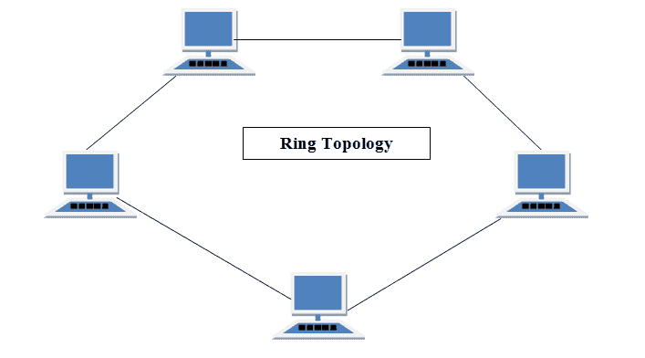
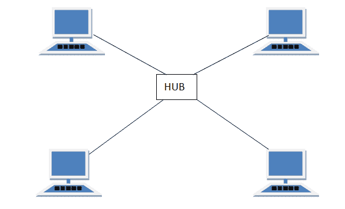
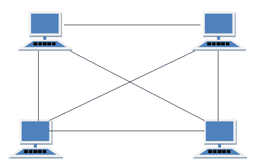
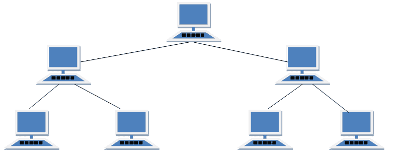
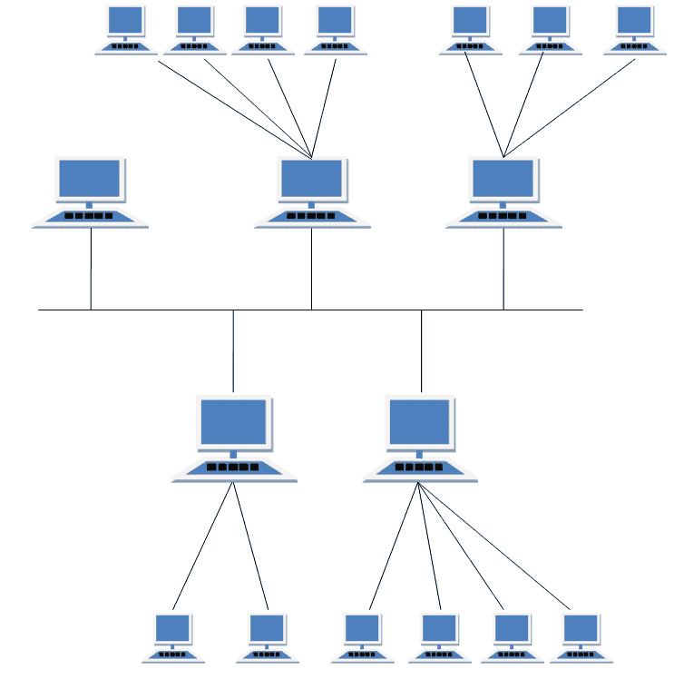

# 网络拓扑的类型

> 原文：<https://www.studytonight.com/computer-networks/network-topology-types>

网络拓扑是网络布置的示意图，通过连接线连接各种节点(发送方和接收方)。

* * *

## 总线拓扑

总线拓扑是一种网络类型，其中每台计算机和网络设备都连接到一根电缆。当它正好有两个端点时，则称为**线性总线拓扑**。

#### 总线拓扑的特点

1.  它只向一个方向传输数据。
2.  每台设备都连接到一根电缆

#### 总线拓扑的优势

1.  它具有成本效益。
2.  与其他网络拓扑相比，所需电缆最少。
3.  用于小型网络。
4.  这很容易理解。
5.  易于扩展，将两根电缆连接在一起。

#### 总线拓扑的缺点

1.  电缆出现故障，然后整个网络出现故障。
2.  如果网络流量较大或节点较多，网络性能会下降。
3.  电缆长度有限。
4.  它比环形拓扑慢。

* * *

## 环形拓扑

它被称为环形拓扑，因为它形成一个环，因为每台计算机都连接到另一台计算机，最后一台计算机连接到第一台计算机。每个设备正好有两个邻居。

#### 环形拓扑的特征

1.  大量的中继器用于具有大量节点的环形拓扑，因为如果有人想要向具有 100 个节点的环形拓扑中的最后一个节点发送一些数据，那么数据将必须通过 99 个节点才能到达第 100 个节点。因此，为了防止数据丢失，网络中使用中继器。
2.  传输是单向的，但每个网络节点之间有 2 个连接就可以双向传输，称为**双环拓扑**。
3.  在双环拓扑中，形成了两个环网，其中数据流方向相反。此外，如果一个环出现故障，第二个环可以作为备份，以保持网络正常运行。
4.  数据以一点一点的顺序方式传输。传输的数据必须经过网络的每个节点，直到目的节点。

#### 环形拓扑的优点

1.  传输网络不受高流量或添加更多节点的影响，因为只有具有令牌的节点才能传输数据。
2.  安装和扩展成本低廉

#### 环形拓扑的缺点

1.  在环形拓扑中很难排除故障。
2.  添加或删除计算机会干扰网络活动。
3.  一台计算机的故障会扰乱整个网络。

* * *

## 星形布局

在这种拓扑中，所有计算机都通过电缆连接到一个集线器。该集线器是中心节点，所有其他节点都连接到该中心节点。

#### 星型拓扑的特征

1.  每个节点都有自己专用的集线器连接。
2.  集线器充当数据流的中继器。
3.  可用于双绞线、光纤或同轴电缆。

#### 星型拓扑的优势

1.  快速性能，节点少，网络流量低。
2.  集线器可以轻松升级。
3.  易于排除故障。
4.  易于设置和修改。
5.  只有出现故障的节点受到影响，其余节点才能顺利工作。

#### 星型拓扑的缺点

1.  安装成本高。
2.  使用起来很贵。
3.  如果集线器出现故障，整个网络就会停止运行，因为所有节点都依赖于集线器。
4.  性能基于集线器，也就是说，它取决于集线器的容量

* * *

## 网状拓扑

它是到其他节点或设备的点对点连接。所有网络节点都相互连接。Mesh 有`n(n-1)/2`物理通道连接`n`设备。

通过网状拓扑传输数据有两种技术，它们是:

1.  选择途径
2.  泛滥

### 网状拓扑:路由

在路由中，根据网络要求，节点具有路由逻辑。像路由逻辑一样，引导数据以最短的距离到达目的地。或者，路由逻辑，其具有关于断开的链路的信息，并且它避开那些节点等。我们甚至可以使用路由逻辑来重新配置故障节点。

### 网状拓扑:泛洪

在泛洪中，相同的数据被传输到所有网络节点，因此不需要路由逻辑。网络是强大的，它不太可能丢失数据。但是它会导致网络上不必要的负载。

#### 网状拓扑的类型

1.  **部分网状拓扑:**在该拓扑中，一些系统以与网状拓扑相同的方式连接，但是一些设备仅连接到两个或三个设备。
2.  **全网状拓扑:**每个节点或设备都相互连接。

#### 网状拓扑的特征

1.  完全连接。
2.  健壮。
3.  不灵活。

#### 网状拓扑的优势

1.  每个连接都可以承载自己的数据负载。
2.  它是健壮的。
3.  故障容易诊断。
4.  提供安全性和隐私。

#### 网状拓扑的缺点

1.  安装和配置很困难。
2.  布线成本更高。
3.  需要大量布线。

* * *

## 树形布局

它有一个根节点，所有其他节点都连接到它，形成一个层次结构。它也被称为分层拓扑。它至少应该有三个层次。

#### 树形拓扑的特征

1.  如果工作站成组放置，则非常理想。
2.  用于广域网。

#### 树形拓扑的优点

1.  总线和星形拓扑的扩展。
2.  节点的扩展是可能且容易的。
3.  易于管理和维护。
4.  错误检测很容易完成。

#### 树形拓扑的缺点

1.  电缆很紧。
2.  代价高昂。
3.  如果增加更多的节点，维护就很困难。
4.  中央枢纽故障，网络故障。

* * *

## 混合拓扑

两种不同类型的拓扑是两种或多种拓扑的混合。例如，如果在一个部门的办公室中使用环形拓扑，而在另一个部门中使用星形拓扑，连接这些拓扑将产生混合拓扑(环形拓扑和星形拓扑)。

#### 混合拓扑的特征

1.  它是两种或多种拓扑的组合
2.  继承了包含的拓扑的优点和缺点

#### 混合拓扑的优势

1.  可靠的错误检测和故障排除很容易。
2.  有效。
3.  可扩展，因为大小可以轻松增加。
4.  灵活。

#### 混合拓扑的缺点

1.  设计复杂。
2.  代价高昂。

* * *

* * *