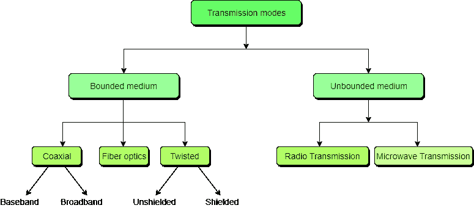

# 计算机网络中的传输介质

> 原文：<https://www.studytonight.com/computer-networks/transmission-mediums>

数据由计算机和其他使用信号的电信设备来表示。信号以电磁能的形式从一个设备传输到另一个设备。电磁信号通过真空、空气或其他传输介质从一点传播到另一点(从发送者到接收者)。

电磁能(包括电场和磁场)由能量、声音、可见光、无线电波、紫外线、伽马射线等组成。

传输媒介是我们将数据从一个地方传送到另一个地方的手段。通信网络的第一层(物理层)OSI 七层模型是专门针对传输介质的，我们后面会研究 OSI 模型。

* * *

### 选择传输介质时要考虑的因素

1.  传输速率
2.  安装成本和简易性
3.  对环境条件的抵抗力
4.  距离

* * *

* * *