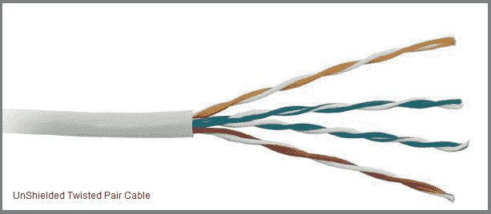
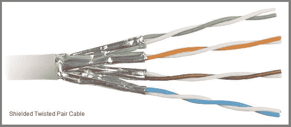
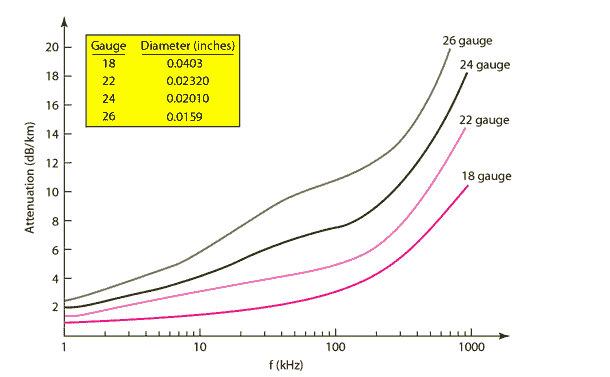
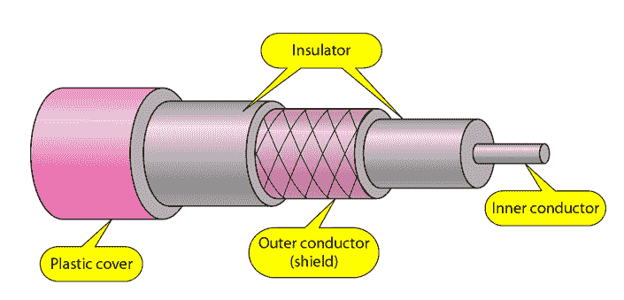
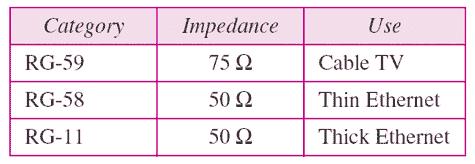
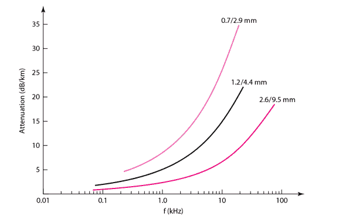
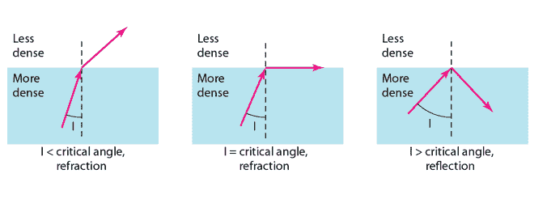
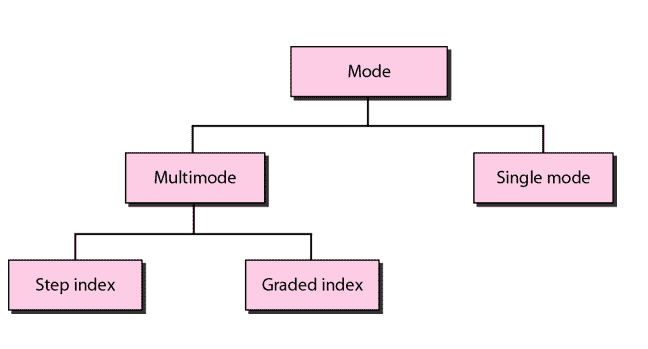
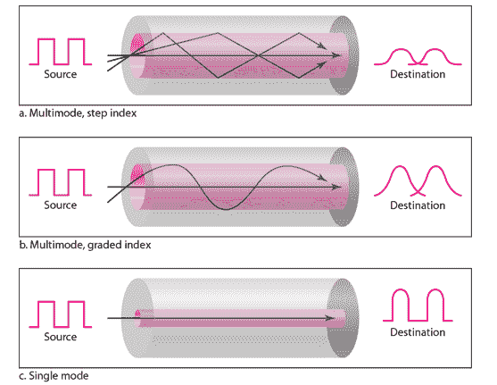
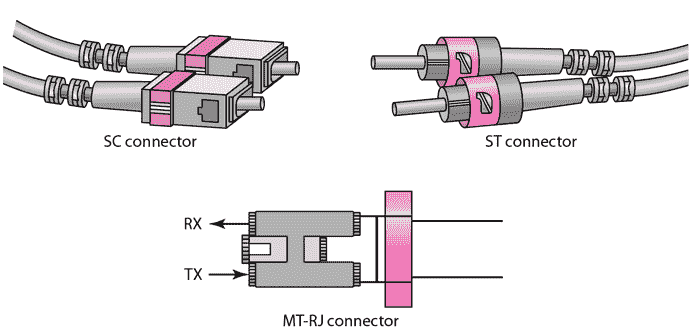

# 有界或引导传输媒体

> 原文：<https://www.studytonight.com/computer-networks/bounded-transmission-media>

引导介质，即提供从一个设备到另一个设备的导管的介质，包括**双绞线**、**同轴电缆**和**光纤电缆**。

沿着这些介质中的任何一种传播的信号都是由介质的物理极限所引导和包含的。双绞线和同轴电缆使用金属(铜)导体来接受和传输电流形式的信号。**光纤**是以光的形式接受和传输信号的电缆。

* * *

## 双绞线电缆

这种电缆是最常用的，比其他电缆便宜。它重量轻，价格便宜，易于安装，并且它们支持许多不同类型的网络。一些要点:

*   它的频率范围是 0 到 3.5 千赫。
*   在 1kHz 时，典型衰减为 0.2 dB/Km。
*   典型延迟为 50 秒/公里。
*   中继器间距为 2 公里。

双绞线由两根导线(通常为铜)组成，每根导线都有自己的塑料绝缘层，并绞合在一起。其中一根导线用于将信号传输至接收器，另一根仅用作接地参考。接收器利用两者之间的差异。除了发送方在其中一条线路上发送的信号之外，干扰(噪声)和串扰可能会影响两条线路并产生不想要的信号。如果两条导线平行，则这两条导线中的无用信号的影响并不相同，因为它们相对于噪声或串扰源位于不同的位置。这导致接收器处的差异。

双绞线有两种类型:

*   **非屏蔽双绞线(UTP)**
*   **屏蔽双绞线(STP)**

* * *

### 非屏蔽双绞线电缆

与屏蔽双绞线电缆相比，它是最常见的电信类型，屏蔽双绞线电缆由两个导体组成，通常是铜，每个导体都有自己的彩色塑料绝缘体。标识是彩色塑料绝缘背后的原因。

UTP 电缆由 2 或 4 对双绞线组成。2 对电缆使用 **RJ-11** 连接器，4 对电缆使用 **RJ-45** 连接器。

* * *

#### 非屏蔽双绞线电缆的优点

*   安装很容易
*   灵活的
*   便宜的
*   它具有高速容量，
*   百米极限
*   更高等级的 UTP 被用于像以太网这样的局域网技术。

它由两根绝缘铜线(1 毫米厚)组成。电线以螺旋状缠绕在一起，以减少来自相似线对的电干扰。

* * *

#### 非屏蔽双绞线电缆的缺点

*   与同轴电缆相比，带宽较低
*   提供较少的抗干扰保护。

* * *

### 屏蔽双绞线电缆

这种电缆有一个金属箔或编织网覆盖，包裹每对绝缘导线。金属外壳可防止电磁噪声穿透。屏蔽还可以消除串扰(在关键术语一章中解释)。

它的衰减与非屏蔽双绞线相同。它比无屏蔽同轴电缆更快。它比同轴和非屏蔽双绞线贵。

* * *

#### 屏蔽双绞线电缆的优点

*   易于安装
*   性能足够
*   可用于模拟或数字传输
*   提高信令速率
*   比非屏蔽双绞线容量更高
*   消除串扰

* * *

#### 屏蔽双绞线电缆的缺点

*   难以制造
*   沉重的

* * *

#### 屏蔽双绞线电缆的性能

测量双绞线性能的一种方法是比较衰减与频率和距离的关系。如下图所示，双绞线可以通过很宽的频率范围。然而，随着频率的增加，衰减(单位为分贝/公里)会随着频率超过 100 千赫而急剧增加。请注意，规格是电线厚度的量度。

* * *

#### 屏蔽双绞线电缆的应用

*   在电话线路中提供语音和数据通道。电话公司用来提供高数据速率连接的 DSL 线路也使用非屏蔽双绞线电缆的高带宽能力。
*   局域网，如 10Base-T 和 100Base-T，也使用双绞线电缆。

* * *

## 同轴电缆

同轴电缆之所以叫这个名字，是因为它包含两个相互平行的导体。铜在这里用作中心导体，可以是实心线，也可以是标准线。它被聚氯乙烯装置包围，这是一个包裹在金属箔、barid 或两者的外导体中的护套。

外部金属包裹用作噪声屏蔽和完成电路的第二导体。外导体也包裹在绝缘护套中。最外面的部分是保护整个电缆的塑料盖。

这里最常见的同轴标准。

*   50 欧姆 RG-7 或 RG-11:用于厚以太网。
*   50 欧姆 RG-58:用于薄以太网
*   75 欧姆 RG-59:用于有线电视
*   93 欧姆 RG-62:与 ARCNET 一起使用。

### 同轴电缆标准

同轴电缆按其无线电政府等级分类。每个 RG 编号表示一组独特的物理规格，包括内导体的线规、内绝缘体的厚度和类型、屏蔽层的结构以及外壳的尺寸和类型。RG 额定值定义的每根电缆都适用于特定功能，如下表所示:

* * *

### 同轴电缆连接器

要将同轴电缆连接到设备，我们需要同轴连接器。今天使用的最常见的连接器类型是卡口尼尔-康塞尔曼(BNC)连接器。下图显示了这种连接器的三种流行类型:BNC 连接器、BNC T 连接器和 BNC 终结器。

BNC 连接器用于将电缆末端连接到设备，如电视机。BNC 测试连接器用于以太网中，以分支到计算机或其他设备的连接。BNC 终结器用于电缆末端，以防止信号反射。

**同轴电缆有两种类型:**

#### 1.基带

这是一根 50 欧姆(ω)同轴电缆，用于数字传输。它主要用于局域网。基带以非常高的速度一次传输一个信号。主要缺点是每 1000 英尺后需要放大。

#### 2.宽带

这在标准有线电视电缆上使用模拟传输。它使用不同的频率同时发送几个信号。与基带同轴电缆相比，它占地面积大。

* * *

#### 同轴电缆的优点

*   带宽很高
*   用于长途电话线路。
*   以 10Mbps 的极高速率传输数字信号。
*   更高的抗噪能力
*   数据传输无失真。
*   与双绞线电缆相比，它们具有更好的屏蔽性能，因此可以在更高的速度下跨越更长的距离

* * *

#### 同轴电缆的缺点

*   单根电缆故障可能会导致整个网络出现故障。
*   与双绞线相比，安装困难，价格昂贵。
*   如果屏蔽层不完善，会导致回路接地。

* * *

#### 同轴电缆的性能

我们可以用测量双绞线电缆的方法来测量同轴电缆的性能。从下图可以看出，同轴电缆的衰减比双绞线高得多。换句话说，虽然同轴电缆具有高得多的带宽，但信号会迅速减弱，需要频繁使用中继器。

* * *

#### 同轴电缆的应用

*   同轴电缆广泛用于模拟电话网络，一个同轴网络可以传输 10，000 个语音信号。
*   有线电视网络也使用同轴电缆。在传统的有线电视网络中，整个网络都使用同轴电缆。有线电视采用 RG-59 同轴电缆。
*   在传统的以太局域网中。由于同轴电缆的高带宽和随之而来的高数据速率，在早期的以太局域网中，同轴电缆被选择用于数字传输。10Base-2，或薄以太网，使用 RG-58 同轴电缆和 BNC 连接器，以 10 兆位/秒的速度传输数据，传输范围为 185 米

* * *

## 光缆

光缆由玻璃或塑料制成，以光的形式传输信号。

为了更好地理解，我们首先需要探索光的**本质的几个方面。**

只要光穿过单一的均匀物质，它就沿着直线传播。如果穿过一种物质的光线突然进入另一种物质(密度不同)，光线会改变方向。

下图显示了光线从密度较大的物质变为密度较小的物质时如何改变方向。

**光线弯曲**

如图所示:

*   如果**入射角 I** (光线与垂直于两物质界面的直线所成的角度)**小于**临界角**，则光线**折射**并向表面靠近。**
*   如果入射角**大于临界角**，光线**反射**(转向)并在密度较大的物质中再次传播。
*   如果入射角**等于**临界角，光线折射，**平行于**移动到表面，如图所示。

> **注:** *临界角是物质的一个性质，其值因物质而异。*

光纤利用反射引导光线通过通道。玻璃或塑料芯由密度较低的玻璃或塑料包层包围。这两种材料的密度差必须使得穿过纤芯的光束被包层反射，而不是折射到包层中。

**光纤内部视图**

* * *

### 光缆的传播模式

目前的技术支持两种模式(**多模**和**单模**，用于沿光通道传播光，每种模式都需要具有不同物理特性的光纤。多模式可以以两种形式实现:**步进指数**和**分级指数**。

* * *

#### 多模传播模式

多模之所以如此命名，是因为来自光源的多束光束以不同的路径穿过纤芯。这些梁如何在电缆内移动取决于芯的结构，如下图所示。

*   在**多模阶跃光纤**中，纤芯的密度从中心到边缘保持不变。一束光以直线穿过这个恒定的密度，直到它到达纤芯和包层的界面。
    阶跃指数这个术语指的是这种变化的突然性，当信号通过光纤时，这种变化会导致信号失真。
*   在**多模渐变折射率光纤**中，这种失真通过电缆减小。这里的指数指的是折射率。这个折射率与密度有关。因此，渐变折射率纤维是一种具有不同密度的纤维。密度在核心的中心最高，在边缘逐渐降低到最低。

* * *

#### 单模

**单模**使用阶跃折射率光纤和高度聚焦的光源，将光束限制在小角度范围内，所有角度都接近水平。单模光纤本身的直径比多模光纤的直径小得多，密度也低得多。
密度的降低导致临界角接近 90 度，使光束的传播几乎水平。

* * *

### 光缆的纤维尺寸

光纤由直径或纤芯与包层直径之比来定义，二者均以微米表示。常见尺寸如下图所示:

* * *

### 光纤电缆连接器

光缆连接器有三种类型，如下图所示。

**用户频道(SC)** 连接器用于有线电视。它采用推/拉锁定系统。**直尖(ST)** 连接器用于将电缆连接到网络设备。MT-RJ 是一个连接器，大小与 RJ45 相同。

* * *

#### 光纤电缆的优点

光纤比金属电缆有几个优点:

*   更高的带宽
*   信号衰减更小
*   抗电磁干扰
*   抗腐蚀性材料
*   轻量
*   更强的抗敲击能力

* * *

#### 光纤电缆的缺点

使用光纤有一些缺点:

*   安装和维护
*   单向光传播
*   高成本

* * *

#### 光纤电缆的性能

衰减比双绞线和同轴电缆的情况更平坦。性能是这样的，当我们使用光纤电缆时，我们需要更少(实际上是十分之一)的中继器。

* * *

#### 光纤电缆的应用

*   常见于主干网，因为它的宽带具有成本效益。
*   一些有线电视公司使用光纤和同轴电缆的组合，从而创建了一个混合网络。
*   局域网，如 100Base-FX 网络和 1000Base-X 网络也使用光缆。

* * *

* * *