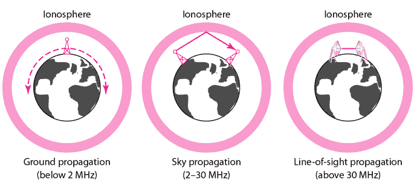
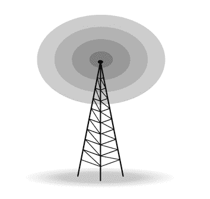
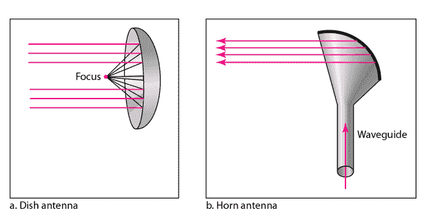
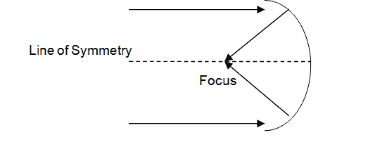
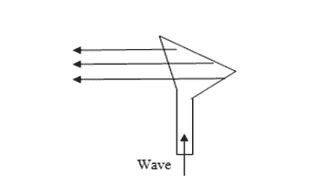
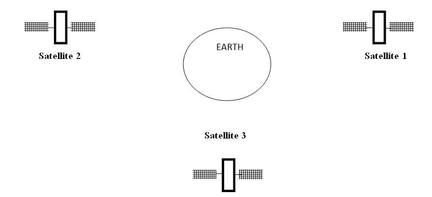

# 无界或无导向传输介质

> 原文：<https://www.studytonight.com/computer-networks/unbounded-transmission-media>

非导向介质不使用物理导体传输电磁波。这种类型的通信通常被称为无线通信。信号通常通过自由空间广播，因此任何拥有能够接收信号的设备的人都可以使用。

下图显示了用于无线通信的电磁频谱部分，范围从 3 千赫到 900 千赫。

无制导信号可以通过几种方式从源传播到目的地:**地面传播**、**天空传播**和**视线传播**，如下图所示。

**传播模式**

*   **地面传播:**在这种情况下，无线电波穿过大气层的最低部分，拥抱着地球。这些低频信号从发射天线向四面八方发射，并遵循行星的曲率。
*   **天空传播:**在这种情况下，较高频率的无线电波向上辐射到电离层，在那里它们被反射回地球。这种类型的传输允许更大的距离和更低的输出功率。
*   **视线传播:**在这种类型中，甚高频信号直接从天线到天线直线传输。

我们可以将无线传输分为三大类:

1.  无线电波
2.  微波
3.  红外线波

* * *

## 无线电波

频率在 3 千赫到 1 千兆赫之间的电磁波通常被称为无线电波。

无线电波是全向的。当天线发射无线电波时，它们向各个方向传播。这意味着发送和接收天线不必对齐。发送天线发送任何接收天线都能接收到的波。全向性也有缺点。一个天线发射的无线电波容易受到另一个天线的干扰，另一个天线可能使用相同的频率或频带发送信号。

无线电波，尤其是中低频的无线电波，可以穿透墙壁。这种特性可能是优点，也可能是缺点。这是一个优势，因为调幅收音机可以接收建筑物内的信号。这是一个缺点，因为我们无法将通信隔离到建筑物内部或外部。

* * *

### 无线电波全向天线

无线电波使用全向天线，向各个方向发送信号。

* * *

#### 无线电波的应用

*   无线电波的全向特性使其对于只有一个发送方但有多个接收方的多播非常有用。
*   调幅和调频广播、电视、海事广播、无绳电话和寻呼都是多播的例子。

* * *

## 微波

频率在 1 至 300 千兆赫之间的电磁波称为微波。微波是单向的。当天线发射微波时，它们可以被狭窄地聚焦。这意味着发送和接收天线需要对齐。单向特性具有明显的优势。一对天线可以对齐，而不会干扰另一对对齐的天线。

以下描述了微波传播的一些特征:

*   微波传播是视线。由于安装了天线的塔需要彼此直视，相距很远的塔需要非常高。
*   甚高频微波不能穿透墙壁。如果接收器在建筑物内，这种特性可能是一个缺点。
*   微波波段比较宽，差不多 299 GHz。因此，可以分配更宽的子带，并且高数据速率是可能的。
*   使用乐队的某些部分需要得到当局的许可。

* * *

### 微波单向天线

微波需要单向天线向一个方向发送信号。微波通信使用两种天线:**抛物面天线**和**喇叭**。

抛物面天线就像一个漏斗，捕捉大范围的波，并将它们导向一个公共点。通过这种方式，比单点接收器恢复更多的信号。

喇叭天线看起来像一个巨大的勺子。传出的传输通过一根杆传播，并通过弯曲的头部以一系列狭窄的平行光束向外偏转。以类似于抛物面的方式，接收到的传输由喇叭的铲形收集，并向下偏转到杆中。

* * *

#### 微波的应用

微波由于其单向特性，在发送方和接收方之间需要单播(一对一)通信时非常有用。它们用于移动电话、卫星网络和无线局域网。

微波传输有两种类型:

1.  地面微波
2.  卫星微波

* * *

#### 微波传输的优势

*   用于长途电话通信
*   同时承载 1000 个语音频道

* * *

#### 微波传输的缺点

*   它非常昂贵

* * *

## 地面微波

为了增加地面微波服务的距离，每个天线可以安装中继器。如下图所示，天线接收到的信号可以转换成可发射的形式并中继到下一个天线。这是全世界电话系统的一个例子

用于地面微波通信的天线有**两种类型**:

* * *

### 1.抛物面碟形天线

在这种情况下，平行于对称线的每一条线都以一定的角度从曲线上反射，它们相交于一个称为焦点的公共点。这种天线是基于抛物线的几何形状。

* * *

### 2.号角天线

这是一个巨大的勺子。传出的信号沿主干传播，并通过弯曲的头部以一系列狭窄的平行光束向外偏转。

* * *

## 卫星微波

这是一个放置在外太空的微波中继站。这些卫星或者由火箭发射，或者由航天飞机运载。

这些卫星位于赤道上方 36000 Km 处，轨道速度与地球的旋转速度完全匹配。由于卫星位于地球同步轨道，它相对于地球是静止的，并且总是停留在地面的同一点上。这通常是为了让地面站将天线对准天空中的一个固定点。

* * *

### 卫星微波的特点

*   带宽容量取决于使用的频率。
*   轨道卫星的卫星微波部署是困难的。

* * *

#### 卫星微波的优势

*   发射站可以接收回自己的传输，并检查卫星是否正确传输了信息。
*   一个单一的微波中继站，可以从任何一点看到。

* * *

#### 卫星微波的缺点

*   卫星制造成本非常高
*   发射卫星的费用非常昂贵
*   传播高度依赖于条件，它可以在恶劣的天气下传播

* * *

## 红外波

频率从 300 千兆赫到 400 太赫兹的红外波可以用于短程通信。高频的红外线无法穿透墙壁。这种有利的特性防止了一个系统和另一个系统之间的干扰，一个房间中的短距离通信系统不会受到另一个房间中的另一个系统的影响。

当我们使用红外遥控器时，我们不会干扰邻居使用遥控器。然而，同样的特性使得红外信号对远距离通信毫无用处。此外，我们不能在建筑物外使用红外线，因为太阳光线中含有会干扰通信的红外线。

* * *

#### 红外波的应用

*   近 400 太赫兹的红外波段具有极好的数据传输潜力。如此宽的带宽可用于以非常高的数据速率传输数字数据。
*   红外数据协会(IrDA)是一个支持使用红外波的协会，它已经建立了使用这些信号在键盘、鼠标、个人电脑和打印机等设备之间进行通信的标准。
*   红外信号可用于使用视线传播的封闭区域内的短距离通信。

* * *