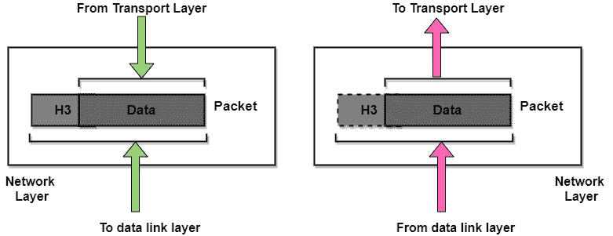
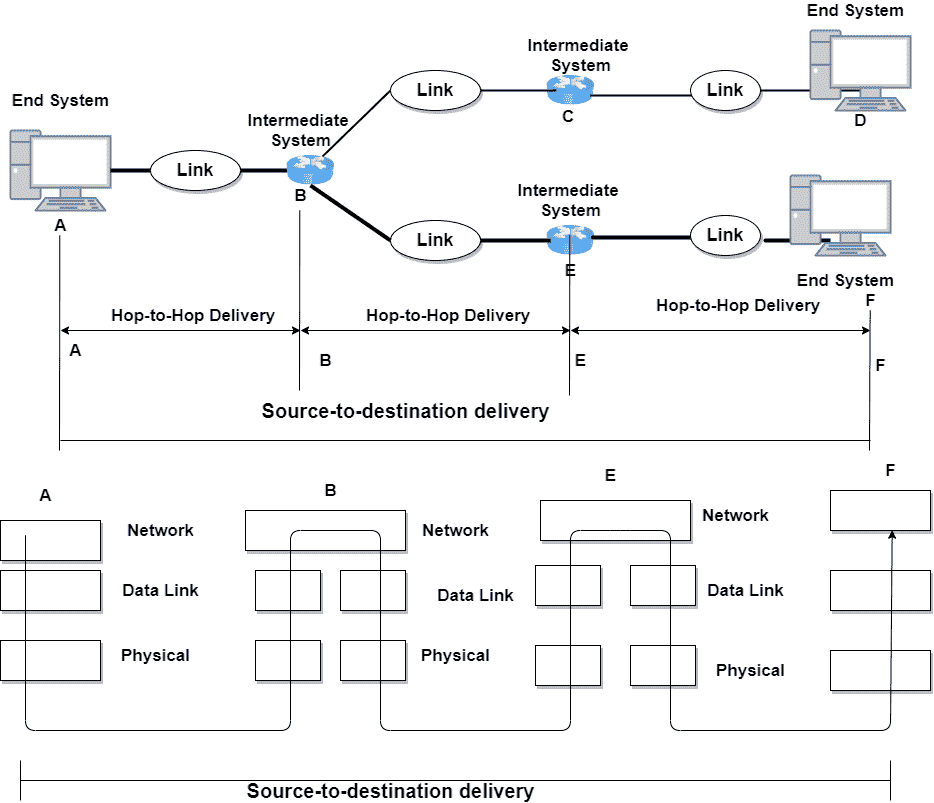

> 原文：<https://www.studytonight.com/computer-networks/network-layer-in-computer-networks>

# 计算机网络中的网络层

在本教程中，我们将介绍现场视察模型网络层的概念。

网络层是现场视察参考模型的第 3 层。网络层控制子网的运行。该层的主要目的是通过多条链路(网络)将数据包从源传送到目的地。它通过不同的通道将信号路由到另一端，并充当网络控制器。

因为数据链路层监督同一网络上两个系统之间的数据包传递；网络层主要确保每个数据包从其起点到达最终目的地。

它还将传出的消息分成数据包，并将传入的数据包组装成更高级别的消息。

在广播网络中，路由问题很简单，因此网络层通常很薄甚至不存在。

如果两台计算机(系统)连接在同一链路上，则不需要网络层。但是，如果两个系统通过网络(链路)之间的连接设备连接到不同的网络(链路)，则需要网络层来完成源到目的地的传送。

### 图:网络层

网络层的主要职责是将单个数据包从源主机传送到目的主机。

## 网络层的职责/功能

下面给出了网络层的一些其他职责。

1.  网络层将较大的数据包分解成较小的数据包。

2.  提供连接服务，包括网络层流量控制、网络层错误控制和分组序列控制。

3.  **逻辑寻址**
    数据链路层实现的物理寻址处理本地寻址的问题。网络层向来自上层的数据包添加报头，该报头还包括发送方和接收方的逻辑地址。

4.  **路由**
    当独立的网络或链路连接在一起以创建互联网络/大型网络时，路由设备(路由器或交换机)将数据包路由到最终目的地。这是网络层的主要功能之一。

## 网络层提供的服务

**1。数据包的保证传送**
网络层保证数据包到达目的地。

**2。有限制延迟的保证传送**
这是网络层提供的另一种服务，它保证数据包一定会在指定的主机到主机延迟范围内传送。

**3。按顺序传送数据包**
根据这项服务，确保数据包按照发送方发送的顺序到达目的地。

**4。安全性**
网络层通过使用源主机和目的主机之间的会话密钥来提供安全性。

### 网络层服务的优势

下面给出了网络层提供的服务的一些好处:

*   通过网络层的转发服务，数据包在网络中从一个地方传输到另一个地方。

*   为了减少流量，网络层的路由器会产生冲突并广播域。

*   数据通信系统中的故障通过分组化得以消除。

### 网络层服务的缺点

*   在网络层的设计中，缺乏流量控制

*   在网络层，缺乏适当的错误控制机制；由于碎片数据分组的存在，错误控制机制的实现变得困难。

*   由于存在太多的数据报，会发生拥塞。

### 从源到目的地的交付

让我们理解网络层从源到目的地的传输示例:

在上图中，A 节点的网络层将数据包发送到 B 节点的网络层。当数据包到达路由器 B 时，路由器会根据最终目的地(即所传输数据包的 F 节点)来决定路径。路由器 B 利用其路由表寻找下一跳，即路由器 E。节点 B 的网络层将数据包发送到 E 的网络层，然后网络层将数据包发送到 f 的网络层

### 网络层的设计问题

*   一个关键的设计问题是**确定数据包如何从源路由到目的地**。路由可以基于连接到网络的静态表，并且很少改变。它们也可以是高度动态的，为每个数据包重新确定，以反映当前的网络负载。

*   如果**子网中同时存在太多的数据包**，它们会相互干扰，形成**瓶颈**。这种拥塞的**控制**也属于网络层。

*   此外，提供的**服务质量**(延迟、传输时间、抖动等)也是网络层问题。

*   当数据包必须从一个网络传输到另一个网络才能到达目的地时，会出现许多问题，例如:

    *   第二网络使用的寻址可能与第一网络不同。

    *   第二个可能根本不接受数据包，因为它太大了。

    *   协议可能不同，等等。

*   网络层需要克服所有这些问题，以允许异构网络互联。

* * *

* * *